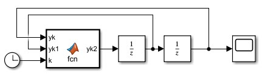
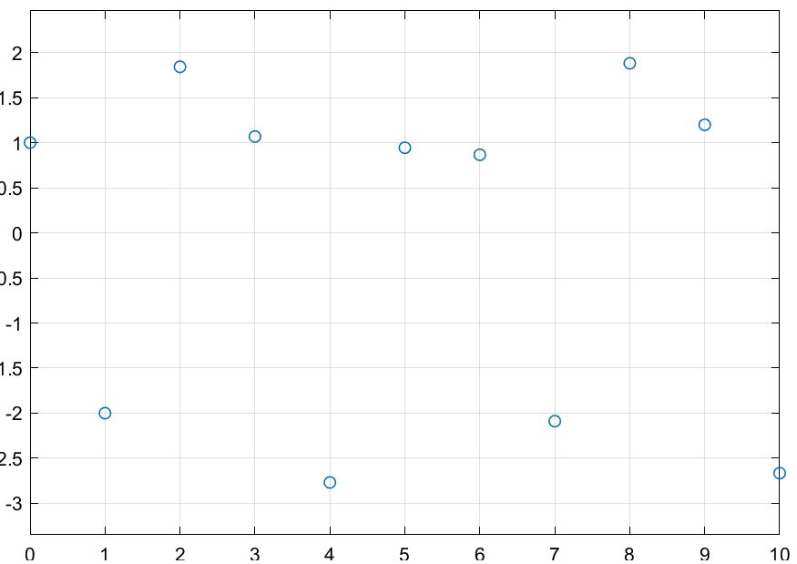
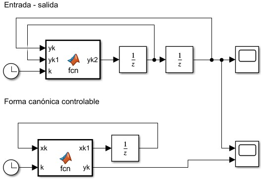
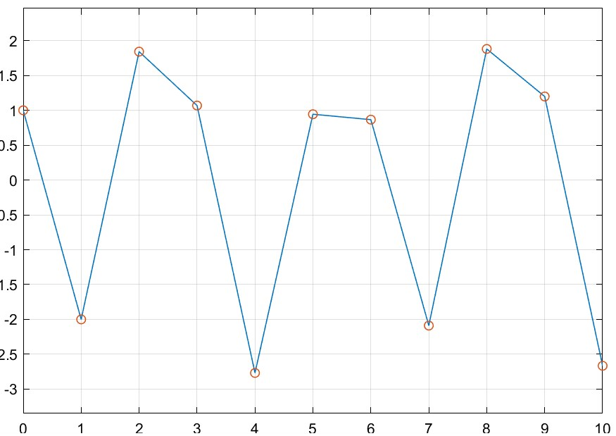
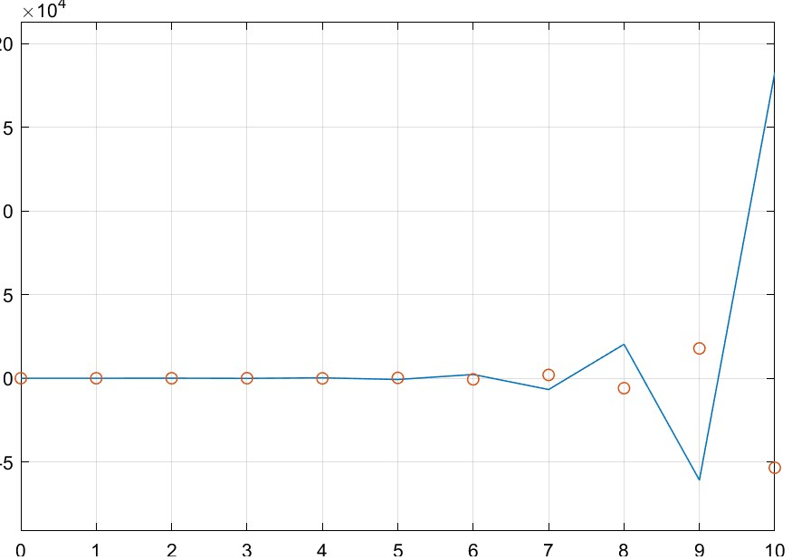

Considere el sistema en timpo discreto:

$$
(1)\quad y(k) + a_1 y(k-1) + \ldots + a_n y(k-n) = b_1 u(k-1) + \ldots + b_n u (k-n)
$$

donde $y(k)$ es la salida y $u(k)$ es la entrada, $k$ es el instante de muestreo.

Al sistema $(1)$ se le conoce como representación entrada - salida.

Aplicando transformada $\mathcal{Z}$ en ambos lados de $(1)$,

$$
\mathcal{Z}\left\{y(k) + a_1 y(k-1) + \ldots + a_n y(k-n)\right\} = \mathcal{Z}\left\{b_1 u(k-1) + \ldots + b_n u (k-n)\right\}
$$

$$
Y(z) + a_1z^{-1}Y(z) + a_2z^{-2}Y(z)+\ldots+a_nz^{-n}Y(z) = b_1z^{-1}U(z) + \ldots + b_nz^{-n}U(z)
$$

$$
\begin{aligned}
    \frac{Y(z)}{U(z)} &= \frac{b_1z^{-1} + b_2z^{-2} + \ldots + b_nz^{-n}}{1 + a_1z^{-1} + a_2z^{-2} + \ldots + a_nz^{-n}}\frac{z^{n}}{z^{n}}\\
    (3)\quad&= \underbrace{\frac{b_1z^{n-1} + b_2z^{n-2} + \ldots + b_n}{z^{n} + a_1z^{n-1} + a_2z^{n-2} + \ldots + a_n}}_\text{Polinomio característico}
    \end{aligned}
$$

El sistema $(1)$ es estable si las raíces del polinomio característico se encuentran dentro del círculo unitario en el plano complejo.

De $(3)$,

$$
\frac{Y(z)}{b_1z^{-1} + b_2z^{-2} + \ldots + b_nz^{-n}} = \frac{U(z)}{1 + a_1z^{-1} + a_2z^{-2} + \ldots + a_nz^{-n}} = Q(z)
$$


$$
Q(z) + a_1z^{-1}Q(z) + a_2z^{-2}Q(z) + \ldots + a_nz^{-n}Q(z) = U(z)
$$

$$
(5)\quad\begin{cases}
    Q(z) = - a_1z^{-1}Q(z) - a_2z^{-2}Q(z) - \ldots - a_nz^{-n}Q(z) + U(z)\\
    Y(z) = b_1z^{-1}Q(z) + b_2z^{-2}Q(z) + \ldots + b_nz^{-n}Q(z)
\end{cases}
$$

A partir de $(5)$ se definen las variables de estado,

$$
(6)\quad\begin{cases}
    X_1(z) = z^{-n}Q(z)\\
    X_2(z) = z^{-n+1}Q(z)\\
    X_3(z) = z^{-n+2}Q(z)\\
    \vdots\\
    X_{n-1}(z) = z^{-2}Q(z)\\
    X_{n}(z) = z^{-1}Q(z)\\
\end{cases}
$$

Multiplicando $(6)$ por $z$,

$$
(7)\quad\begin{cases}
    zX_1(z) = z^{-n+1}Q(z) = X_2(2)\\
    zX_2(z) = z^{-n+2}Q(z) = X_3(z)\\
    \vdots\\
    zX_{n-1}(z) = z^{-1}Q(z) = X_n(z)\\
    zX_{n}(z) = Q(z) = -a_1X_n(z) - a_2X_{n-1}(z) - \ldots - a_n x_1(z) + U(z)\\
    \\
    Y(z) = b_1X_n(z) + b_2X_{n-1}(z) + \ldots + b_n X_1 (z)
\end{cases}
$$

Aplicando transformada inversa al sistema $(7)$:

$$
(8)\quad\begin{cases}
    x_1(k+1) = x_2(k)\\
    x_2(k+1) = x_3(k)\\
    \ldots\\
    x_{n-1}(k+1) = x_n(k)\\
    x_{n}(k+1) = -a_nx_1(k) - a_{n-1}x_2(k) - \ldots - a_2 x_{n-1}(k) + a_1 x_n(k) + u(z)\\
    \\
    y(k) = b_nx_1(k) + b_{n-1}x_2(k) + \ldots + b_2 x_{n-1} + b_1 x_n (k)

\end{cases}
$$

$$
x(k) = \begin{bmatrix}
    x_1(k)\\
    x_2(k)\\
    \vdots\\
    x_n(k)
\end{bmatrix}
$$

$$
\begin{aligned}
    x(k+1) &= \begin{bmatrix}
        0 & 1 & 0 & \ldots  & 0\\
        0 & 0 & 1 & \ldots  & 0\\
        0 & 0 & \ddots & \ddots  & 0\\
        \vdots &  & \ddots & \ddots  & \vdots\\
        -a_n & -a_{n-1} & \ldots & -a_2  & -a_1\\
    \end{bmatrix}x(k) + \left.\begin{bmatrix}
        0\\0\\\vdots\\0\\1
    \end{bmatrix}u(k)\right\}\text{ Forma canónica controlable}\\
    y(k) &= \begin{bmatrix}
        b_n & b_{n-1} & \ldots &  b_2 & b_1
    \end{bmatrix}x(k)
\end{aligned}
$$

#### Ejercicio
1. Sea el sistema

    $$
    (2)\quad y(k) + y(k-1) + y(k-2) = u(k-1)
    $$

    donde, $y(0) = 1$, $y(1) = -2$, $u(k) = \sin(k)$

    1. Simular la ec. $(2)$. Graficar $y(k)$.

        $$
        \begin{aligned}
            y(k) &= -y(k-1) - y(k-2) + u(k-1)\\
            k = 0\quad\Rightarrow\quad y(0)&= -y(-1) - y(-2) + u(-1)\\
        \end{aligned}
        $$
        
        dado que no conocemos los valores de $y$ para tiempos negativos:

        $$
        \rightarrow\quad y(k+2) = -y(k+1) - y(k) + u(k+1)
        $$
        
        

        ```matlab
        function yk2 = fcn(yk,yk1,k)
        uk1 = sin(k+1);

        yk2 = -yk1 - yk + uk1;
        ```
        
        En los integradores se ponen las $c.i.$, en la configuración del modelo, se especifica un paso fijo unitario. El resultado es el siguiente:

        
        
    2. Indicar si el sistema es estable

        $$
        Y(z) + z^{-1}Y(z) + z^{-2} Y(z) = z^{-1}U(z)
        $$
        
        $$
        \frac{Y(z)}{U(z)} = \frac{z^{-1}}{1 + z^{-1} + z^{-2}}\frac{z^2}{z^2} = \frac{z}{z^2 + z + 1}
        $$
        
        $$
        p(z) = z^2 + z + 1 = 0
        $$
        
        $$
        \Rightarrow \quad z_{1,2} = -\frac{1}{2} \pm \frac{\sqrt{3}}{2} j
        $$
        
        $$
        |z_1| = 1\quad;\quad|z_2| = 2
        $$
        
        Por lo tanto el sistema **es estable**.

    3. Obtener la forma canónica controlable
        
        $$
        \begin{aligned}
            x(k+1) &= \begin{bmatrix}
                0 & 1\\
                -1 & -1\\
            \end{bmatrix}x(k) + \begin{bmatrix}
                0\\1
            \end{bmatrix}u(k)\\
            y(k) &= \begin{bmatrix}
                0 & 1
            \end{bmatrix}x(k)
        \end{aligned}
        $$
        
    4. Simular el sistema del punto 3. Graficar $y(k) = Cx(k)$.
        
        Primero obtenemos las condiciones iniciales:
        
        Para $k = 0$:
        $$
        \begin{cases}
            y(0) = x_2(0) = 1\\
            x_1(1) = x_2(0) = 1\\
            x_2(1) = - x_1(0) - x_2(0) + u(0) = -2\\
            x_1(0) = -x_2(1) - x_2(0) + u(0) = 2 -1 + \sin(0) = 1
        \end{cases}
        $$
        
        

        ```matlab
        function [xk1,yk] = fcn(xk,k)
        A = [0  1
            -1 -1];
        B = [0 1]';
        C = [0 1];

        uk = sin(k);

        xk1 = A*xk + B*uk;
        yk = C*xk;
        ```
        
        
    $$
    \square
    $$

2. Sea el sistema
    
    $$
    y(k) + 4y(k-1) + 3y(k-2) = u(k-1)
    $$
    
    $$
    y(0) = 1\quad,\quad y(1) = 1\quad,\quad u(k) = k
    $$
    
    1. Obtener la forma canónica controlable. Graficar y(k)
        
        $$
        \begin{cases}
            \begin{aligned}
                x(k+1) &= \begin{bmatrix}
                    0 & 1\\
                    -3 & -4
                \end{bmatrix}x(k) + \begin{bmatrix}
                    0\\1
                \end{bmatrix}u(k)\\
                y &= \begin{bmatrix}
                    0 & 1
                \end{bmatrix}x(k)
            \end{aligned}
        \end{cases}
        $$
        
        Para $k = 0$
        
        $$
        \begin{cases}
            x_2(0) = y(0) = 1\\
            x_1(1) = x_2(0) = 1\\
            x_2(1) = -3x_1(0) - 4x_2(0) + u(0) = y(1) = 1\\
            x_1(0) = \frac{-4x_2(0) + u(0) - x_2(1)}{3} = -1\\
        \end{cases}
        $$
        
        
    2. Indicar si el sistema es estable.

        $$
        Y(z) + 4z^{-1}Y(z) + 3z^{-2} Y(z) = z^{-1}U(z)
        $$
        
        $$
        \frac{Y(z)}{U(z)} = \frac{z^{-1}}{1 + 4z^{-1} + 3z^{-2}}\frac{z^2}{z^2} = \frac{z}{z^2 + 4z + 3}
        $$
        
        $$
        p(z) = z^2 + 4z + 3 = 0
        $$
        
        $$
        \Rightarrow\quad\begin{aligned}
            z_{1} &= -1\\
            z_{2} &= -3\\
        \end{aligned}
        $$
        
        Por lo tanto el sistema **no es estable**.

    3. Simular el sistema $(1)$. Graficar $y(k)$. Comparar con la gráfica del punto 1.
        
        $$
        y(k+2) + 4y(k+1) + 3y(k) = u(k+1)
        $$
        
        $$
        y(k+2) = -4y(k+1) - 3y(k) + u(k+1)
        $$
        
        
        
    
    $$
    \square
    $$
