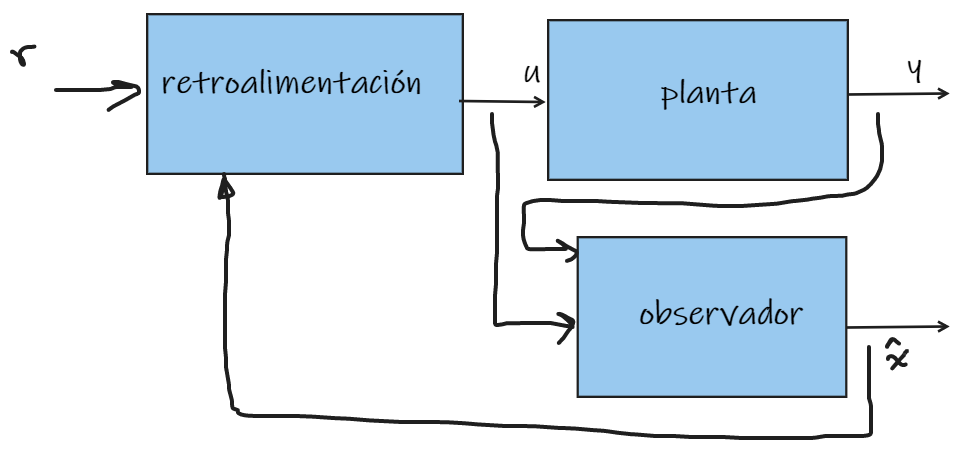
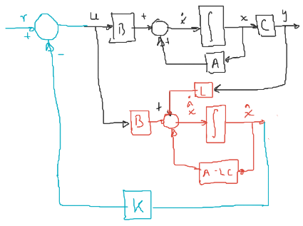

Demostrar que el sistema interconectado es **estable**.

$$
\begin{aligned}
(1)\quad    \dot{x} &= Ax + Bu\quad,\quad y = Cx\\
(2)\quad   \dot{\hat{x}} &= (A - LC)\hat{x} + Bu + Ly\\
(3)\quad   u &= r-k\hat{x}\\
\end{aligned}
$$

Sustituyendo $(3)$ en $(1)$:

$$
\begin{aligned}
\dot{x} &= Ax + B(r-k\hat{x})\\
(4)\quad \dot{x} &= Ax -Bk\hat{x} + Br\\
\end{aligned}
$$

Sustituyendo $(3)$ en $(2)$:

$$
\begin{aligned}
\dot{\hat{x}} &= (A - LC)\hat{x} + B(r-k\hat{x}) + LCx\\
(5)\quad \dot{\hat{x}} &= LCx + (A - LC - Bk)\hat{x} + Br\\
\end{aligned}
$$

De las ecuaciones $(4)$ y $(5)$

$$
\dot{\mathcal{X}} = \begin{bmatrix}
    \dot{x}\\\dot{\hat{x}}
\end{bmatrix} = \underbrace{\begin{bmatrix}
    A  & -Bk\\
    LC & A-LC-Bk\\
\end{bmatrix}}_\mathcal{A}\underbrace{\begin{bmatrix}
    x\\\hat{x}
\end{bmatrix}}_\mathcal{X} + \underbrace{\begin{bmatrix}
    B\\B
\end{bmatrix}}_\mathcal{B}T
$$

Sea la transformación $X = T\tilde{X}$, con $T$ invertible

$$
\begin{aligned}
    T\tilde{\dot{\tilde{\mathcal{X}}}} &= \mathcal{A}T\mathcal{\tilde{X}}+ \mathcal{B}r\\
    \tilde{\dot{\tilde{\mathcal{X}}}} &= T^{-1}\mathcal{A}T{\tilde{\mathcal{X}}}+ T^{-1}\mathcal{B}r\\
\end{aligned}
$$

Se propone:

$$
T = \begin{bmatrix}
    I & 0 \\
    I & I \\
\end{bmatrix}\quad;\quad T^{-1} = \begin{bmatrix}
    I & 0 \\
   -I & I \\
\end{bmatrix}
$$

Por lo tanto:

$$
\begin{aligned}
    T^{-1}{A}T &= \begin{bmatrix}
        I & 0\\
       -I & I\\
    \end{bmatrix}\begin{bmatrix}
        {A} & -{B}k\\
        LC & {A}-LC-{B}k\\
    \end{bmatrix}\begin{bmatrix}
        I & 0\\
        I & I\\
    \end{bmatrix}\\
    &= \begin{bmatrix}
        {A} & -{B}k\\
        -{A}+LC & {B}k + {A}-LC-{B}k
    \end{bmatrix}\begin{bmatrix}
        I & 0\\
        I & I\\
    \end{bmatrix}\\
    &= \begin{bmatrix}
        {A} - {B}k & -{B}k\\
        -{A}+LC+{A}-LC & A - LC\\
    \end{bmatrix} = \begin{bmatrix}
        {A}-{B}k & -{B}k\\
        0 & {A}-LC\\
    \end{bmatrix}\\
\end{aligned}
$$

Las matrices

$$
\begin{bmatrix}
    {A} & -{B}k\\
    LC & {A}-LC-{B}k\\
\end{bmatrix}\quad\text{y}\quad \begin{bmatrix}
        {A}-{B}k & -{B}k\\
        0 & {A}-LC\\
    \end{bmatrix}
$$

Es decir, $\mathcal{A}$ y $T^{-1}\mathcal{A}T$ son similares:

$$
\lambda(\mathcal{A}) = \underbrace{\lambda({A} - {B}k)}_{\text{polos por retroalimentación}} \cup \overbrace{\lambda(A-LC)}^\text{Polos del observador}
$$

El diseño de un observador de estado y el diseño de un controlador se pueden hacer de manera independiente, a esto se le conoce como **Principio de separación**.
