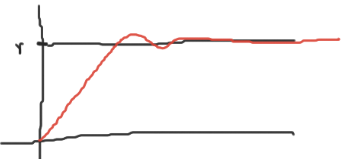
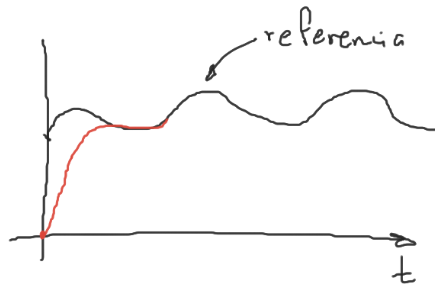

Donde:
$y$ es la salida disponible
$u$ es la señal de control

Si la señal de referencia es una constante

Si la señal de referencia varía con respecto al tiempo


# Ubicación de polos por retroalimentación de estado
Considere el sistema `SISO`

$$
(1)\begin{cases}
\dot{x} &= Ax + Bu\\
y &= Cx
\end{cases}
$$

* Se asume que el sistema $(1)$ es controlable
* Se asume que se conoce todo el vector de estado $x$

El polinomio característico del sistema $(1)$ es,

$$
\begin{aligned}
p(s) &= \det(sI-A) = s^n + a_1 s^{n-1}+ a_2 s^{n-2} + \cdots + a_{n-1} s + a_n\\
&=(s-q_1)(s-q_2)\cdots(s-q_n)
\end{aligned}
$$

Donde: $q_1, q_2, \ldots, q_n$ son los polos en lazo abierto.

El problema de ubicación de polos consiste en asignar vectores $\mu_1, \mu_2,\ldots,\mu_n$ al polinomio característico en lazo cerrado.

$$
\begin{matrix}q_1\\ q_2\\ \vdots\\ q_n\end{matrix} \longrightarrow \begin{matrix}\mu_1\\ \mu_2\\ \vdots\\ \mu_n\end{matrix}
$$

Se define la retroalimentación de estado:

$$
\begin{aligned}
(2)\quad u &= r-kx\quad,\quad k=[k_1\ k_2\ \ldots\ k_n]:1\times n\\
&= r-[k_1\ k_2\ \ldots\ k_n]\begin{bmatrix}x_1\\x_2\\\vdots\\x_n\end{bmatrix}\\
&= r-(k_1x_1+k_2x_2+\ldots+k_nx_n)
\end{aligned}
$$

$$
u = r - \sum^n_{i=1}k_ix_i
$$


Sustituyendo $(2)$ en $(1)$:

$$
\begin{aligned}
\dot{x} &= Ax + B(r-kx)\\
&= Ax + Br-Bkx\\
\end{aligned}
$$

$$
(3)\quad \dot{x} = (A-Bk)x + Br\quad\text{Sistema en lazo cerrado}
$$


Calculando el polinomio característico:

$$
\begin{aligned}
p_{LC}(s) &= \det(sI-(A-Bk)) = s^n + \tilde{a}_1 s^{n-1}+ \tilde{a}_2 s^{n-2} + \cdots + \tilde{a}_{n-1} s + \tilde{a}_n\\
&=(s-\mu_1)(s-\mu_2)\cdots(s-\mu_n)
\end{aligned}
$$


## Procedimiento
1. Calcular el polinomio característico en función de los polos deseados en lazo cerrado.

$$
p_{LC}=(s-\mu_1)(s-\mu_2)\cdots(s-\mu_n) = s^n + \tilde{a}_1 s^{n-1}+ \cdots + \tilde{a}_n
$$

2. Calcular $p_{LC}$ en términos de la ganancia $k$

$$
p_{LC}(s) = \det(sI-(A-Bk)) = s^n + \tilde{a}_1 s^{n-1}+ \tilde{a}_2 s^{n-2} + \cdots + \tilde{a}_{n-1} s + \tilde{a}_n\\
$$

3. Igualar los coeficientes

$$
\tilde{a}_1(k) = a_1\quad,\quad \tilde{a}_2(k) = a_2\quad,\quad \ldots\quad,\quad \tilde{a}_n(k) = a_n
$$

4. Realizar la comprobación. Calcular los valores propios de $(A-Bk)$


# Ubicación de polos por forma canónica controlable
Se define la retroalimentación de estado:

$$
u = r-kx = r - kP^{-1}\tilde{x} = r - \bar{k}\tilde{x}
$$

$$
\tilde{x} = Px\\
x = P^{-1}\tilde x\\
\bar{k} = kP^{-1} \Rightarrow k=\bar{k}P
$$


Sustituyendo $\tilde x = Px$ en (1)

$$
P^{-1}\dot{\tilde x} = AP^{-1}\tilde x + Bu\\
\begin{aligned}
\dot{\tilde x} &= PAP^{-1}\tilde x + PBu\\
&= PAP^{-1}\tilde x + PB(r-kP^{-1}\tilde x)\\
&= PAP^{-1}\tilde x + PBr-PBkP^{-1}\tilde x\\
&= P(A-Bk)P^{-1}\tilde x + PBr
\end{aligned}
$$

Por lo que los sistemas $(3)$ y $(4)$ son similares.

Es decir, $A-Bk$ y $P(A-Bk)P^{-1}$ tienen los mismos valores propios

$$
\begin{aligned}
p_{LC} &= det(sI-(A-Bk)) = det(sI - P(A-Bk)P^{-1})\\
&= s^n + \tilde{a}_1 s^{n-1}+ \tilde{a}_2 s^{n-2} + \cdots + \tilde{a}_{n-1} s + \tilde{a}_n\\
\end{aligned}
$$

$$
\begin{aligned}
\tilde{A}-\tilde{B}\bar{k}= \begin{bmatrix}
-\tilde{a_1} &-\tilde{a_2} &-\tilde{a_3} & \cdots & -\tilde{a_n}\\
1&0&\cdots&\cdots&0\\
0&1&0&\cdots&\vdots\\
\vdots&\ddots&\ddots&\ddots\\
0&\cdots&\cdots&1&0\\
\end{bmatrix} &= \begin{bmatrix}
-a_1 &-a_2 &-a_3 & \cdots & -a_n\\
1&0&\cdots&\cdots&0\\
0&1&0&\cdots&\vdots\\
\vdots&\ddots&\ddots&\ddots\\
0&\cdots&\cdots&1&0\\
\end{bmatrix} - \begin{bmatrix}1\\0\\\vdots\\0\end{bmatrix}[\bar{k}_1\ \bar{k}_2\ \ldots \bar{k}_n]\\
&=\begin{bmatrix}
-a_1-\bar{k}_1 &-a_2-\bar{k}_2 &-a_3-\bar{k}_3 & \cdots & -a_n-\bar{k}_n\\
1&0&\cdots&\cdots&0\\
0&1&0&\cdots&\vdots\\
\vdots&\ddots&\ddots&\ddots\\
0&\cdots&\cdots&1&0\\
\end{bmatrix}
\end{aligned}
$$


Por lo tanto:

$$
\begin{matrix}
-\tilde{a}_1 = -a_1 - \bar{k}_1\\
-\tilde{a}_2 = -a_2 - \bar{k}_2\\
\vdots\\
-\tilde{a}_n = -a_n - \bar{k}_n\\
\end{matrix}\quad\Longrightarrow\quad\begin{matrix}
\bar{k}_1 = \tilde{a}_1 - a_1\\
\bar{k}_2 = \tilde{a}_2 - a_2\\
\vdots\\
\bar{k}_n = \tilde{a}_n - a_n\\
\end{matrix}
$$


# Procedimiento
1. Polinomio característico en lazo abierto. Determinar $a_1, a_2, \ldots, a_n$
2. Calcular $P^{-1}$, luego $P = (P^{-1})^{-1}$
3. Polinomio característico en lazo cerrado $\tilde{a}_1, \tilde{a}_2, \ldots, \tilde{a}_n$
4. Calcular $\bar{k} = [\tilde{a}_1-a_1,\tilde{a}_2-a_2, \ldots, \tilde{a}_n-a_n]$
5. Obtener $k = \bar k P$
6. Comprobación
```
>> eig(A-Bk)
```

$$
\mu_1\\
\mu_2\\
\vdots\\
\mu_n\\
$$


# Teorema de Cayley-Hamilton
Toda matriz satisface su polinomio característico.

$$
\begin{aligned}
p(s) &= \det(sI-A) = s^n + a_1 s^{n-1}+ a_2 s^{n-2} + \cdots + a_{n-1} s + a_n\\
	 &= A^n + a_1 A^{n-1} + a_2 A^{n-2} + \cdots + a_n I = 0\\
\end{aligned}
$$


# Ubicación de polos por el método de Ackerman
Es un método muy importante y de hecho matlab tiene un comando para esto:
```matlab
acker()
```
Se tiene el sistema `SISO`

$$
(1)\begin{cases}
\dot{x} &= Ax + Bu\\
y &= Cx
\end{cases}
$$

* Se asume que el sistema $(1)$ es controlable
* Se asume que se conoce todo el vector de estado $x$

El polinomio característico del sistema $(1)$ es,

$$
\begin{aligned}
p(s) &= \det(sI-A) = s^n + a_1 s^{n-1}+ a_2 s^{n-2} + \cdots + a_{n-1} s + a_n\\
&=(s-q_1)(s-q_2)\cdots(s-q_n)
\end{aligned}
$$

Donde: $q_1, q_2, \ldots, q_n$ son los polos en lazo abierto.

Si $u = r-kx$

$$
\dot{x} = (A-Bk)x + Br\qquad\leftarrow \text{Sistema en lazo cerrado}
$$

Cuyo polinomio característico (lazo cerrado):

$$
\begin{aligned}
p_{LC}(s) &= \det(sI-(A-Bk)) = s^n + \tilde{a}_1 s^{n-1}+ \tilde{a}_2 s^{n-2} + \cdots + \tilde{a}_{n-1} s + \tilde{a}_n\\
&=(s-\mu_1)(s-\mu_2)\cdots(s-\mu_n)
\end{aligned}
$$

 
Por lo tanto:

$$
P_{LC}(A-Bk)= (A-Bk)^n + \tilde{a}_1 (A-Bk)^{n-1} + \tilde{a}_2 (A-Bk)^{n-2} + \cdots + \tilde{a}_n I = 0\\
$$


Considerando $n = 3$

$$
\begin{aligned}
p_{LC}(s) &= s^3 + \tilde{a}_1 s^{2}+ \tilde{a}_2 s +\tilde{a}_3\\
P_{LC}(A-Bk)&= (A-Bk)^3 + \tilde{a}_1 (A-Bk)^{2} + \tilde{a}_2 (A-Bk)^{n-2} + \cdots + \tilde{a}_n I = 0\\
\end{aligned}
$$

$$
(A-Bk)^2 = A^2 - ABk - BkA + (Bk)^2 = A^2 - ABk - Bk(A-Bk)
$$

$$
(A-Bk)^3 = (A-Bk)(A-Bk)^2 = A^3 - A^2Bk - ABk(A-Bk) - Bk(A-Bk)^2
$$


Por lo tanto:

$$
A^3 - A^2Bk - ABk(A-Bk) - Bk(A-Bk)^2 + \tilde{a}_1A^2 - \tilde{a}_1ABk - \tilde{a}_1Bk(A-Bk) + \tilde{a}_2A - \tilde{a}_2Bk + \tilde{a}_3I = 0
$$


$$
\underbrace{A^3 + \tilde{a}_1A^2 + \tilde{a}_2A + \tilde{a}_3I}_{p_LC(A)\neq0} - \underbrace{[B\ AB\ A^2B]}_{C}\begin{bmatrix}
k(A-Bk)^2 + \tilde{a}_1k(A-Bk) + \tilde{a}_2k\\
k(A-Bk) + \tilde{a}_1k\\
k
\end{bmatrix} = 0
$$


$$
P_{LC}(A) = C\begin{bmatrix}
k(A-Bk)^2 + \tilde{a}_1k(A-Bk) + \tilde{a}_2k\\
k(A-Bk) + \tilde{a}_1k\\
k
\end{bmatrix}
$$


$$
C^{-1}P_{LC}(A) = \begin{bmatrix}
k(A-Bk)^2 + \tilde{a}_1k(A-Bk) + \tilde{a}_2k\\
k(A-Bk) + \tilde{a}_1k\\
k
\end{bmatrix}
$$

Finalmente:

$$
\boxed{[0\ 0\ \ldots\ 0\ 1]C^{-1}P_{LC}(A)}\\
\text{Fórmula de Ackerman}
$$


# Ecuación de Lyapunov
Sea una matriz $F : n\times n$ con valores propios iguales que los polos deseados en lazo cerrado, entonces

$$
A - Bk = TFT^{-1}\qquad ,T:n\times n \text{ es invertible}
$$

Se construye $F$ para que tenga los mismos valores propios de $(A-Bk)$, como una matriz diagonal por bloques para que sea más fácil. Con bloques de Jordan para valores repetidos deseados (en la diagonal con 0s abajo y 1s arriba).
#### Ejemplo


Despejando

$$
AT - BkT = TF\\
AT - TF - B\underbrace{kT}_{\bar{k}} = 0\\
$$

$$
\boxed{AT - TF - B\bar{k} = 0}\\
\text{Ecuación de Lyapunov}
$$


## Procedimiento
1. Construir una matriz $F$ con los polos deseados en lazo cerrado. Se recomienda que sea una matriz diagonal por bloques.
2. Proponer $\bar{k}$ tal que el par $(F,\bar{k})$ sea observable.
3. Resolver la ecuación de Lyapunov para encontrar $T$.

$$
T = \text{lyap}(A,-F,-B\bar{k})
$$

```matlab
T = lyap(A,-F,-B*kb)
```
4. $k = \bar{k}T^{-1}$