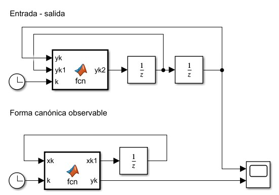
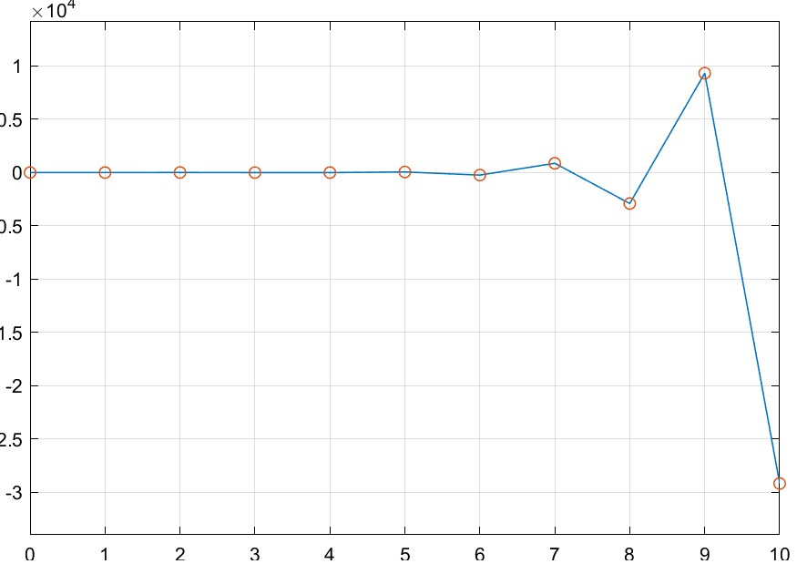

Considere un sistema con función de transferencia,

$$
    \frac{Y(z)}{U(z)} = \frac{b_1z^{-1} + b_2z^{-2} + \ldots + b_nz^{-n}}{1 + a_1z^{-1} + a_2z^{-2} + \ldots + a_nz^{-n}}
$$


$$
Y(z) + a_1z^{-1}Y(z) + a_2z^{-2}Y(z)+\ldots+a_nz^{-n}Y(z) = b_1z^{-1}U(z) + \ldots + b_nz^{-n}U(z)
$$

$$
Y(z) = z^{-1}\left[b_1 U(z) - a_1Y(z)\right] + z^{-2}\left[b_2U(z) - a_2Y(z)\right] + \ldots + z^{-n+1} \left[b_{n-1}U(z) - a_{n-1}Y(z)\right] + z^{-n}\left[b_nU(z) - a_{n}Y(z)\right]
$$

$$
Y(z) = z^{-1}\left[b_1U(z) - a_1Y(z) + z^{-1}\left\{b_2 U(z) - a_2Y(z) + \ldots + z^{-1}\left(b_{n-1} U(z) - a_{n-1}Y(z) + z^{-1}\left[b_n U(z) - a_n Y(z)\right]\right)\right\}\right]
$$

Se definen las variables de estado,

$$
\tag{a}\begin{cases}
    \begin{aligned}
        X_1(z) &= z^{-1}\left[b_nU(z) - a_nX_n(z)\right]\\
        X_2(z) &= z^{-1}\left[b_{n-1}U(z) - a_{n-1}X_n(z) + X_1(z)\right]\\
        &\vdots\\
        X_{n-1}(z) &= z^{-1}\left[b_2U(z) - a_2X_n(z) + X_{n-2}(z)\right]\\
        X_n(z) &= z^{-1}\left[b_1U(z) - a_1X_n(z) + X_{n-1}(z)\right] = Y(z)\\
    \end{aligned}
\end{cases}
$$

Multiplicando ambos lados del sistema $a$ por $z$:

$$
\tag{b}\begin{cases}
    \begin{aligned}
        zX_1(z) &= \left[b_nU(z) - a_nX_n(z)\right]\\
        zX_2(z) &= \left[b_{n-1}U(z) - a_{n-1}X_n(z) + X_1(z)\right]\\
        &\vdots\\
        zX_{n-1}(z) &= \left[b_2U(z) - a_2X_n(z) + X_{n-2}(z)\right]\\
        zX_n(z) &= \left[b_1U(z) - a_1X_n(z) + X_{n-1}(z)\right]\\
        Y(z) &= X_n(z)
    \end{aligned}
\end{cases}
$$

Aplicando la transformada inversa al sistema $b$:

$$
\tag{c}\begin{cases}
    \begin{aligned}
        x_1(k+1) &= - a_nx_n(k) + b_nu(k) \\
        x_2(k+1) &= x_1(k) - a_{n-1}x_n(k) + b_{n-1}u(k) \\
        &\vdots\\
        x_{n-1}(k+1) &= x_{n-2}(k) - a_2x_n(k) + b_2u(k)\\
        x_n(k+1) &= x_{n-1}(k) - a_1x_n(k) + b_1u(k)\\
        y(k) &= x_n(k)
    \end{aligned}
\end{cases}
$$

En forma matricial:

$$
\underbrace{\begin{aligned}
    x(k+1) &= \begin{bmatrix}
        0 & 0 & 0 & \ldots & 0 & -a_n\\
        1 & 0 & 0 & \ldots & 0 & -a_{n-1}\\
        0 & 1 & 0 & \ldots & 0 & -a_{n-2}\\
        \vdots &  & \ddots &  & \vdots & \vdots\\
        0 & 0 & \ldots & 1 & 0 & -a_{2}\\
        0 & 0 & \ldots & 0 & 1 & -a_{1}\\
    \end{bmatrix}x(k) + \begin{bmatrix}
        b_n\\b_{n-1}\\\vdots\\b_2\\b_1
    \end{bmatrix}u(k)\\
    \\
    y(k) &= \begin{bmatrix}
        0 & 0 & \ldots & 0 & 1
    \end{bmatrix} x(k)
\end{aligned}}_\text{Forma canónica observable}
$$

#### Ejercicio
Sea el sistema,

$$
y(k) + 5y(k-1) + 6y(k-2) = u(k-1) + u(k-2)
$$

1. Simular el sistema, $y(0) = 2$, $y(1) = -3$, $u(k) = \cos(k)$. Graficar $y(k)$
    
    $$
    y(k+2) + 5y(k+1) + 6y(k) = u(k+1) + u(k)
    $$
    
    $$
    y(k+2) = - 5y(k+1) - 6y(k) + u(k+1) + u(k)
    $$
    
    ```matlab
    function yk2 = fcn(yk,yk1,k)
    uk1 = cos(k+1);
    uk = cos(k+2);

    yk2 = -5*yk1 - 6*yk + uk1 + uk;
    ```
    
2. Obtener la forma canónica observable. Graficar $y(k)$ y comparar con el punto 1.
    
    $$
    \begin{aligned}
    x(k+1) &= \begin{bmatrix}
        0 & -6\\
        1 & -5\\
    \end{bmatrix}x(k) + \begin{bmatrix}
        1\\1
    \end{bmatrix}u(k)\\
    y(k) &= \begin{bmatrix}
        0 & 1
    \end{bmatrix}x(k)
    \end{aligned}
    $$
    
    Para $k = 0$:
    
    $$
    \begin{cases}
        x_2(0) = y(0) = 2\\
        x_2(1) = x_1(0) -5 x_2(0) + u(0) = x_1(0) -10 + 1 = y(1) = -3\\
        x_1(0) = 9-3 = 6
    \end{cases}
    $$
    
    ```matlab
    function [xk1,yk] = fcn(xk,k)
    A = [0 -6
         1 -5];
    B = [1 1]';
    C = [0 1];

    uk = cos(k);

    xk1 = A*xk + B*uk;
    yk = C*xk;
    ```
    
    Simulando ambos sistemas:
    
    

    Se realiza la comparación de las salidas $y(k)$:

    
    
    $$
    \square
    $$
