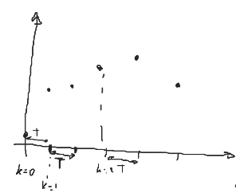
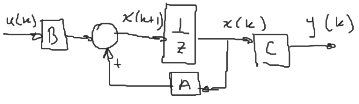
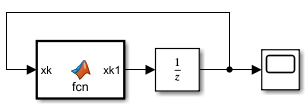
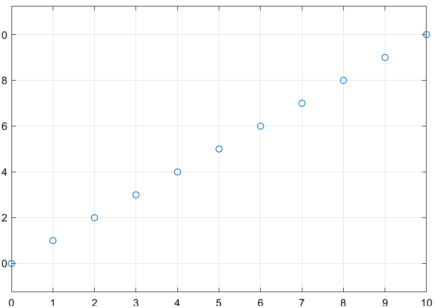
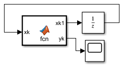
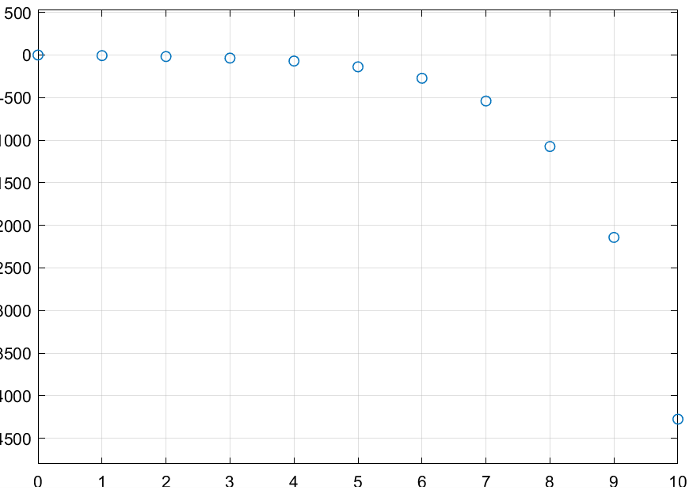

De manera general, un sistema en tiempo discreto se define en función del periodo de muestreo $T$ y el instante de muestreo $k$



$$
t = kT
$$

Un **sistema en tiempo discreto** se representa como,

$$
\boxed{x((k+1)T) = f(x(kT),u(kT))}
$$

con $T = 1$

$$
x((k+1)) = f(x(k),u(k))
$$

Para un sistema lineal:

$$
(a)\quad\begin{cases}
    x(k+1) = Ax(k) + Bu(k)\\
    y(k) = Cx(k)
\end{cases}
$$

Su diagrama de bloques es el siguiente:



#### Ejemplos
1. Simular el siguiente sistema en timpo discreto

    $$
    \begin{cases}
        x(k+1) = x(k) + 1\\
        x(0) = 0
    \end{cases}
    $$
    
    
    
    ```matlab
    function xk1 = fcn(xk)
    xk1 = xk + 1;
    ```
    
    Se configura el solver para tener paso fijo de 1.

    ##### Resultado
    
    
    
2. Simular el siguiente sistema en timpo discreto

    $$
    \begin{cases}
        x_1(k+1) = 2 x_1(k) + 0.5 x_2(k) - 5\\
        x_2(k+1) = 0.8 x_2(k) + 2\\
        y(k) = x_1(k) - x_2(k)\\
    \end{cases}\quad\begin{aligned}
        x_1(0) &= 2\\
        x_2(0) &= -1\\
    \end{aligned}
    $$

    $$
    \begin{cases}
        x(k+1) = \begin{bmatrix}
            2 & 0.5\\
            0 & 0.8
        \end{bmatrix}x(k) + \begin{bmatrix}
            -5\\2
        \end{bmatrix}u(k)\\
        y(k) = \begin{bmatrix}
            1 & -1
        \end{bmatrix}x(k)
    \end{cases}\quad,\quad u(k) = 1
    $$

    
    
    ```matlab
    function [xk1,yk] = fcn(xk)
    A = [2 0.5
         0 0.8];
    B = [-5 2]';
    C = [1 -1];
    u = 1;

    xk1 = A*xk + B*u;
    yk = C*xk;
    ```
    
    Se configura el solver para tener paso fijo de 1.

    ##### Resultado
    
    
