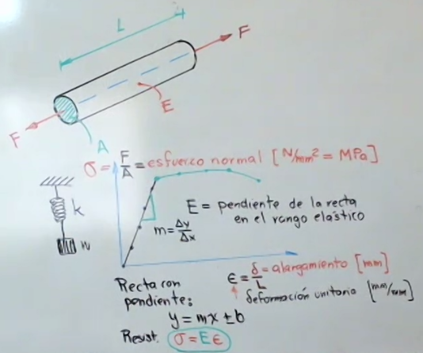
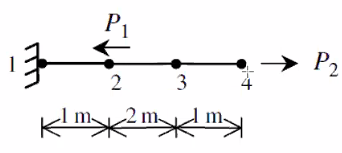
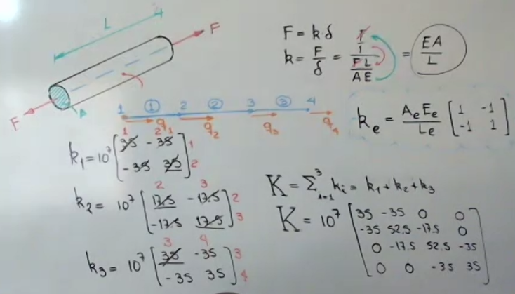

## Resistencia

$$
\sigma = E\epsilon
$$

$$
\epsilon = \dfrac{\delta}{L}
$$

## Rigidez

$$
\delta = \dfrac{FL}{AE} = \dfrac{\sigma L}{E}
$$

Debido a las propiedades elásticas de los sólidos, estos se pueden representar como un resorte.

$$
F = k\delta
$$

$$
k = \dfrac{F}{\delta} = \dfrac{F}{\dfrac{FL}{AE}} = \dfrac{AE}{L}
$$

En forma matricial:

$$
F = KQ
$$

Donde:
$K$ es la matriz ensamblada de rigidez y sus dimensiones dependen de los grados de libertad del sistema.
$Q$ Es el vector de fuerzas aplicadas en los nodos del sistema.

Suma en ensamble de constantes de rigidez
### Ejercicio
Considere la estructura compuesta de tres elementos lineales llamados barras como se muestra en la figura de abajo. el material de los dos elementos es: $E=70GPa$, $A=0.005m^2$ $P_1 = 10kN$, $P_2 = 15kN$. En un momento determinado en la operación del elemento máquina, Determine:
1. La matriz de rigidez global.
2. Los desplazamientos de los nodos 2, 3, y 4.
3. La reacción en el apoyo en el nodo 1.
4. El esfuerzo axial en cada barra.

$$
k_e = \dfrac{A_eE_e}{L_e}\begin{bmatrix}
1 & -1\\
-1 & 1
\end{bmatrix}
$$

