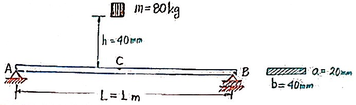
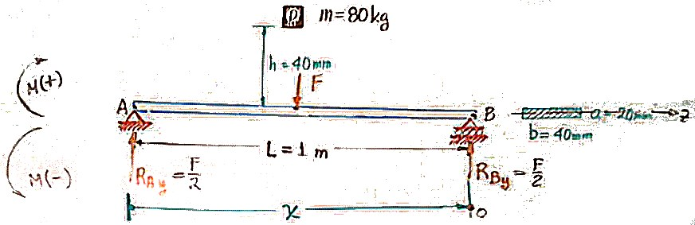

1. Un bloque D con masa $m = 80\ kg$ se deja caer de una altura desde el reposo, la altura $h = 40\ mm$ antes de impactar el punto C; que es el punto medio de una viga simplemente apoyada AB (de aluminio). La sección transversal de la viga es rectangular de base $40\ mm$ y altura $20\ mm$, $L = 1\ m$, $E=70\ GPa$, determine:
    
    

    1. La deflexión máxima del punto $C$ de la viga.
    2. El esfuerzo máximo que ocurre en la viga.

    ## Principio de trabajo y energía
    Posición $I$: Debido a que el cuerpo D se deja caer del reposo, la energía cinética del cuerpo y la energía de deformación de la viga son **cero**.
    Posición $II$: La energía de deformación de la viga es máxima y la energía cinética del cuerpo D es **cero**.
    
    
    
    $$
    \begin{aligned}
        EI_zy'' &= M<x>\\
        &= \frac{F}{2}<x> - F<x - \frac{L}{2}>\\
        EI_zy'&= \frac{F}{4}<x>^2 - \frac{F}{2}<x - \frac{L}{2}>^2 + C_1\\
        EI_zy&= \frac{F}{12}<x>^3 - \frac{F}{6}<x - \frac{L}{2}>^3 + C_1<x> + C_2\\
    \end{aligned}
    $$
    
    $$
    y(0) = 0\quad\Rightarrow\quad \boxed{C_2 = 0}
    $$
    
    $$
    \begin{aligned}
        y(L) = 0 &= \frac{FL^3}{12} - \frac{F}{6}\left(\frac{L}{2}\right)^3 + C_1L\\
        &= \frac{FL^3}{12} - \frac{FL^3}{48} + C_1L\\
    \end{aligned}
    $$
    
    
    $$
    C_1 = \frac{FL^2 - 4FL^2}{48} = \frac{-3FL^2}{48}
    $$
    
    Sustituyendo $C_1$ y $C_2$:
    
    $$
    EI_zy = \frac{F}{12}<x>^3 - \frac{F}{6}<x - \frac{L}{2}>^3 - \frac{3FL^2}{48}<x>
    $$
    
    $$
    y\left(\frac{L}{2}\right) = y_{max}
    $$
    
    $$
    EI_zy_{max} = \frac{FL^3}{96} - \frac{3FL^3}{96} = -\frac{FL^3}{48}
    $$
    
    Por lo tanto:
    
    $$
    y_{max} = -\frac{F_{max}L^3}{48EI_z}
    $$
    
    ### Energía de deformación
    Es el área bajo la curva en el diagrama fuerza - deformación:
    
    $$
    U = \frac{1}{2}Fy
    $$
    
    Por lo tanto se calcula la energía de deformación máxima:
    
    $$
    U_{max} = \frac{1}{2}F_{max}y_{max} = \underbrace{\frac{24EI_z}{L^3}y_{max}^2}_\text{E. de deformación de viga}
    $$
    
    La masa D desarrolla un trabajo para recorrer la altura $h$ y deformar la viga ($y_{max}$).
    
    $$
    W = mg(h + y_{max})
    $$
    
    Igualando las energías:
    
    $$
        \frac{24EI_z}{L^3}y_{max}^2 = mg(h + y_{max})
    $$
    
    $$
        \frac{24EI_z}{L^3}y_{max}^2 - mgy_{max} - mgh = 0
    $$
    
    $$
        \frac{24(70\times10^{9})\frac{1}{12}(0.04)(0.02)^3}{1}y_{max}^2 - (80)(9.81)y_{max} - (80)(9.81)(0.04) = 0
    $$
    
    Solucionando:
    
    $$
    \begin{aligned}
    y_{max1} &= 36.6\ mm\quad\checkmark\\
    y_{max2} &= -19\ mm\quad\times
    \end{aligned}
    $$
    
    Por lo tanto:
    
    $$
    \boxed{y_{max} = 36.6\ mm}
    $$
    
    Para calcular el esfuerzo por impacto:
    
    $$
    \sigma_{flex} = \frac{V_{max}C}{I_z} = \frac{\frac{F_{max}L}{4}C}{I_z}
    $$
    
    $$
    F_{max} = \frac{48EI_z}{L^3} = 3225.6\ N
    $$
    
    Por lo tanto:
    
    $$
    \sigma_{flex} = \frac{(3225.6)(1)(\frac{1}{4})(0.01)}{\frac{1}{2}(0.04)(0.02)^3} = 302.4\times10^6\ Pa
    $$
    
    
    $$
    \boxed{\sigma_{flex} = 302.4\ MPa}
    $$
    
    El factor de seguridad es:
    
    $$
    N = \frac{S_{yp}}{\sigma_{flex}} = \frac{276}{302.4} = 0.91 < 1\quad\times
    $$
    
    Por lo que es **deformación plástica**.
    
    Si no hubiera impacto:
    
    $$
    \sigma_{flex} = \frac{(80)(9.81)(\frac{1}{4})(0.01)}{\frac{1}{12}(0.04)(0.02)^3} = 73.5\ MPa
    $$
    
    Por lo que
    
    $$
    N = \frac{276}{73.5} = 3.75\quad>>\quad1
    $$
