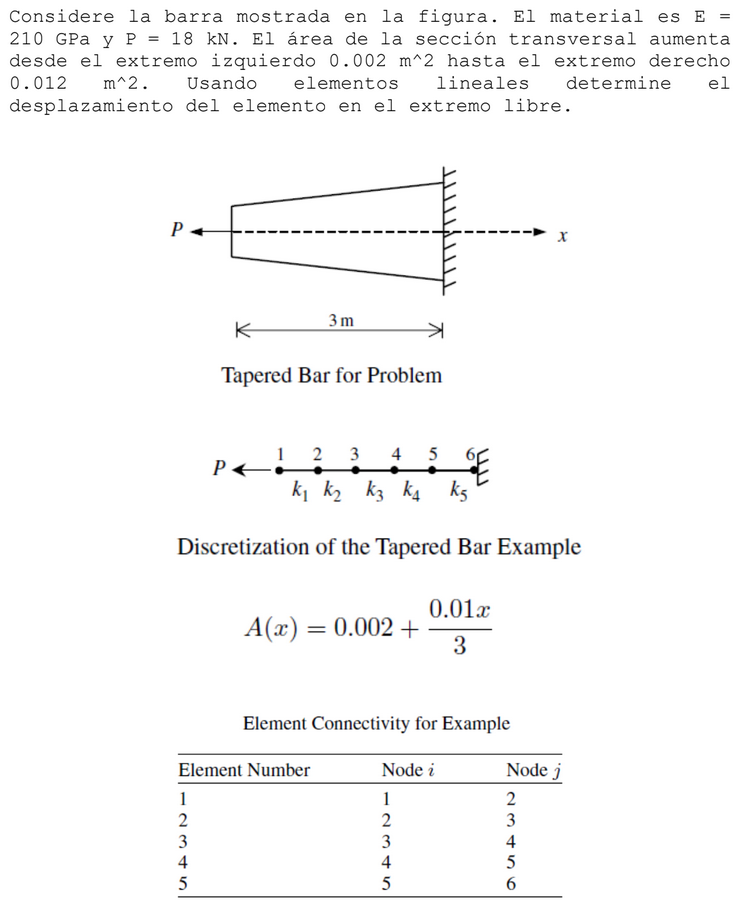
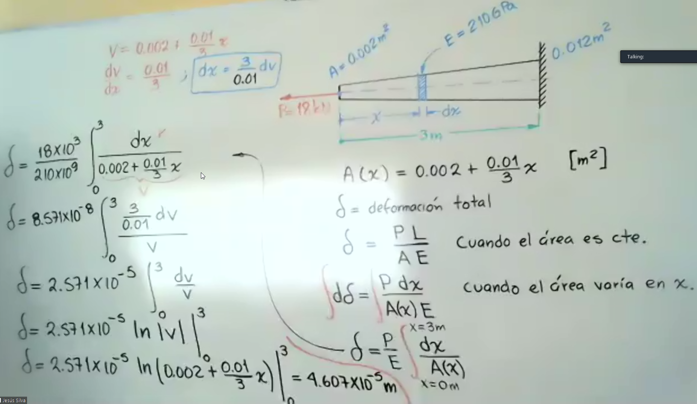

# Problema

# Análitico



# Numérico
```
% Problema 2
clc
clear all
close all

E = 210e9; %210GPa --> Acero
L=3/5;
A1 = 0.002 + (0.01*(L/2))/3;%Area en la mitad de cada elemento
A2 = 0.002 + (0.01*(3*L/2))/3;%Area en la mitad de cada elemento
A3 = 0.002 + (0.01*(5*L/2))/3;%Area en la mitad de cada elemento
A4 = 0.002 + (0.01*(7*L/2))/3;%Area en la mitad de cada elemento
A5 = 0.002 + (0.01*(9*L/2))/3;%Area en la mitad de cada elemento
P = 18e3;%18kN

k1=LinearBarElementStiffness(E, A1, L)
k2=LinearBarElementStiffness(E, A2, L)
k3=LinearBarElementStiffness(E, A3, L)
k4=LinearBarElementStiffness(E, A4, L)
k5=LinearBarElementStiffness(E, A5, L)

K=zeros(6,6); % 6 nodos cada uno con 1 grado de libertad
K=LinearBarAssemble(K,k1,1,2)
K=LinearBarAssemble(K,k2,2,3)
K=LinearBarAssemble(K,k3,3,4)
K=LinearBarAssemble(K,k4,4,5)
K=LinearBarAssemble(K,k5,5,6)

% Se evalúan las condiciones de frontera, en este caso el nodo 6 es estático
% Por lo tanto no se toma en cuenta la fila 6 ni la columna 6

k=K(1:5,1:5)

% Se crea el vector fuerza del subsitema
f=[-P;0;0;0;0]

% Se resuelven los desplazamientos qn por eleminación Gaussiana
q=k\f

% Este es el vector de desplazamientos global (incluye las reestricciones)
Q=[q;0]

% Este es el vector de fuerzas globales (incluye las reacciones)
F=K*Q

sigma1=E*[-1 1]*[Q(1);Q(2)]/L
sigma2=E*[-1 1]*[Q(2);Q(3)]/L
sigma3=E*[-1 1]*[Q(3);Q(4)]/L
sigma4=E*[-1 1]*[Q(4);Q(5)]/L
sigma5=E*[-1 1]*[Q(5);Q(6)]/L
```