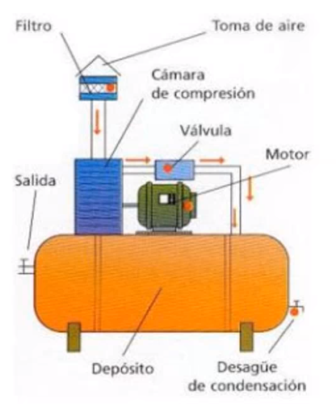
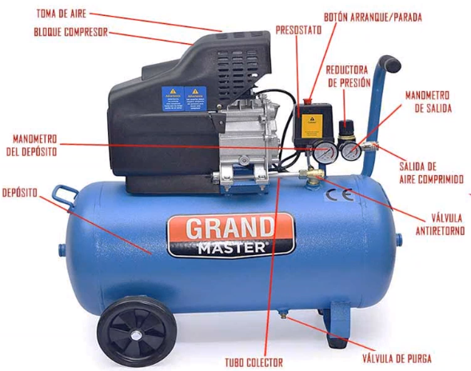
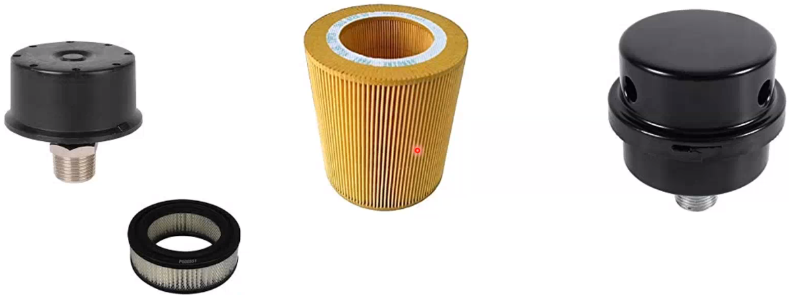
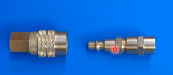
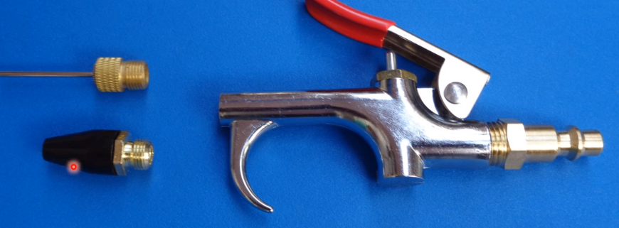

* **Commpresores:** Los compresores son máquinas que aumentan la presión de un volúmen de gas.
	* De pistón: Funcionan con una etapa de `admisión` y `compresión`. En la admisión se permite la entrada de fluido nuevo. En la compresión se cierra la válvula y se comprime el fluido.
	* De membrana: Contienen una membrana elástica que separa el gas con los mecanismos, lo que evita que el aire se ensucie con aceite.
	* De rotación
		* De tornillo: Funcionan con 2 tornillos girando en distintos sentidos. Los tornillos son de distintas dimensiones y por lo tanto hay un `macho` y un `hembra`.
	* Turbo compresores
		* Axial
		* Radial

# Partes de un compresor

## Filtro de aire

## Conector NPT

### Accesorios NPT

# Mantenimiento preventivo
* Cada 4 000 horas de uso:
	* Cambiar aceite
	* Cambiar el filtro de aceite
	* Cambiar el fitro de aire
* Cada sesión de trabajo:
	* Al inicio, drenar la humedad acumulada a través de la válvula inferior.
	* Alfinal, vaciar el depósito usando la válvula purgadora