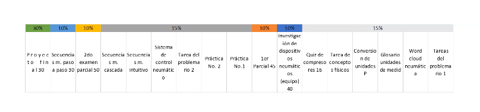

## Contacto

Nombre: Montes Campuzano Octavio
Grupo: 2MM11
Plataforma: Teams

## Evaluación

|Concepto|Valor|
|-|-|
|Proyecto Final|30%|
|Examen 1|10%|
|Examen 2|10%|
|Secuencia s.m. paso a paso|10%|
|Investigación de neumática e hidráulica|10%|
|Actividades en clase|15%|
|Prácticas|15%|

## Notas
