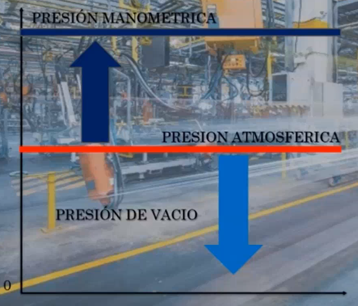

# Presión
Fuerza que ejerce un fluido en una superficie.

$$
P = \dfrac{}{}
$$

# Caudal

$$
Q = \dfrac{V}{t}
$$

# Unidades
| |Dispositivo|Presión $psi$|Presión $Pa$|Presión $bar$|
|-|-----------|-------------|-|-|
|1|Olla exprés|$13 - 15$|$89631.8 - 103421$|$0.896318 - 1.03421$|
|2|Aire comprimido enlatado|$70$|$482633$|$4.82633$|
|3|Balón de football americano|$12.5$|$86184.46$|$0.86184$|
|4|Lata de pintura|$50$|$344738$|$3.447$|
|5|Desodorante en aerosol|$70$|$482633$|$4.82633$|
|6|Llanta de tractocamión|$125$|$861845$|$8.61845$|