# Actuadores
## Actuador de efecto simple

### Construcción interna
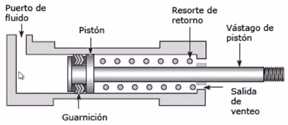
1. Camisa del cilindro
2. Culata anterior y posterior
3. Émbolo con vástago
4. Juntas de estanqueidad
5. Muelle de recuperación
6. Cojinete
## Actuador de doble efecto
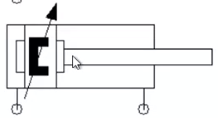

### Construcción interna
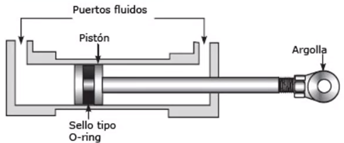
El sello o-ring es un empaque.

1. Camisa del cilindro
2. Culata anterior con cojinete
3. Culata posterior
4. Vástago y émbolo
5. Juntas de estanqueidad
6. Conexiones A,B

## Cilindros con 2 vástagos (TANDEM)
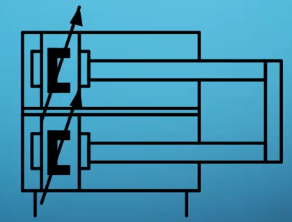
## Cilindro multiposicional
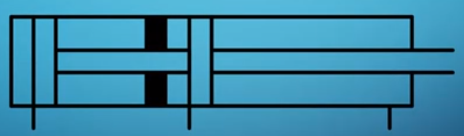
## Motor neumático
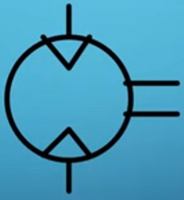
## Tubo de aspiración (ventosa)
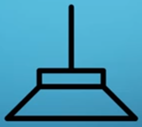
Se necesita un elemento que genere vacío
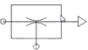
## Actuador semirotatorio
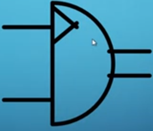

# Válvulas
La nomenclatura de las válvulas se da por el `# de vías` y el `# de estados`.

## Válvulas #v/#e
### Válvula 2/2
Válvula de **2 vías** y **2 estados** = **Válvula 2/2**
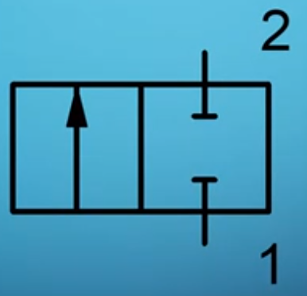

El estado inicial de una válvula es el del lado derecho por lo general. En el caso de la válula de arriba, es normalmente abierto.

### Válvula 3/2
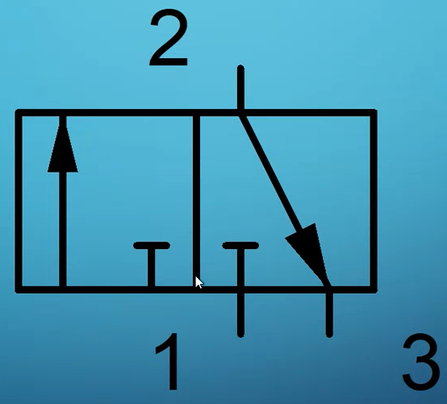
### Válvula 4/2
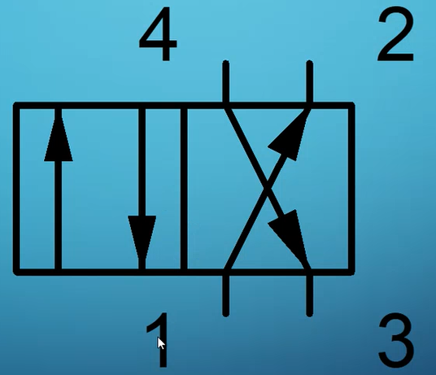

## Tobera (nozzle)
Esta representa una resistencia neumática.

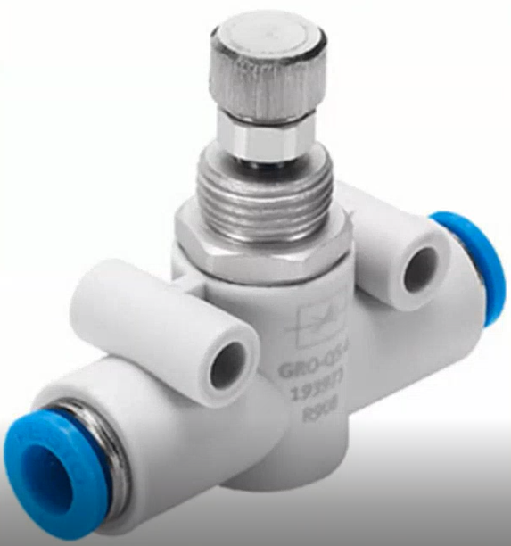

## Valvula estranguladora (throttle valve)
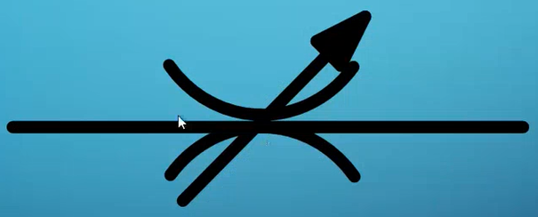

## Orificio

## Válvula antirretorno (check)
El flujo pasa de 1 a 2 sí hay más presión en 1.
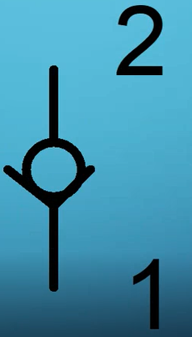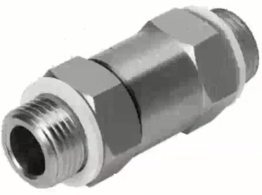

## Válvula selectora (OR)
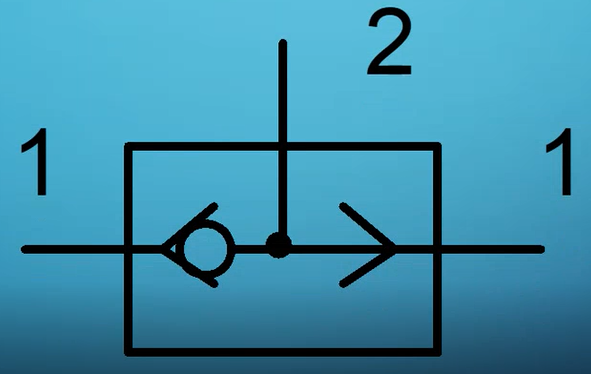

## Válvula de simultaneidad (AND)
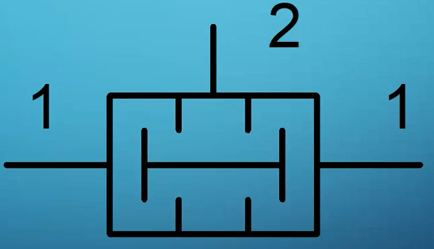

## Válvula de rápido alivio
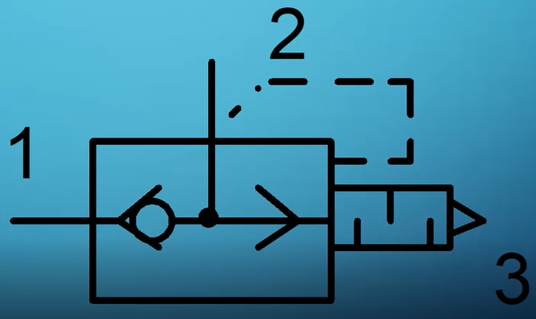
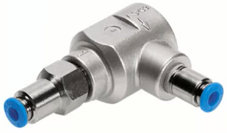

# Sensores
## Manómetros
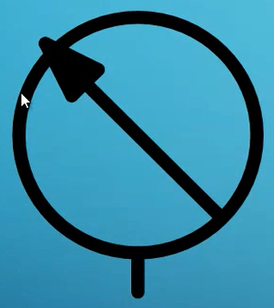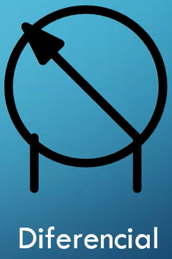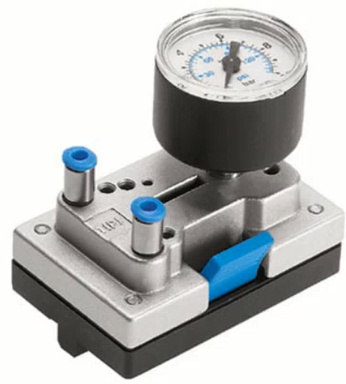

## Indicador de presión
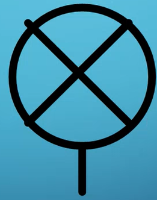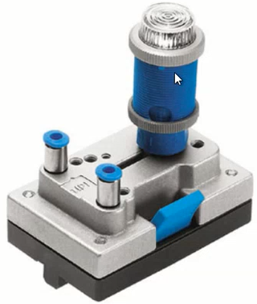

# Alimentación
## Fuente de aire comprimido

## Compresor
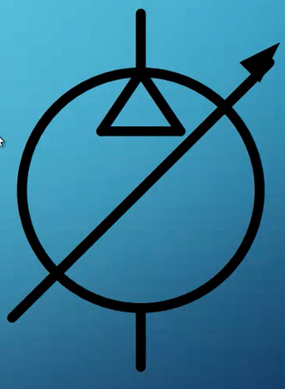

## Unidad de mantenimiento
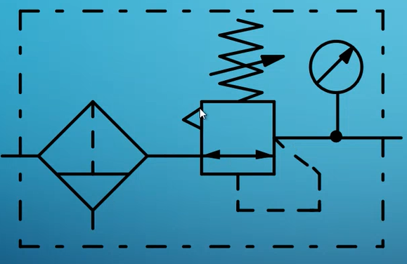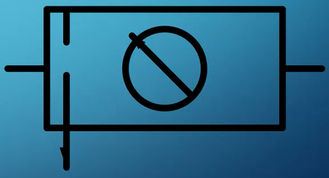