Representa con modelos (Arquitectura) las funciones, la relación entre ella y el comportamiento deseado.

# Modelos
1) Definición de funciones (descomposición). $\rightarrow$ FBS (Functional Breakdown Structure)
2) Relación funcional. $\rightarrow$ IDEF-0 
3) Flujo funcional. $\rightarrow$ $N^2$, FFDD, oFFDB

## Descomposición funcional
Busca dividir las funciones generales en específicas hasta que se llega al dominio de componentes.

### Ejemplo: Impresora
1) **Función general**: Imprimir documentos digitales. **Qué necesita hacer?**
	* Interpretar información digital
	* Transmitir/comunicar información
	* Almacenar papel
	* Transportar papel
	* Verificar estado del sistema
	* Almacenar tinta
	* Inyectar tinta
	* Controlar inyección de tinta
	* Desplazar el inyector
	* Alinear el papel
	* Controlar desplazamiento
	* Suministrar energía
	* Convertir energía
	* Medir nivel de tinta
	* Medir cantidad de impresiones
	* Interactuar con el usuario
2) **Definir la transformación en cuanto a tipo E/S**
	* Interpretar información digital - I
	* Transmitir/comunicar información - I
	* Almacenar papel - M
	* Transportar papel - M
	* Verificar estado del sistema - I
	* Almacenar tinta - M
	* Inyectar tinta - M
	* Controlar impresión de la tinta - I/E
	* Desplazar el inyector - M
	* Alinear el papel - M
	* Controlar desplazamiento - I
	* Suministrar energía - E
	* Convertir energía - E
	* Medir nivel de tinta - I
	* Medir cantidad de impresiones - I
	* Interactuar con el usuario - I
3) **Agrupar primero las funciones propias de la función general**
	* Almacenar papel - M
	* Transportar papel - M
	* Almacenar tinta - M
	* Inyectar tinta - M
	* Controlar impresión de la tinta - I/E
	* Desplazar el inyector - M
	* Alinear el papel - M
	* Controlar desplazamiento - I
	* Medir nivel de tinta - I
	* Medir cantidad de impresiones - I
	***

	* Interpretar información digital - I
	* Transmitir/comunicar información - I
	* Verificar estado del sistema - I
	* Suministrar energía - E
	* Convertir energía - E
	* Interactuar con el usuario - I
4) **Agrupar las funciones propias en transformación de materia (física)**
	* Almacenar papel - M
	* Transportar papel - M
	* Almacenar tinta - M
	* Inyectar tinta - M
	* Controlar impresión de la tinta - I/E
	* Desplazar el inyector - M
	* Alinear el papel - M
	***

	* Controlar desplazamiento - I
	* Medir nivel de tinta - I
	* Medir cantidad de impresiones - I
	***

	* Interpretar información digital - I
	* Transmitir/comunicar información - I
	* Verificar estado del sistema - I
	* Suministrar energía - E
	* Convertir energía - E
	* Interactuar con el usuario - I
5) **Jerarquizar o dividir las funciones**: La división debe ser por más de 2 funciones, en 
	* Imprimir documentos digitales
		* Manejar el papel
			* Almacenar papel - M
			* Transportar papel - M
			* Alinear el papel - M
		* Manejar la tinta
			* Almacenar tinta - M
			* Inyectar tinta - M
			* Controlar impresión de la tinta - I/E
			* Posicionar el inyector $\cancel{\text{Desplazar el inyector}}$ - M
		* Transformar energía: No es válido por que es menos de 2 funciones
			* Suministrar energía - E
			* Convertir energía - E
		* Manejar información (administrar)
			* Tomar decisiones
				* Controlar activación - I*
				* Controlar desplazamiento - I
				* Controlar inyección - I
				* Verificar estado del sistema - I
				* Transmitir/comunicar información - I
			* Interpretar información digital - I
			* Interactuar con el usuario - I
			* Medición de parámetros
				* Medir nivel de tinta - I
				* Medir cantidad de impresiones - I
				* Medir la cantidad de papel - I *
				* Medir el tamaño de papel - I *
				* Medir energía - I *
				* Medir atascos - I *

6) **Pensar en los componentes**: Cuando ya no hay más funciones se comienza a pensar en componentes. Al pensar en un componente, tratando de pensar en una función, implica que ahí hay que parar.

**Nota**: La función `general`, `NO` es la función `principal`. Porque para conocer la principal, necesitamos conocer todas las demás y evaluarlas.

**\*** Son los que fueron agregados después de dividir.

Esto es el borrador, de aquí lo pasamos al modelo FBS

# Implementación FBS
Aquí se enumeran las funciones.
* `f` Imprimir documentos digitales
	* `f1` Manejar el papel
		* `f11` Almacenar papel - M
		* `f12` Transportar papel - M
		* `f13` Alinear el papel - M
	* `f2` Manejar la tinta
		* `f21` Almacenar tinta - M
		* `f22` Inyectar tinta - M
		* `f23` Controlar impresión de la tinta - I/E
		* `f24` Posicionar el inyector $\cancel{\text{Desplazar el inyector}}$ - M
	* `f3` Transformar energía: No es válido por que es menos de 2 funciones
		* `f31` Suministrar energía - E
		* `f32` Convertir energía - E
	* `f4` Manejar información (administrar)
		* `f41` Tomar decisiones
			* `f411` Controlar activación - I*
			* `f412` Controlar desplazamiento - I
			* `f413` Controlar inyección - I
			* `f414` Verificar estado del sistema - I
			* `f415` Transmitir/comunicar información - I
		* `f42` Interpretar información digital - I
		* `f43` Interactuar con el usuario - I
		* `f44` Medición de parámetros
			* `f441` Medir nivel de tinta - I
			* `f442` Medir cantidad de impresiones - I
			* `f443` Medir la cantidad de papel - I *
			* `f444` Medir el tamaño de papel - I *
			* `f445` Medir energía - I *
			* `f446` Medir atascos - I *
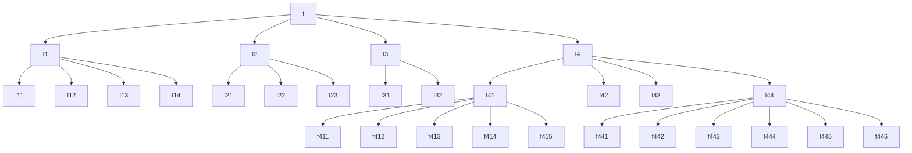
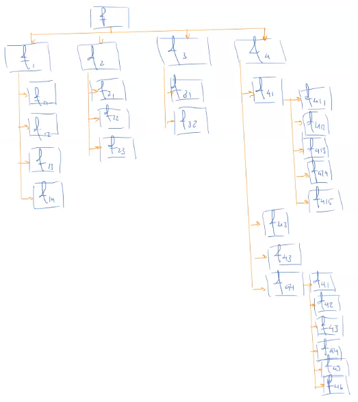
Esto acompañado de una explicación en la documentación es el modelo FBS

Cada hilera es un `nivel` en el sistema. Donde `f` es `Nivel 1`

# Relación funcional ($\text{IDEF-0}$)
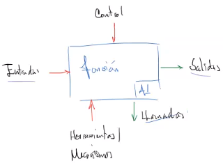
## Directrices
1. Al menos una entrada de control por función.
2. Cada nodo debe conformarse de 3 a 6 funciones.
3. El acomodo de funciones es en diagonal.
4. Emplear la nomenclatura y condiciones de formato establecida
	* Flechas, bloques, márgenes, marcos, etc.

## Elementos
### Entrada
La entrada de la función
### Control
Son variables que van a modificar la transformación
### Salidas
Son las salidas de la transformación
### Llamadas
Son las señales que van a otras funciones
### Herramientas/mecanismos
Importante.
Es el vínculo entre la arquitectura funcional y la física.

## Formato
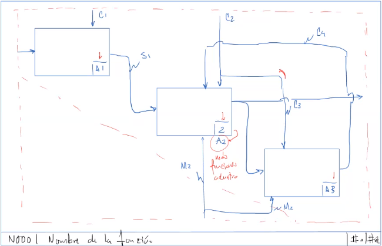
* Los rayitos son para poner etiqueta.
* Las etiquetas sin rayito sólo se pueden poner desde el marco.
* Puede haber varias salidas.
* Puede tener retroalimentación

## Multinivel
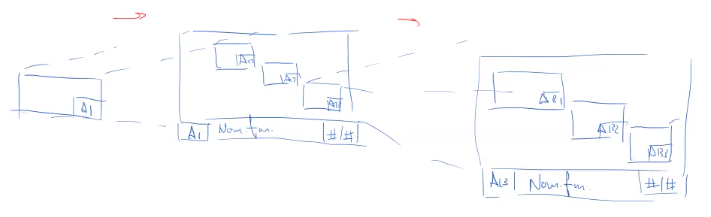
Los diagramas se van detallando por niveles, la profundidad de estos niveles son los mismos que el diagrama FBS.

## Ejemplo (muy simplificado)
Función general:
* `f` Mantener la temperatura del café
	* `f1` Medir la temperatura.
	* `f2` Controlar la temperatura.
	* `f3` Generar energía térmica.
	* `f4` Contener el café.

### FBS
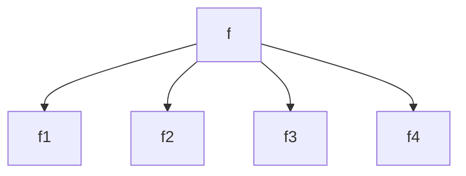
### IDEF-0
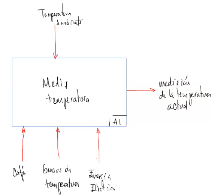
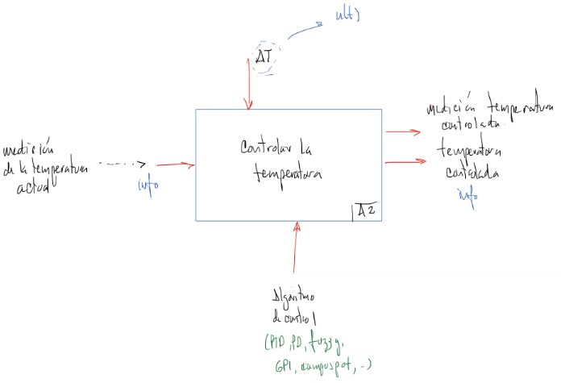
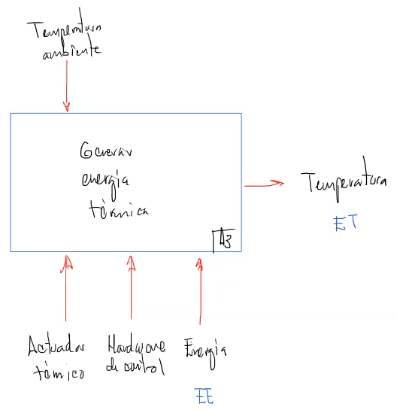
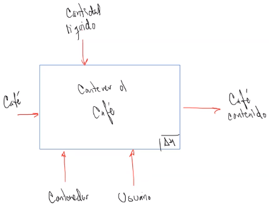
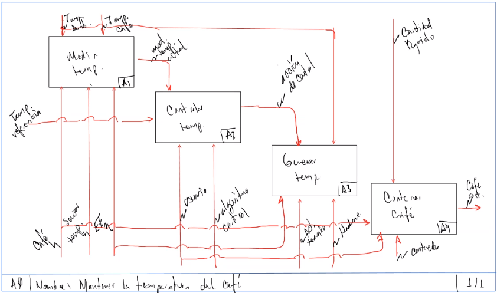
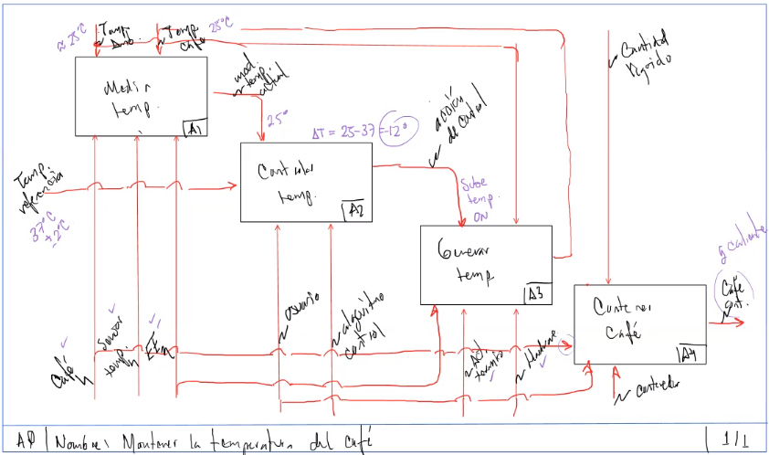
