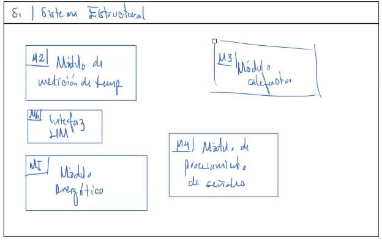
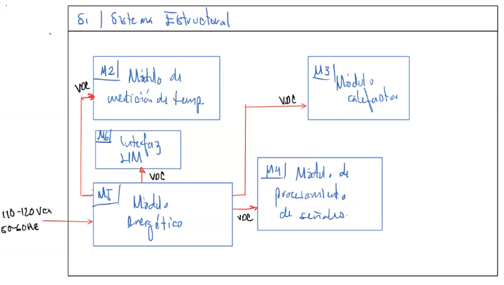
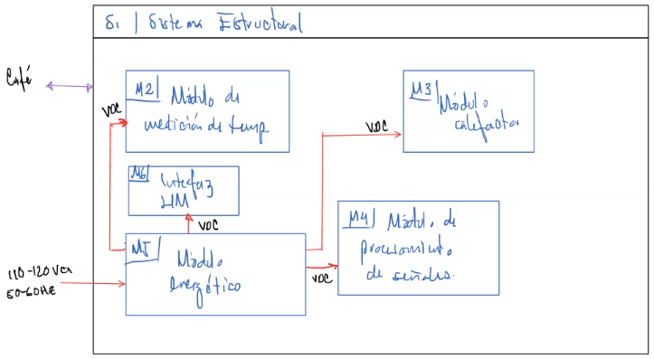
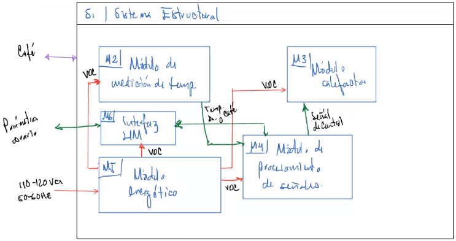

Es una representación del sistema físico (representa conexiones físicas), agrupado en módulos y sistemas.

Comúnmente se emplea un diagrama a bloques, sigue respetando el tipo de entrada-salida, es decir, energía, información y materia.

$$
\text{módulos}\begin{cases}
\text{una función}\\
\text{pocas funciones}\\
\end{cases}\qquad \text{sistemas}\begin{cases}
\text{módulos}\\
\end{cases}
$$

# Se piensan los módulos y sistemas

# Se añaden las señales de E

# Se añaden las señales de M

# Se añaden las señales de I
