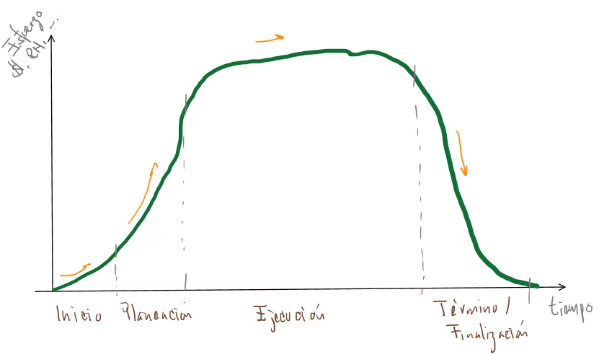
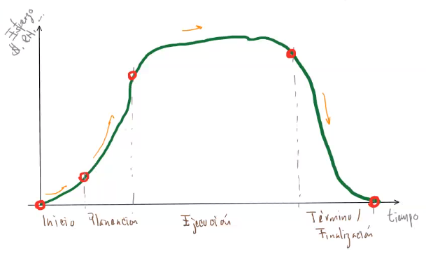
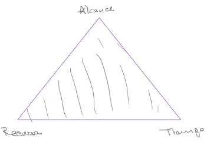
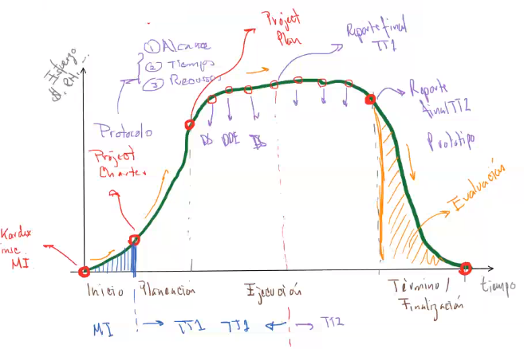

Ciclo de vida de un proyecto

# Proyecto + Integración
**Proyecto:** Un proyecto es un esfuerzo temporal que se lleva a cabo para crear un producto, servicio o resultado único.

El `Project Management Institute` (`PMI`) es una de las principales asociaciones profesionales de la gestión de proyectos en el mundo. Fue fundada en 1969 en Estados Unidos de América y se ha expandido a más de 214 países. 

Tiene un libro llamado [PMBOK](http://amzn.to/2u0QoLW) y una certificación [PMP](http://www.pmoinformatica.com/2020/06/la-certificacion-pmp-internacional-2020.html). Dicha certificación es muy valiosa pues te certifica como un profesional en la gestión de proyectos y existe una tabla donde se enlistan los salarios que tienen los profesionistas en distintos países con el `PMP`. Y en México sin PMP puede ser de 20,000 MXN y con PMP de 70,000 MXN.

## Ciclo de vida de un proyecto

La pendiente de subida es empinada, pero la de bajada lo es más.

Cada proyecto tiene puntos de medición en cada una de las etapas que sirven para medir el avance.

Estos puntos son `entregables`.

**Entregable:** Son elementos tangibles atemporales que sirven para medir avances.

Un entregable puede ser, prototipo, documentación, examen, etc.
Cuando el proyecto es intangible, un entregable puede ser un reporte.

**Protocolo:** Es un entregable también denominado `Project Charter`, que involucra la denición del `alcance`, `tiempo` y los `recursos`.

* **Alcance:**
	* Objetivos
	* Requerimientos
* **Tiempo:**
	* Inicio
	* Fin
	* $\uparrow$ Periodo
* **Recursos:**
	* Recursos Humanos
	* Recursos Materiales
	* Recursos Financieros

La relación que existe entre ellos es la calidad, sí disminuye alguno de ellos disminuye la calidad.

**Proyect Plan:** Incluye plan de riesgos, actividades

## Ejemplo para TT
