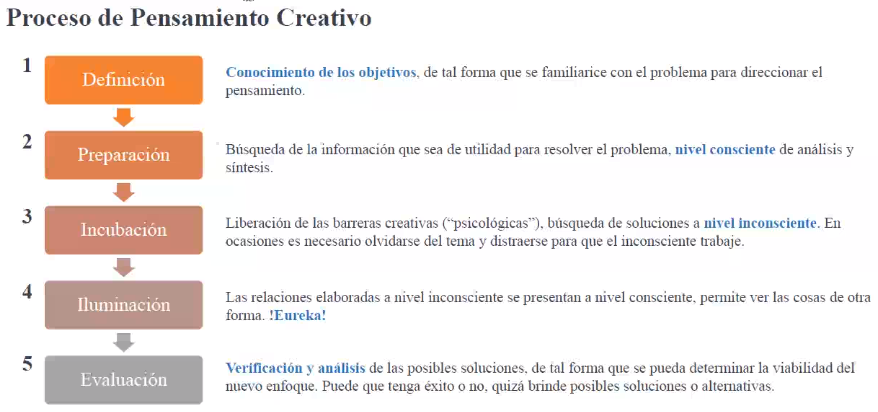
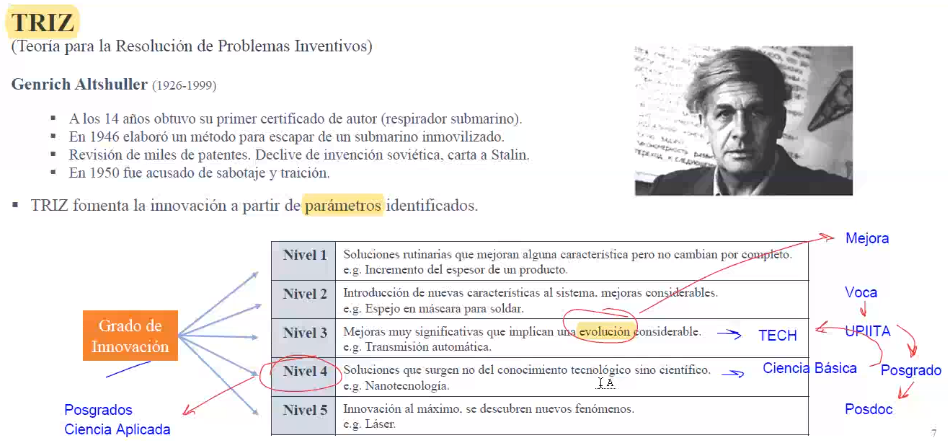
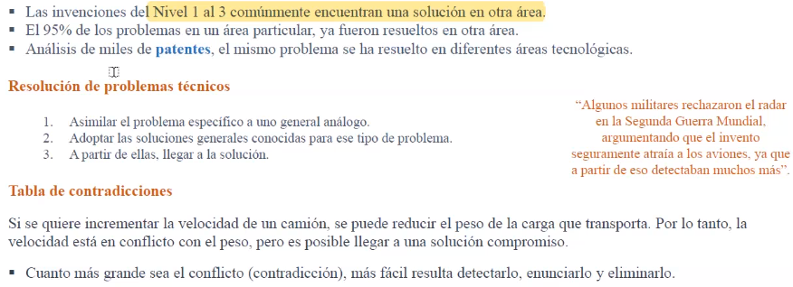
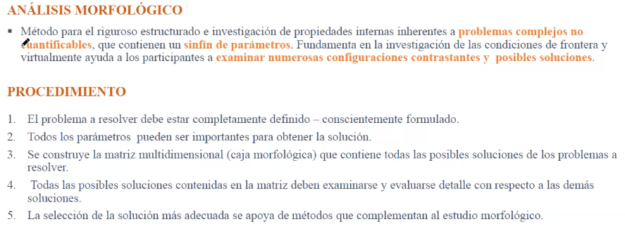
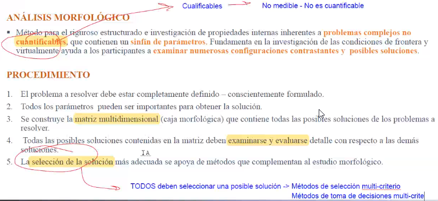
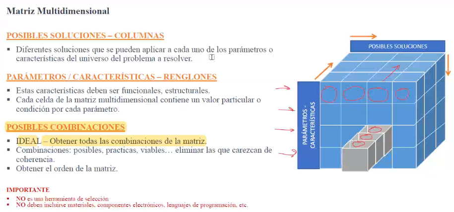
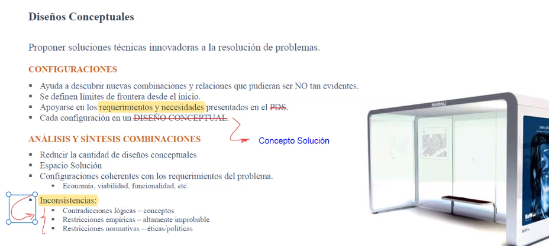

El concepto solución NO es lo mismo que la `conceptualización` o el `diseño conceptual`.

Es un `bosquejo` de la palpable solución a un problema en ingeniería. Esto significa que `no tiene detalle` y trata `generalidades`, busca el `Qué debe hacer?` y NO el `Con qué?`.

# Proceso creativo

# Estrategias
## Lluvia de ideas (Brainstorming)
* Lo mejor es cuando son varías personas con puntos de vista muy diferentes.
* No se permiten críticas... incluyendo "constructivas".
* Mayor cantidad de ideas, sin importar la calidad.

### Pasos
1. Agrupación de 7 a 12 personas, de diversa procedencia y sin un conocimiento experto del tema. El espacio debe ser creativo (donde nos sintamos tranquilos).
2. Sin orden, formular ideas referentes a la posible solución del problema. Puede apoyarse de esbozos, trazos o sentencias.
3. Evaluación de ideas, comparando con los objetivos del problema.

## Mapas mentales
Características de un buen mapa mental:
* Muy poco texto, (bosquejos, imagenes, etc.)

## TRIZ
Teoría para la resolución de problemas inventivos.

## Análisis Morfológico
Es un método asociado para buscar soluciones multidimensionales, orientado a estructurar todas las relaciones contenidas en un espacio multidimensional, no cuantificable y problemas complejos.

# Diseño conceptual
Proponer soluciones técnicas innovadoras a la resolución de problemas.

# Software
* Sketchbook pro