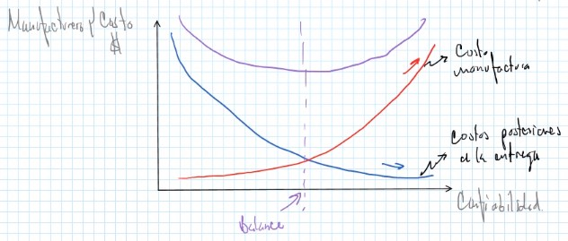
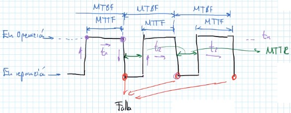
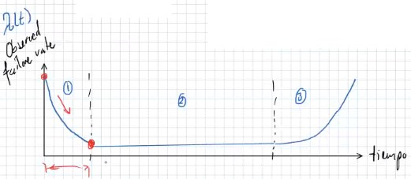
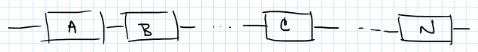
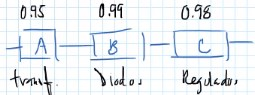
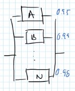
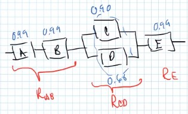

Desarrollar la confiabilidad de un sistema hace que un sistema sea robusto, que el sistema pueda aguantar cargas sin dejar de realizar sus funciones. Por eso, la confiabilidad está relacionada con la **falla**.

**Confiabilidad (Reliability)** es la probabilidad de que exista alguna falla durante un periodo de tiempo establecido.

Existen normas de diseño pensadas en confiabilidad **DFR** (**Design For Reliability**)

En general la confiabilidad $R(t)$ depende del índice de falla y la duración de la prueba.

Se basa en el **FMEA** $\rightarrow$ **Failure Mode and Effect Analysis**.

La confiabilidad se relaciona con las **causas**, **distribución** y **predicción** de **fallas**.

**Falla** es el **término** de la habilidad del un componente o sistema para **realizar su función**.

El **Failure Rate** se expresa como $\lambda(t)$, representa la ocurrencia de las fallas.

Donde:
**MTTF**: Mean time to fail, es el tiempo promedio de operaciones sin fallas.
**MTBF**: Mean time between failures, es el tiempo promedio entre los que ocurren las fallas.
**MTTR**: Mean time to repair, es el tiempo promedio para reparar la falla.

$$
\text{MTTF} + \text{MTTR} = \text{MTBF}
$$

1. Periodo de fallas tempranas $\rightarrow$ Imperfecciones por manufactura
2. Periodo de índice constante de fallas
3. Periodo de fallas graves (desgaste)

Tomando todo esto en cuenta, la confiabilidad se define como:

$$
\boxed{R(t) = \frac{Ns(t)}{N_0}}
$$

Donde:
$Ns(t)$: Componentes que sobreviven
$N_0$: Total de componentes sujetos a prueba

#### Ejemplo
Se hace una prueba de una PCB, con cargas eléctricas en un cierto tiempo

$$
N_0 = 300 \text{ PCB}
$$

$$
Ns(t) = 220 \text{ PCB}
$$

$$
R(t) = 73.33\%
$$

$$
\square
$$

Ahora bien para el Failure Rate:

$$
\lambda = \frac{d}{dt}\frac{Ns(t)}{N_0}
$$

$$
\boxed{R(t) = e^{-\lambda t}}
$$

$$
\text{MTBF} = \frac{1}{\lambda(t)} = \theta
$$

$$
\boxed{R(t) = e^{-\frac{t}{\theta}}}
$$

#### Ejemplo

Se tienen $12,500$ motores de autos, tienen un tiempo de vida continua de $125,000$ horas de funcionamiento. ¿Qué probabilidad existe de que un motor soporte un viaje de CDMX a la Patagonia?

Distancia = $8,762$ km
v = $100$ km/h
tiempo = $877.62$ h

$$
\text{MTBF} = 125,000\ h
$$

$$
\begin{aligned}
R(t) &= e^{-\frac{t}{\theta}} = e^{-\frac{8762}{125000}} = 0.999299\\
&= 99.9299\%
\end{aligned}
$$

### Componentes en serie
Si el componente falla, se ocasiona la falla del sistema.

$$
\boxed{R_T = R_A R_B R_C\ldots R_N}
$$

#### Ejemplo

$$
R_T = (0.95)(0.99)(0.98) = 0.92169
$$

Por lo tanto la confiabilidad por lo general baja con componentes en serie.

### Componentes en paralelo
La falla del componente no genera la falla del sistema

$$
\boxed{R_T = 1 - (1-R_A)(1-R_B)\ldots(1-R_N)}
$$

#### Ejemplo

$$
R_T = 1 - (0.05)(0.01)(0.02) = 0.99996
$$

Por lo tanto en general la confiabilidad incrementa con componentes en paralelo.

En confiabilidad con componentes en paralelo se aplica **redundancia**.

**Redundancia**: Es cuando se tiene más de un componente que realiza la misma función (e.g. la bateria de una laptop conectada con el eliminador y con un no break).

#### Ejercicio

$$
\begin{aligned}
    R_T &= R_A R_B (1 - (1-R_C)(1-R_D))R_E = 0.99^3(1 - (0.1)(0.4))\\
    &= 0.93 \rightarrow 93\%
\end{aligned}
$$

