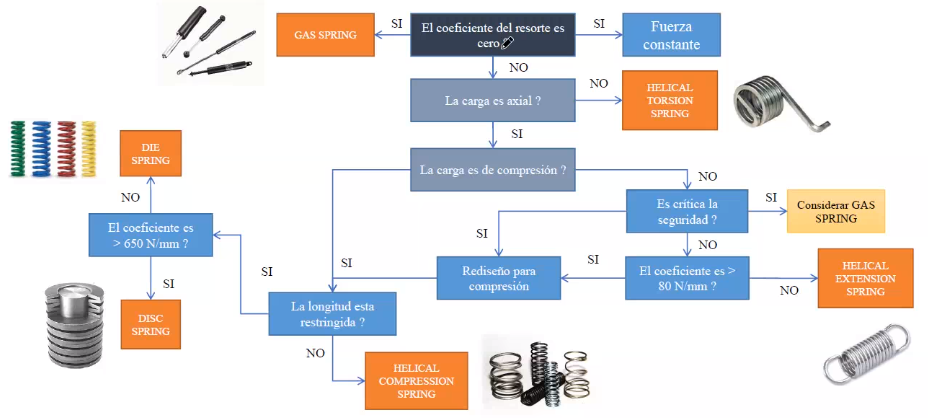

# Se determinan los componentes

# Se determinan que componentes se `diseñan` o se `seleccionan`

# Se determina el área de conocimiento requerida

# Se diseña con los métodos necesarios
## Diseño mecánico

Machinery's Handbook
* Mecanismo corona in fin
	* Diseño de la corona
	Qué metodo se aplica?
		* Modelo: cuerpo libre
			* Expresiones matemáticas
		* Validación:
			* Análisis por resistencia
			* Análisis por rigidez
			* Análisis de fatiga
			* Análisis modal
			* Análisis de interferencias
			* Análisis de fabricación
		* Diseño del sin fín
		* Selección de rodamientos
		* Diseño de eje A
			Qué método se emplea?
		* Diseño de eje B
		* Diseño soportes
		
## Diseño eléctrico
## Diseño informático
# Se seleccionan los componentes pertinentes

Para seleccionar componentes es importante enfocarse principalmente en las `funciones` y después pensar en la `comercialización`.

Es importante tomar como base entonces en los siguientes criterios:
* Cálculos
* Funcionalidad
* Requerimientos: Los requerimientos se pueden ir añadiendo a la lista inicial, después se convertirán en las especificaciones técnicas.

## Diagrama de ruta 
Va asociada a el funcionamiento del componente.

## Procedimiento
1. Recopilar información de la aplicación `Requerimientos`
2. Investigar con los fabricantes-proveedores de las familias y características de los componentes.
	1. Investigar el `método de selección` que recomienda el fabricante.
	2. Si existe, emplear el método del fabricante (el que sea el `más claro`).
		1. Buscar componentes similares de `otras marcas`.
		2. `Seleccionar` al menos `otros 2`.
	3. Si no existe, buscar en bases de datos especializadas.
		1. Utilizar `filtros` y documentar:
			1. `Número inicial de componentes`.
			2. `Filtros`, indicando `rangos`.
			3. `Número final de componentes`.
3. Aplicar un método de `selección multicriterio` tomando en cuenta los criterios de `costos`,`tiempos de entrega`, `disponibilidad`, etc (no funcionales).

## Páginas web
* [Mouser](https://www.mouser.com/)
* [Newark](https://mexico.newark.com/)
* [Automation Direct](https://www.automationdirect.com/adc/home/home)
* [McMaster-CARR](https://www.mcmaster.com/)

# Selección de materiales
Es de suma importancia en el diseño, pues una mala elección de estos pueden implicar `fallas` y `costos` innecesarios.

* Incremento Costo de Manufactura
* Incremento tiempo de Manufactura
* Cambio de propiedades del material - cambio de procesos de manufactura
* Afecciones en rendimiento

La selección debe ir paralela al proceso de diseño.

Para esto debemos pasar de posibles materiales a un sólo material.

## Procedimiento
1. Definir las funciones para que cumpla el rendimiento
    * Traducirlas en propiedades de los materiales
    * Costo del Material y disponibilidad
2. Definir los requerimientos de manufactura
    * Parámetros como: cantidad de piezas, tamaño, complejidad, tolerancia, acabado. etc. 
3. Comparar las características en Bases de Datos.
    * Buscar propiedades que marquen un límite superior o inferior.
    * Preguntar: Este material cumple las características del diseño?
4. Investigar los candidatos
    * Más detalles de los materiales, marcas, costos, fabricación, procesado.
    * Verificar la disponibilidad en presentaciones, tamaño, ventas.
    * Aplicar matrices de decisión.
5. Pruebas y estándares
    * En ocasiones es necesario validar el material definiendo ciertas pruebas
    * Apoyarse en ATSM, ANSI, SAE y MIL

## Proceso de sustitución para un producto o diseño existente:
1. Definir las funciones para que cumpla el rendimiento
2. Definir qué características son importantes para el funcionamiento
    * `Características por mejorar`

    
## Importancia de los materiales de Ashvile

Materiales por función

Ashvile realizó una forma de elección de materiales, evaluando cada propiedad que obedece a una función:

El clasifica los materiales por clases, subclases, etc, hasta llegar a sus atributos:

# Selección de procesos
