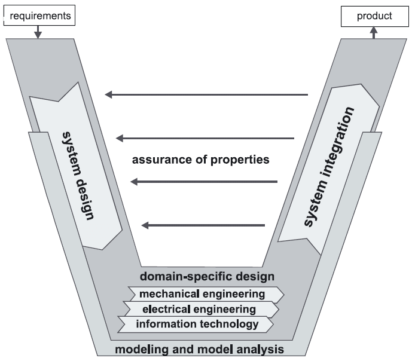
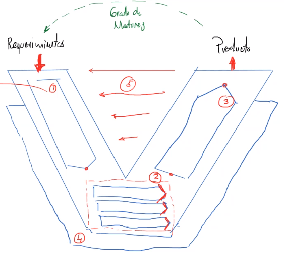
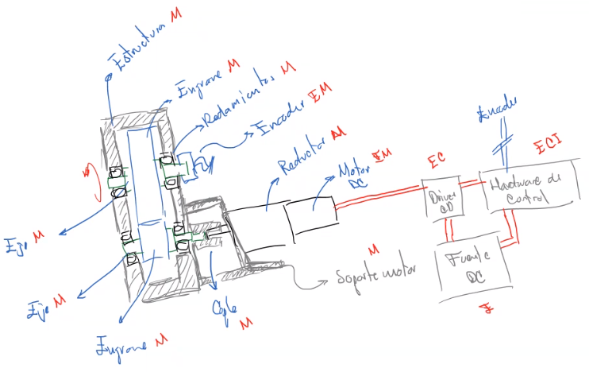
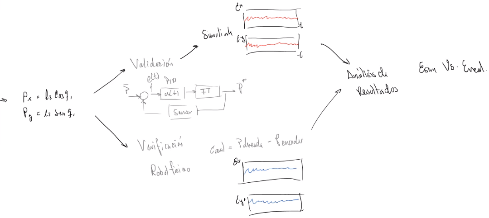

Diseño mecatrónico

Existen muchas metodologías pero la que se estudiará es:
# VDI - 2206
Guía para el diseño de productos mecatrónicos. Fue publicada en 2004 y es un estándar alemán, caracterizado por los números $2206$ y es dada por la *Asociación de Ingenieros Alemanes*.

La principal fuente de inspiración para estos modelos es el `Modelo de diseño V`. De aquí nacen varías vertientes.

Este estándar fue desarrollado como una convergencia de los estándares `VDI-2201` (orientado a sistemas informáticos) y el `VDI-2204` (orientado a teoría de sistemas).

Consta de
* 5 procesos / fases de diseño
* 1 - 3 secuenciales
* 4 - 5 transversales

# Ingeniería de requerimientos
Surgen a partir de las necesidades del sistema y antes de empezar a diseñar, se necesitan los requerimientos, por eso no están comprendidos como una etapa del diseño.
# 1 Diseño del sistema
En esta etapa el objetivo es obtener el `Concepto solución` y este será el primer entregable.

Es importante decir que el `CS` es una aproximación a la solución.

Aquí se genera:
* Arquitectura funcional
* Arquitectura física
	* Se divide el sistema en módulos y esos módulos en componentes.
* Proponer `Concepto solución` (`CS`)
* Seleccionar `CS`

# 2 Diseño del dominio específico
El objetivo es diseñar a nivel componente desde un enfoque disciplinar (MEIC). Es aquí donde están todas las áreas de aprendizaje de la ingeniería mecatrónica.

Aquí se genera un bosquejo a nivel componentes.
En esta etapa se tienen los detalles $E_{2 - n}$ que son los detalles de cada componente de cada módulo. Es decir rodamiento específico (6001Z), engrane (recto, M10, etc.), encoder (TSM-1024-2V).

Aquí se descartan y cambian lo que no funciona del `CS`.

# 3 Integración del sistema
1. Integración de hardware
En está etapa, nos damos cuenta que se necesita para integrar los componentes entre sí y los módulos entre sí. Un ejemplo de esto es que por ejemplo necesitemos diseñar un eje que va acoplado a otro módulo, entonces necesitamos integrar hardware con hardware.
2. Integración de software
Aquí se divide la lógica de comportamiento en estados. Como una máquina de estados finita. Donde se requieren ciertas condiciones para pasar al siguiente estado.

Es en esta parte donde se realiza el `prototipado` y `fabricación`.

Aquí se integran los componentes en módulos, cuándo ya funcionan integrados, ahora se integran los módulos en el sistema.

# 4 Análisis (simulación y modelado)
En esta etapa se representa todo mediante el modelo, esto para poder simularlo. Y estos dos se requieren para la siguiente fase.

Lo más importante aquí, es el análisis de la simulación, puesto que nos ahorra tiempo para no fabricar antes.

# 5 Aseguramiento de las propiedades
Aquí es donde se realiza la `validación` y `verificación`. Y también se implica que se puede regresar, en realidad esta no es la última etapa, sino la que está en cada parte del diseño. Podemos regresar hacia etapas anteriores.

La `validación` es por lo general númerica, entonces se apoya de métodos computacionales.

La `verificación` es física.
