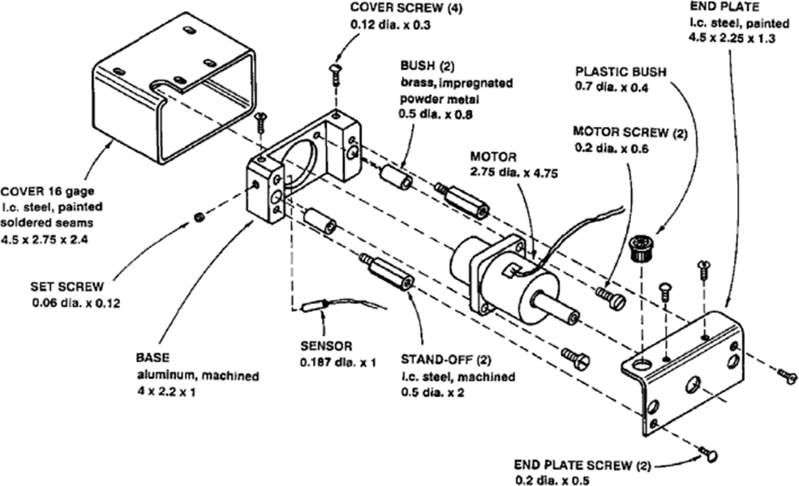
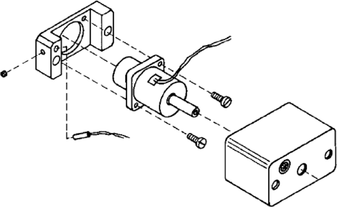

El **Diseño para la Manufactura y Ensamble DFMA** es la combinación de las características de las metodologías **DFM** y **DFA**.

**Diseño para la Manufactura DFM** (*Design for Manufacture*) es el diseño del producto para facilitar los procesos de manufactura para cada componente del producto.

**Diseño para el Ensamble DFA** (*Design for Assembly*) es el diseño del producto para facilitar el ensamble de cada uno de esos componentes.

Estas metodologías fueron propuestas en la industria por el *Dr. Boothroyd* y el *Dr. Dewhurst* en 1983. He incluso crearon una compañia con una marca registrada *DFMA*, esto debido a su gran alcance en la industria.

## Objetivos del *DFMA*
* Guía en el proceso concurrente de diseño para la simplificación estructural.
* Reducción de costos de manufactura y ensamble.
* Herramienta de mercadeo para estudiar los productos del competidor, cuantificando las dificultades de manufactura y ensamble.
* Herramienta de negociación.
* Facilitar las operaciones de Manufactura y Ensamble.
* Disminución de costos de Inversión.
* Optimización del uso de las herramientas y equipos de manufactura y ensamble.
* Incrementa la flexibilidad en la manufactura.
* Disminución del tiempo de introducción en el mercado.
* Disminución de los almacenajes intermedios.

## *DFMA* en el diseño concurrente
El *DFMA* sólo puede ser implementado en la etapa de Integración en el proceso de diseño de un producto mecatrónico.

## Procedimiento
### Definir el número mínimo teórico de componentes del sistema
Se debe buscar siempre reducir la cantidad de componentes, y siempre se debe **dar prioridad al ensamble**.

Para esto, hace falta hacerse los siguientes cuestionamientos:

* Durante la operación del producto, el componente tiene un movimiento relativocon los demás componentes ya ensamblados?

    Únicamente deben considerarse los grandes movimientos.

* El componente debe ser de un material diferente a de los demás componentesya ensamblados? (Con los que se relaciona)

    Únicamente razones fundamentadas en las propiedades de los materiales y laaplicación deben considerarse.

* El componente debe separarse de los demás componentes ya ensambladosdebido a que de otra forma el ensamble o desensamble no podría realizarse?

    Considerar las dificultades que se pueden presentar para ensamblar, como puedeser el acceso para los ensambles.

### Secuencia de ensamble
Se debe siempre buscar minimizar el tiempo. Para esoto primero debemos buscar quitar todas las operaciones de reorientación, pues quitan tiempo que pueden no ser necesarios.

#### Antes de DFMA

| COMPONENTE                   | CANTIDAD | CANTIDAD TEÓRICA | TIEMPO DE ENSAMBLE (S) | COSTO ENSAMBLE (¢) |
|------------------------------|----------|------------------|------------------------|--------------------|
| BASE                         | 1        | 1                | 3.5                    | 2.9                |
| BUJES                        | 2        | 0                | 12.3                   | 10.2               |
| SUB‐ENSAMBLE MOTOR           | 1        | 1                | 9.5                    | 7.9                |
| TORNILLOS MOTOR              | 2        | 0                | 21                     | 17.5               |
| SUB‐ENSAMBLE SENSOR          | 1        | 1                | 8.5                    | 7.1                |
| OPRESOR                      | 1        | 0                | 10.6                   | 8.8                |
| SOPORTES LATERALES           | 2        | 0                | 16                     | 13.3               |
| TAPA DE LA CARCAZA           | 1        | 1                | 8.4                    | 7                  |
| TORNILLOS TAPA DE LA CARCAZA | 2        | 0                | 16.6                   | 13.8               |
| TAPA PLÁSTICA                | 1        | 0                | 3.5                    | 2.9                |
| REORIENTACIÓN                | ‐        | ‐                | 4.5                    | 3.8                |
| CARCAZA                      | 1        | 0                | 9.4                    | 7.9                |
| TORNILLOS CARCAZA            | 4        | 0                | 31.2                   | 26                 |
| TOTAL                        | 19       | 4                | 160                    | 133                |

Se realizan cada una de las consideraciones expresadas en el criterio descrito con anterioridad a todoslos componentes del dispositivo de desplazamiento:
1. **Base**: debido a que es el primer componente por ensamblar, en teoría es un componente necesario.
2. **Bujes (2)**: No satisfacen el criterio, ya que teóricamente la base y los bujes pudieran ser del mismomaterial.
3. **Motor**: No puede cambiarse debido a que no se esta diseñando, y es el componente funcional.
4. **Tornillos del Motor (2)**: No se aplica el criterio ya que dependen de la adecuada sujeción del motor.
5. **Sensor**: No puede considerarse como componente separado debido a la funcionalidad del sensado.
6. **Opresor lateral**: en teoría no es necesario.
7. **Soportes laterales (2)**: No cumplen el criterio, pudieran incorporarse a la base.
8. **Tapa de la carcaza**: Debe separarse por razones de ensamble de los componentes.
9. **Tornillos Tapa de carcaza (2)**: en teoría no son necesarios.
10. **Tapa plástica para cables**: pudieran ser del mismo material que la tapa de la carcaza.
11. **Carcaza**: Pudiera combinarse con la tapa de la carcaza.
12. **Tornillos Carcaza (4)**: en teoría no son necesarios.

#### Después de DFMA

| COMPONENTE          | CANTIDAD | CANTIDAD TEÓRICA | TIEMPO DE ENSAMBLE (S) | COSTO ENSAMBLE (¢) |
|---------------------|----------|------------------|------------------------|--------------------|
| BASE                | 1        | 1                | 3.5                    | 2.9                |
| SUB‐ENSAMBLE MOTOR  | 1        | 1                | 4.5                    | 3.8                |
| TORNILLOS MOTOR     | 2        | 0                | 12                     | 10                 |
| SUB‐ENSAMBLE SENSOR | 1        | 1                | 8.5                    | 7.1                |
| OPRESOR             | 1        | 0                | 8.5                    | 7.1                |
| CARCAZA PLÁSTICA    | 1        | 0                | 4                      | 3.3                |
| TOTAL               | 6        | 3                | 41                     | 34.2               |

#### Análisis y negociación

|| Caso 1 | Caso 2 |
| -              | ------  | ------   |
| T. de ensamble | $160s$  | $41s$    |
| C. de ensamble | $1.33¢$ | $0.342¢$ |

Suponemos una producción semanal de $5000$ sistemas:

|| Caso 1 | Caso 2 |
| -        | ------         | ------        |
| T. total | $222.22$ horas | $56.94$ horas |

$$
\text{Tiempo de ahorro} = \boxed{165.28\ \text{horas}}
$$

Considerando la jornada laboral:
* $8$ horas/turno
* $3$ personas por día = 24 horas
* $6.88$ días de ahorro

Sí el salario de un obrero es de \$$2,216$/semana el costo total por semana es de \$$6,650$/semana

Por lo tanto:

$$
\begin{aligned}
\text{Costo de ahorro semanal} &= 4,940\ \text{USD}\\
\text{Costo de ahorro anual} &= \boxed{256,880\ \text{USD}}\\
\end{aligned}
$$

Ahora bien, calculando la ganancia produciendo, se calculan el número de piezas extra que se pueden ensamblar:

$$
\text{Piezas extra} = 14512.39\ \text{pza}
$$

Considerando una ganancia por sistema de $\$0.50$

$$
\begin{aligned}
\text{Ganancia extra semanal} &= 7,256\ \text{USD}\\
\text{Ganancia extra anual} &= \boxed{377,312\ \text{USD}}
\end{aligned}
$$

### Razones para no aplicar *DFMA*
* **Sin Tiempo**: en ocasiones los diseñadores no cuentan con el tiempo adecuado para el desarrollo delproyecto de tal forma que logren implementar *DFMA*, aunque ese tiempo es completamenteaconsejable.
* **Costos reducidos de ensamble**: cuando los productos por su aplicación y diseño con cuentan conmuchos componentes.
* **Reducido volumen**: cuando la cantidad de productos que se realizan son reducidos y decomplejidad mínima.

### Ventajas del *DFA* para ensamble manual
* Proporcionar al diseñador una herramienta que le permita considerar la complejidad de los ensambles del producto en las etapas previas de diseño.
* Orientar al diseñador para simplificar el producto, reduciendo los costos de ensamble y de componentes.
* La administración de la información a partir de los diseñadores experimentados,  permitirá  a  los  diseñadores  con  menor experiencia disminuir los errores de diseño.
* Establecer una base de datos donde se consideren los tiempos desensamble y los factores que influyen en el costo de diversos diseños en diversas situaciones y condiciones de producción.
