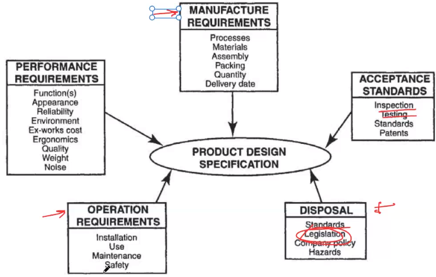

# Necesidad
Desde el punto de vista sistemas:
La necesidad es el resultado de una `transformación formal` de uno o más conceptos de una entidad a una `expectativa`, de tal forma que, satisfaga con las `funcionalidades` o procesos para cumplir cierta `calidad`.

La `expectativa` siempre va ligado a la `calidad`.

Desde el punto de vista de la ingeniería:
Es una definición `ambigua` de lo que se quiere (Perspectiva del que necesita).

# Requerimientos
Los requerimientos `no` son lo mismo que `especificación` en general. Los requerimientos son `especificaciones de diseño`.

Son los `datos técnicos`, con los que se llevará a cabo la `transformación` que llevará a cabo la máquina.

Para obtener un requerimiento es necesario, `caracterizar` el producto de salida.

Cuándo se definen requerimientos, se define entonces la `calidad`.

Según la ingeniería de procesos:
El requerimiento es el resultado de la transformación formal de una o más `necesidades` para una entidad que debe `cumplir funciones` con un `rendimiento espefífico` (`calidad`).

## Características de los requerimientos
1. Necesario $\rightarrow$ transforma necesidad.
2. Singular $\rightarrow$ único (cada necesidad puede tener varios requerimientos).
3. Correcto $\rightarrow$ Represente la necesidad.
4. No ambiguo $\rightarrow$ Rangos (medible)
5. Factible $\rightarrow$ Se puede lograr con la tecnología que existe.
6. De nivel apropiado $\rightarrow$ Sistema, módulo.
7. Completo $\rightarrow$ No necesita otra explicación.
8. Conformado $\rightarrow$ estructurado estándar.
9. Verificable $\rightarrow$ Comprobar su cumplimiento cuando tenga el sistema.

## Ejemplo: Máquina de tortillas

$$
\begin{matrix}
\text{Necesidad}&\text{Requerimiento}&\text{Especificación técnica}\\
N_1 \rightarrow&R_1:&60\leq\phi_t\leq62 mm\\
N_2 \rightarrow&R_2:&0.5\leq e_t\leq 0.8 mm\\
N_3 \rightarrow&R_3:&70\leq T_c\leq 80 \degree C\\
N_3 \rightarrow&R_4:&10\leq t_c\leq 12 s\\
\end{matrix}
$$

Por lo general, hay más requerimientos que necesidades.

# Identificar una necesidad
1. Identificar el problema $\rightarrow$ Falta de agua
	* Quién tiene el problema?
	* Qué es el problema en si?
	* Qué factores contextuales son importantes?
	* Qué efectos adversos se deben evitar?
	* Qué acciones son admisibles? (Reestricciones)

# Definición de requerimientos
Los requerimientos son **rangos**. Cuándo son límites que no están acotados de ambos lados, formalmente se llaman **restricciones**.

# Matriz de trazabilidad de requerimientos
||$R_1$|$R_2$|$R_3$|$R_4$|$R_5$|
|-|-|-|-|-|-|
|$N_1$|$\checkmark$|$\checkmark$||||
|$N_2$|||$\checkmark$|||
|$N_3$||||$\checkmark$|$\checkmark$|
