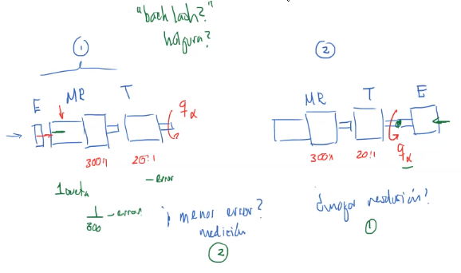
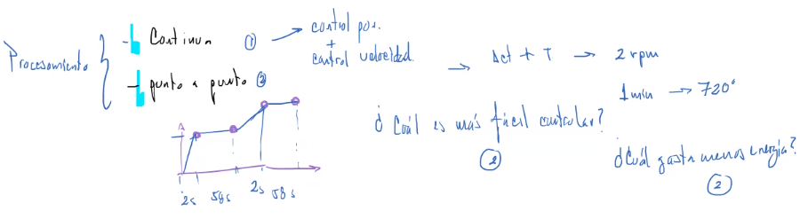

Existen varios métodos, entre ellos:
* Matrices ponderadas
	* Matrices binarias
* AHP - Analytical Hierarchy Process
* Redes neuronales

Todas estas tienen en cuenta un conjunto de criterios y estos son propuestos por el diseñador. Y pueden estar mal o bien propuestos. Si están mal generan duda y si están bien incrementan la probabilidad de éxito.

Los criterios deben tener las siguientes características:
* No deben ser ambiguos
* No deben generar duda

# AHP (Saatey)
## 1. Proponer y definir los criterios
* Hay que generar una `cantidad` suficiente que me permita evaluar toda la funcionalidad del sistema.
	* Para esto se utiliza como base la Arquitectura funcional (FBS, IDEF-0).
* El planteamiento de los criterios debe estar basado en `fuentes formales`
	* referencias
	* métodos
	* Herramientas
	* Casos de estudio
	* Experimentos
	
## 2. Generar el vector de prioridad de los criterios y normalizarlo

$$
\omega = [\omega_1\ \omega_2\ \ldots\ \omega_n]T
$$

Para $n$ criterios y $|\omega|$ normalizar el vector

Se define una escala de comparación, Saatey propone de 9 niveles de la siguiente forma:
$1$. Igual de importante
$3$. Ligeramente importante
$5$. Un poco más
$7$. Significativamente más
$9$. Mucho más importante

El profesor Diego Flores, en su tesis doctoral propone 5 nivles:
$1$. Igual de importante
$3$. Más importante
$5$. Significativamente más importante

## 3. Generar el vector de soluciones

$$
s_1 = \omega_1 v_1 + \omega_2 v_2 + \ldots + \omega_n v_n
$$

# Ejemplo
Sistema seguidor solar, Robot de 2 GDL
Funciones:
* Generar movimiento azimutal $\to$ `Módulo azimutal`
* Generar movimiento de elevación $\to$ `Módulo elevación`
* Generar trayectoria solar $\to$ `Módulo de procesamiento`
* Almacenar energía $\to$ `Módulo energético`

## Generar concepto solución
`NO` se deben usar:
* Materiales
* Procesos
* Componentes

### Módulo azimutal
* actuadores
* mecanismos
	* rot $\to$ rot
		* Corona sin fin
		* Bandas
		* Cadenas/juntas
		* tren de engranes
	* rot $\to$ tras
		* cremallera
		* Biela manivela corredera
		* tornillo sin fin
	* autobloqueante?
* sensores
	* principios físicos
		* resistividad
		* capacitancia
		* inductancia
		* efecto Hall
		* óptico
	* acoplamiento
		* eje de movimiento (salida)
		* eje de transmisión (entrada)

E: Encoder
MR: Motoreductor
T: Transmisión

La transmisión siempre tiene un `backlash` o `holgura` que mete error en la medición.

* procesamiento
	* trayectoria continua $\to$ control de posición y velocidad
	* trayectoria punto a punto $\to$ control de posición
	* ubicación de hardware
		* En el GDL
		* Externo

Después se debe aplicar AHP para determinar cuáles de las opciones son mejores.

Los criterios de selección deben estar asociados a ingeniería.

