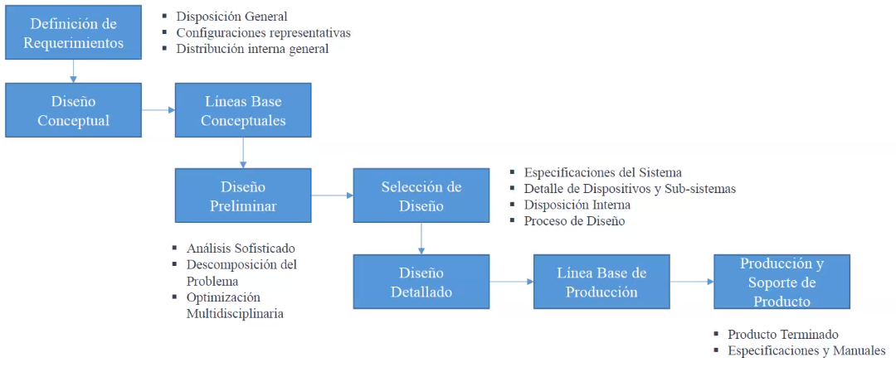
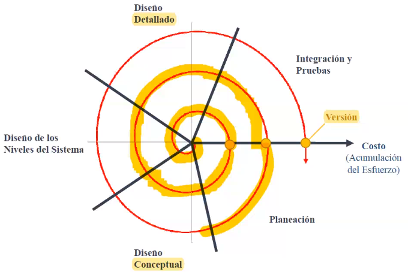
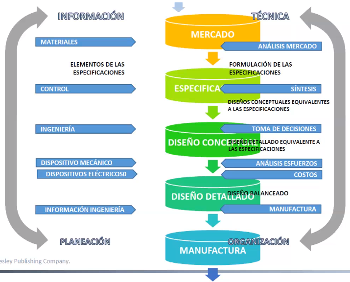
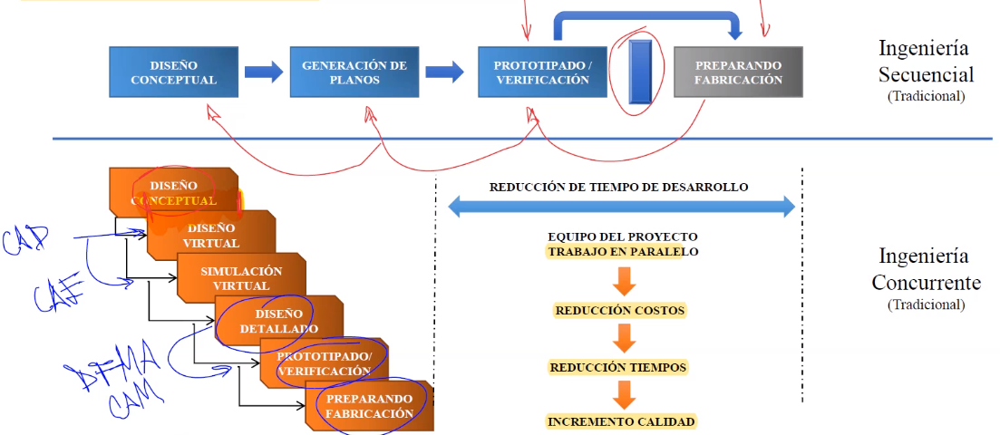
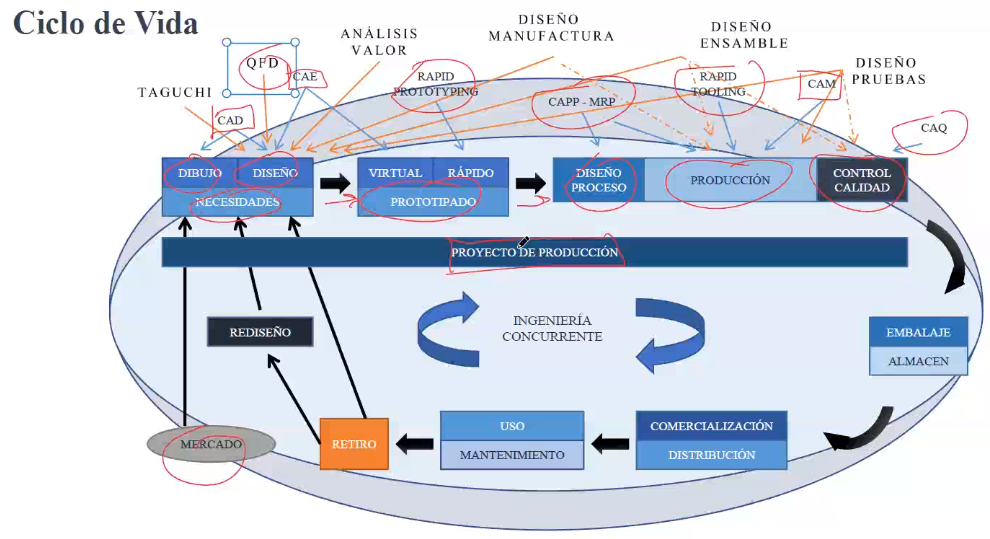

Es una actividad creativa, dominio funcional, solución física, dominio físico.

Actividad sistemática

El diseño de ingeniería es toda actividad necesaria para definir soluciones a problemas específicos que no se han podido resolver con anterioridad, o nuevas soluciones a problemas resueltos de diferente forma.

El ingeniero de diseño emplea su habilidad intelectual aplicando los conocimientos científicos y **asegurar que el producto satisface las necesidades del mercado**, así como las especificaciones necesarias de manufactura.

# Productos
## Producto artesanal
La mercancía es principalmente artística.

## Producto industrial
La mercancía es producida con el uso de maquinaria y tecnología en una fábrica, se realiza en un sistema productivo.

# Diseño industrial
* Producción en serie
* Mecanización
* Esteticismo
* Buen diseño
	* Estética
	* Sencillez
	* Seguridad
	* Compatibilidad
	* Normalización
	* Sensibilización de entorno
	* Eficacia
	* Economía
	* Eficacia energética
	* Facilidad de manufactura

# Fases típicas en el proceso de diseño

## Proceso de diseño en espiral

## Proceso de diseño total

# Principales habilidades y conocimientos
* Diseño de soluciones prácticas limitadas por los Requerimientos
* Esquemas de Diseño, Análisis, Manufactura, etc.
* Liderazgo en el manejo de equipos de trabajo, interacción entre Departamentos, negociación con clientes y proveedores, etc.
* Estudios de fiabilidad para futuros proyectos, análisis de costos y calidad de los Productos.
* Bosquejado, dibujo técnico y herramientas CAD
* Propiedades de los materiales y procesos de manufactura
* Aplicaciones de la Química – protección anti corrosión, recubrimientos
* Estática, dinámica, esfuerzos, cinemática y mecanismos
* Comunicación oral, comprensión de lectura, escritura técnica y habilidades de equipo
* Fundamentos de electricidad y control industrial
* Diseño de experimentos y pruebas de rendimiento de materiales y sistemas
* Creatividad, resolución de problemas y administración de proyectos
* Análisis de Esfuerzos
* Conocimiento especializado de elementos de máquinas (engranes, bandas, ejes, acoplamientos, sellos mecánicos, frenos, etc.)

# Ingeniería concurrente

# Niveles en el proceso de diseño
1. Empresarial
2. Administración de negocio: Ciclo de vida del producto.
3. Operación del negocio: Procesos en el ciclo de vida.
4. Sistemas
5. Sub-sistemas: Módulos y dispositivos.