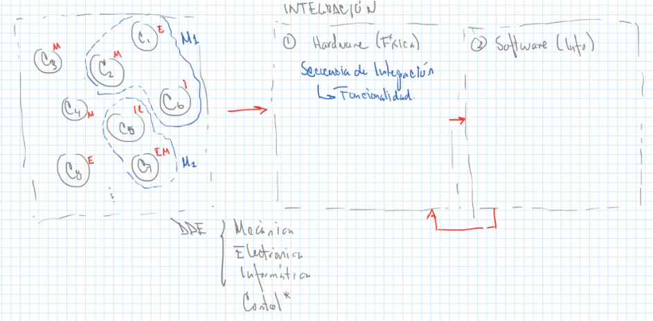
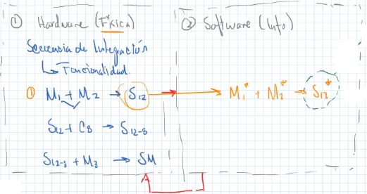
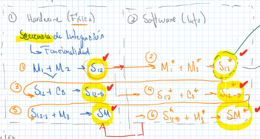

Primero se integra el hardware entre sí, para después integrar con el software, que necesitará regresar a modificar el hardware.

La integración debe ser sinérgica, es decir, no hay una división clara de disciplinas. Siempre busca la mejora.

Al integrar, se puede llegar a la conclusión de que se necesita diseñar un nuevo cmponente para integrar ambos módulos.

$$
\underbrace{M_1 + M_2 \to S{12}}_{\downarrow}
$$

* Diseñar un elemento de unión (Mecánico - Electrónico)
* Modificar piezas de $M_1$ y/0 $M_2$
* Seleccionar componentes nuevos o cambiar componentes

Al integrar se necesita realizar la validación computacional!

Por ejemplo:

$$
S_{12} \begin{cases}
    \text{Estructural (M)}\begin{cases}
        \text{Ensamble}\\
        \text{Interferencias}\\
        \text{Manufactura}\\
    \end{cases}\\
    \text{Electónica}\\
    \text{Dinámica (Cinética)}\\
    \qquad\quad\vdots
\end{cases}
$$

$$
S_{12}^*\begin{cases}
    \text{Estrategia de control}\\
    \text{Programación}\begin{cases}
        \text{Sincronización}\\
        \text{Secuencia}\\
    \qquad\quad\vdots
    \end{cases}\\
    \text{Modelos}\\
\end{cases}
$$

$$
\underbrace{S_{12}^*}_\text{computacional}\begin{cases}
    \text{Comportamiento del sistema}\\
    \text{Modelado multi cuerpo}
    \text{Control}\\
\end{cases}
$$

Esto se debe hacer para cáda integración de módulos.

1. Se integran por hardware
2. Se valida la integración del hardware
3. Se integra por software
4. Se valida la integración del software
5. Se procede al siguiente conjunto de módulos de hardware

Al acabar, se finaliza la integración y validación del sistema, o sea que queda listo :smiley:

## Software
* [vrep (Copelia SIM)](https://www.coppeliarobotics.com/)
