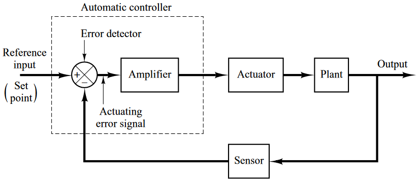
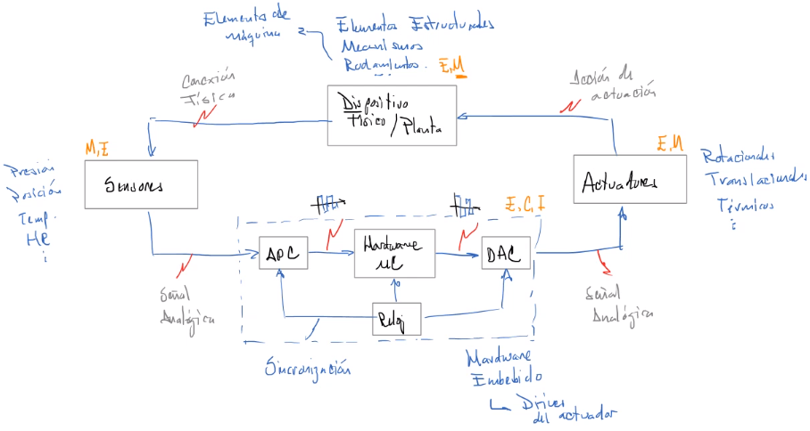

Un `sistema` es lo que resulta cuando un grupo de "cosas" se agrupa de una forma específica por una razón partícular.

### Definición
Sistema (Ingeniería de sistemas): Un conjunto de elementos (componentes) que interactúan entre ellos para lograr un propósito establecido.

## Tipos de sistemas
* Abiertos
* Cerrados
* Naturales
* Sintéticos
* Modificados por el hombre
* Físicos
* Conceptuales/Abstractos

## Jerarquía de sistemas
Puede haber sistemas dentro de otros sistemas que se compongan de múltiples sistemas. A estos sistemas se les conoce como `Systems of Systems (SoS)`.

De esos sistemas, se tiene el `System of Interest (SoI)`.

Un sistema, a su vez se compone de:

$$
\text{Sistema}\\
\downarrow\\
\text{Módulos}\\
\downarrow\\
\text{Ensambles}\\
\downarrow\\
\text{Componentes}\\
$$

Este tipo de diseño se llama `diseño convergente`.

### Ejemplo
Para un sistema péndulo:

Tiene los siguientes componentes:
* Motor
* Cople mecánico
* Rodamiento
* Soportes de Rodamiento
* Opresores
* Driver motor
* PCB control
* Encoder

De los cuáles podemos tener los siguientes ensambles:
* Ensamble de potencia
* Ensamble de la barra
* Masa
* Ensamble de control

Lo que hace de esto un módulo y no un sistema. Además porque tiene pocas funciones.

## Arquitectura de sistemas
La arquitectura de un sistema se compone de modelos del sistema.
Estos a su vez son representaciones de las funciones que el sistema debe desempeñar.
1. Arquitectura lógica/funcional: Representación de las funciones que el sistema debe desempeñar.
2. Arquitectura física: Representación de la interrelación de los componentes, módulos, sistemas a través de entradas y salidas.

* Una `función` es una transformación de entradas en salidas.
	* Transformación de materia
	* Transformación de energía
	* Transformación de información

## Herramientas de modelado
* FBS Functional Breakdown Structure
* IDEF-0 Integration Definition Modeling Function: Es un estándar que sirve para modelar la relación entre funciones (E/S). El puente entre arquitectura lógica y la arquitectura física.
* eFFBD 

## Diagrama de sistema mecatrónico
