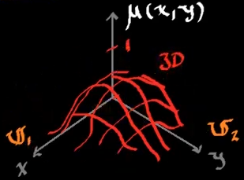

Una función de membresía bidimensional, es un par que está definido en 2 espacios de discurso independientes.

Las funciones membresía se vuelven el par ordenado siguiente:

$$
x \in \mathbb{U_1}\quad;\quad y\in\mathbb{U_2}
$$

$$
A = \left\{(x,y),\mu_{\mathbb{U}_1\times\mathbb{U}_2} | x \in \mathbb{U_1};y \in \mathbb{U_2}\right\}
$$

Para representar estas funciones, es necesario una gráfica en 3D.
