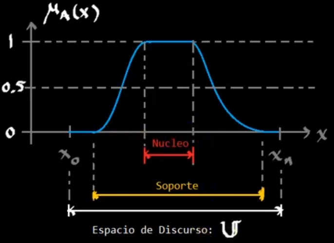
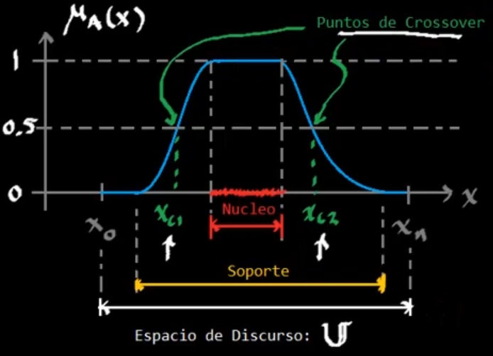
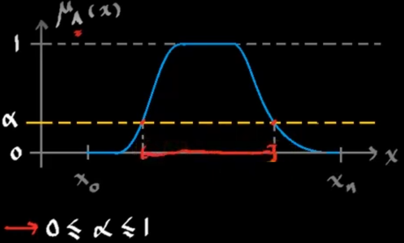
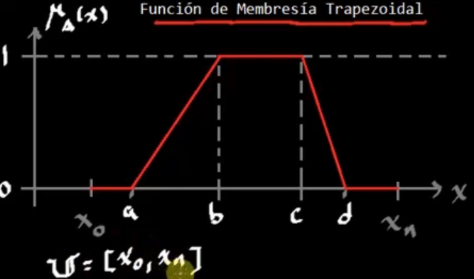
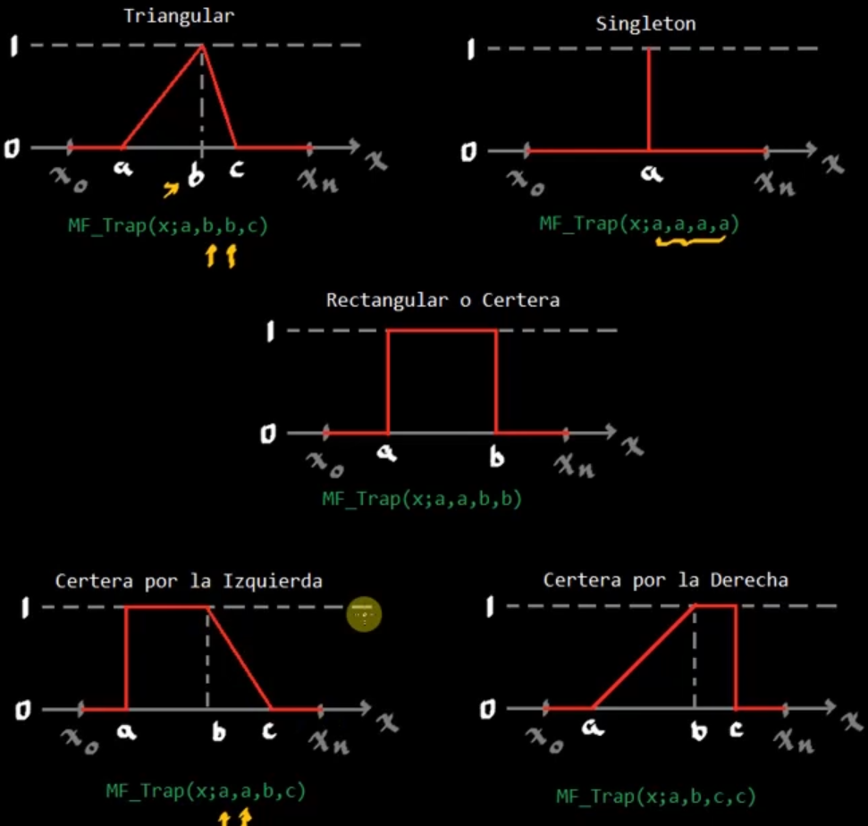
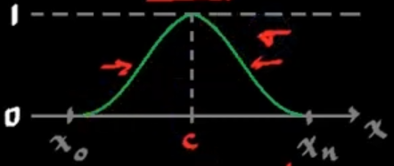
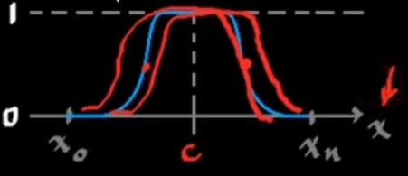
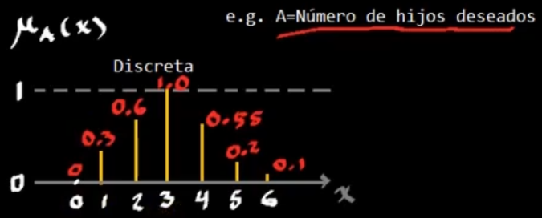

# Formulación y parametrización

## Soporte
Es un conjunto en el dominio y un subconjunto del espacio de discurso donde los valores de A son mayores a 0.

$$
\text{Soporte de }A = \left\{x\in\mathbb{U}|: \mu_A(x) > 0\right\}
$$

## Núcleo o Kernel
Es un conjunto en el dominio, un subconjunto del espacio de discurso y un subconjunto del soporte, donde los valores de A son 1.

$$
\text{Núcleo de }A = \left\{x\in\mathbb{U}|: \mu_A(x) = 1\right\}
$$

## Puntos de crossover
Son los puntos en la función de membresía donde $\mu(x) = 0.5$

$$
\text{Puntos de crossover} = \left\{x_{C1},x_{C2}\in\mathbb{U}|: \mu_A(x_{C1}) = \mu_A(x_{C2}) = 0.5\right\}
$$

## Corte $\alpha$

$$
A_\alpha = \left\{x\in\mathbb{U}|: \mu_A(x) \geq \alpha \right\}
$$

## Corte $\alpha$ fuerte

$$
A_\alpha = \left\{x\in\mathbb{U}|: \mu_A(x) > \alpha \right\}
$$

# Funciones de membresía unidimensionales
## Dominios continuos
### Trapezoidal

$$
\mu_A(x) = \begin{cases}
0&x<a\\
\\
\dfrac{x-a}{b-a}&a\leq x<b\\
\\
1&b\leq x\leq c\\
\\
\dfrac{d-x}{d-c}&c< x\leq d\\
\\
0&x>d\\
\end{cases}
$$

$$
\mu_A(x) = \text{MF\_TRAP}(x;a,b,c,d)
$$

### Gaussiana

$$
\mu_A(x) = e^{\frac{1}{2}(\frac{x-c}{\sigma})^2}
$$

$$
\mu_A(x) = \text{MF\_Gauss}(x;c,\sigma)
$$

### Campana generalizada

$$
\mu_A(x) = \dfrac{1}{1+\left|\dfrac{x-c}{a}\right|^{2b}}
$$

$$
\mu_A(x) = \text{MF\_Bell}(x;a,b,c)
$$

## Dominios discretos

$$
x\in\mathbb{Z}\quad;\quad\mu_A: \mathbb{Z} \mapsto[0,1]
$$

$$
\mathbb{U} = {0,1,2,3,4,5,6}
$$

$$
\begin{aligned}
A &= \{x,\mu_A(x)|: x\in\mathbb{U}\}\\
&=\{(0,0),(1,0.3),(2,0.6),(3,1),(4,0.55),(5,0.2),(6,0.1)\}\\
&=0/0+1/0.3+2/0.6+3/1+4/0.55+5/0.2+6/0.1
\end{aligned}
$$

$+$ denota `unión`, y $/$ denota `membresía`.

### Conjuntos difusos discretos no ordenables
Algunos conjuntos no se pueden ordenar:

$$
\mathbb{U} = {0,1,2,3,4,5,6}
$$

$$
\begin{aligned}
B&=\{(CDMX,0.7),(Celaya,0.1),(Cancún,0.1)\}\\
B&=CDMX/0.7+Celaya/0.1+Cancún/0.1\\
\end{aligned}
$$
