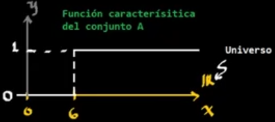
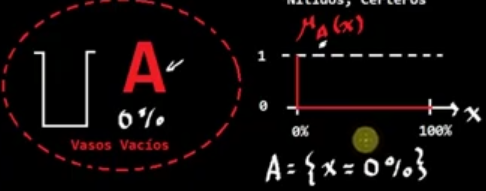
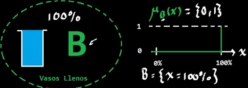
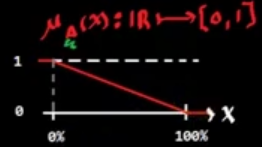
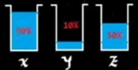
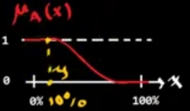
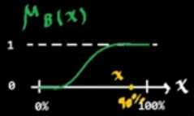
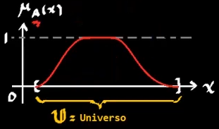

# Conjuntos clásicos

$$
A = \{x \in \mathbb{R} | x\geq 6\} = [6, \infty)
$$

Se puede observar que:

$$
5 \in A\quad 7\cancel\in A
$$

En los conjuntos clásicos se tienen límites bien definidos. En este caso dado por el número 6.

Otra notación para expresar que 5 no pertenece a A, es la siguiente:

$$
5\cancel\in A\quad\longleftrightarrow\quad(5,0)
$$

$$
5\cancel\in A\quad\longleftrightarrow\quad(7,0)
$$

## Ecuación característica de un conjunto

$$
\mu_A(x) = \{0,1\}
$$

# Lógica difusa
Supongamos que se tienen los siguientes conjuntos A, de vasos vacíos, es decir al 0% y B de vasos llenos (100%).

Para conjuntos clásicos, tendríamos lo siguiente:

Pero esto es demasiado estricto y sólo dejan 1 valor en cada conjunto.

Para esto `Lofti Zadeh` crea la `lógica difusa`.

## Conjuntos difusos
Para los conjuntos anteriores se puede definir la siguiente `función de membresía` o `relación difusa`.
 
Ahora bien, suponiendo que se tienen los siguientes vasos:

En este caso podemos observar:

$$
\begin{aligned}
\mu_A(x)&=0.1\\
\mu_A(x)&=0.9\\
\mu_A(z)&=0.5\\
\end{aligned}\qquad
\begin{aligned}
\mu_B(x)&=0.9\\
\mu_B(x)&=0.1\\
\mu_B(z)&=0.5\\
\end{aligned}
$$

Esto es una forma mucho más acercada a como pensamos los humanos pues el concepto de estar lleno, es relativo y puede ser que 0.9 este lleno dependiendo del contexto.

Así mismo las funciones de membresía pueden ser diferentes, por ejemplo una función sigmoide:
 

El cambio en estas funciones es dado por la `subjetividad`.

### Definición
Un conjunto difuso se define de la siguiente forma:

$$
A = \{(x,\mu(x))|: x \in \mathbb{U}\}
$$

Donde:
$\mu(x)$ = Función de membresía

$$
\mu_A: \mathbb{U} \mapsto[0,1]
$$

$\mathbb{U}$ = Conjunto `universo` o `espacio de discurso` 

# Variable linguistíca
Es una palabra que puede ser sustituida por otra palabra dentro de un conjunto difuso.

#### Ejemplo

$$
\text{Estatura} = \{\text{Baja},\text{Media},\text{Alta}\}
$$

La estatura puede ser baja, media o alta.