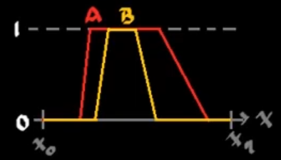
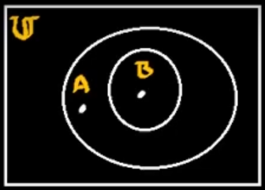
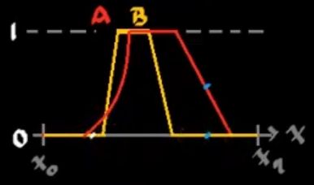
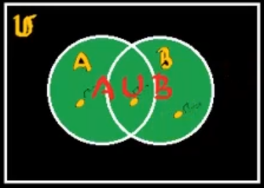
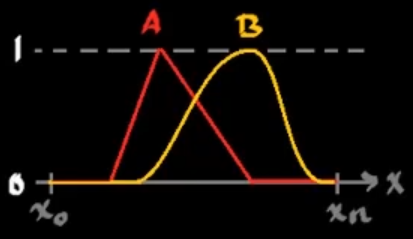
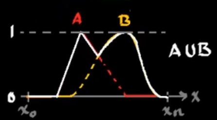
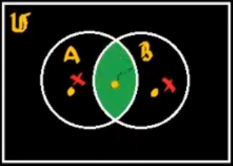
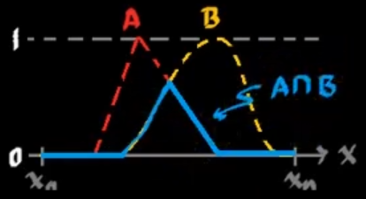
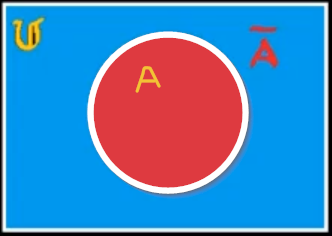
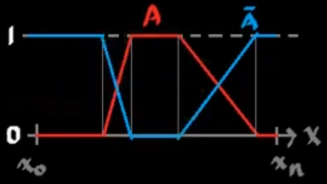

En conjuntos difusos, para que un elemento pertenezca a un conjunto difuso, basta con que su `membresía` sea `mayor que 0`.

$$
\begin{aligned}
A=\left\{x,\mu_A(x)|:\mu_A(x)>0\right\}\\
B=\left\{x,\mu_B(x)|:\mu_B(x)>0\right\}\\
\end{aligned}
$$

En este caso:

$$
B\subset A
$$

$$
\begin{aligned}
&\forall x |:\mu_B(x)>0 \rightarrow \mu_A(x) > 0\\
&\exists x, mu_A(x)>0 |:\mu_B(x)=0\\
\end{aligned}
$$

En este caso, esto es cierto, pero si se tiene el siguiente ejemplo:
	
En esto caso el enunciado anterior, es falso. Puesto que existen elementos en B que tienen mayor membresía en B que en A.

## Subconjunto
Por lo que en general la expresión de subconjunto es la siguiente:

$$
B\subset A
$$

$$
\forall x \in \mathbb{U} |: \mu_B(x)>0 \rightarrow\mu_A(x)\geq\mu_B(x)
$$

# Unión difusa

$$
A \cup B = \left\{x\in\mathbb{U}:x\in A\quad\text{ó}\quad x\in B\right\}
$$

$$
\begin{cases}
\mu_{A\cup B}(x) \geq \mu_A(x)\\
\mu_{A\cup B}(x) \geq \mu_B(x)\\
\end{cases}\quad;\quad \forall x \in \mathbb{U}
$$

Por lo tanto:

$$
\mu_{A\cup B} = \text{MAX}[\mu_A(x),\mu_B(x)]
$$

$$
A\cup B = \left\{x,\mu_{A\cup B}(x)|:\mu_{A\cup B} = \text{MAX}[\mu_A(x),\mu_B(x)]\right\}
$$

# Intersección difusa

$$
A \cap B = \left\{x\in\mathbb{U}:x\in A\quad\text{y}\quad x\in B\right\}
$$

Por lo tanto:

$$
\mu_{A\cap B} = \text{MIN}[\mu_A(x),\mu_B(x)]
$$

$$
A\cap B = \left\{x,\mu_{A\cup B}(x)|:\mu_{A\cup B} = \text{MIN}[\mu_A(x),\mu_B(x)]\right\}
$$

# Complemento difuso

$$
\begin{aligned}
\bar{A} &= \left\{x\in\mathbb{U}|: x\notin A\right\}\\
&= \left\{x,\mu_{\bar{A}}(x)|: \mu_{\bar{A}}(x) = 1 - \mu_A(x)\right\}\\
\end{aligned}
$$

# Convención de notación

$$
\begin{cases}
A\cup B = \text{OR}(A,B) = \text{MAX}(A,B) &\rightarrow \text{MAX}(\mu_A(x),\mu_B(x))\\
\\
A\cap B = \text{AND}(A,B) = \text{MIN}(A,B) &\rightarrow \text{MIN}(\mu_A(x),\mu_B(x))\\
\\
\bar{A} = \text{NOT}(A) = 1-A &\rightarrow 1-\mu_A(x)
\end{cases}
$$
