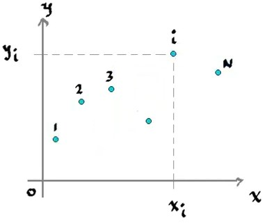
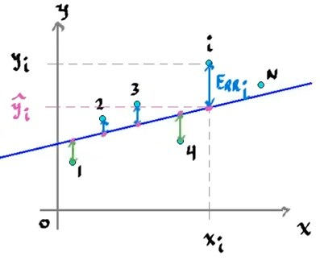

Dado un conjunto de datos

El objetivo es encontrar una recta que represente a los datos elegidos. Sin embargo, existen multiples rectas de la forma

$$
\hat{y}_i = mx_i + b
$$

Que representen a los datos, pero para encontrar la recta que sea más precisa, es necesario medir el error que existe entre la recta y los datos.

El error total, se define entonces como el error cuadrático, esto para medir efectivamente el error negativo y positivo sin que se cancelen a si mismos, si no que sea mayor conforme los datos estén más alejados de la recta.

### Suma del error cuadrático (Sum of Square Error)

$$
SSE = \frac{1}{2} \Sigma_{i=1}^N(y_i - \hat{y_i})^2 \geq 0
$$

La suma del error cuadrático será $0$ sólamente cuando todos los puntos coinciden con la recta elegida.

Por lo tanto nos interesa saber, para qué configuración de parámetros de la recta, el error es mínimo. Sustituyendo la definición de la recta en el $SSE$:

$$
SSE(m,b) = \frac{1}{2} \Sigma_{i=1}^N(y_i - mx_i - b)^2
$$

Esta función que depende de dos variables, puede ser representada por una superficie. Como nos interesa saber los mínimos de la función, requerimos el uso del gradiente.

### Gradiente
El gradiente de una función indica la dirección hacía el máximo local cuando se evalúa en algún punto $(m,b)$, es el análogo a la derivada, pero para funciones vectoriales. Para una función de superficie, el gradiente se define de la siguente forma:

$$
\nabla F(x_1,x_2) = \begin{bmatrix}
    \dfrac{\delta F}{\delta x_1}\\
    \\
    \dfrac{\delta F}{\delta x_2}\\
\end{bmatrix}
$$

Como apunta el gradiente al valor máximo local, significa que la dirección opuesta es la que apunda al mínimo local.

### Método del descenso del gradiente
Este método consiste en acercarse a un mínimo local, comenzando en un valor $(x_1^0,x_2^0)$, y reccorrer una cierta candidad en la dirección opuesta del gradiente. Sí existe un mínimo local, se puede converger a dicho punto porque una vez rebazando ese punto, el gradiente comenzaría a apuntar hacia atrás. Esto depende sin embargo, de la elección del paso de avance que se elija, pues uno inadecuado podría terminar en que no se converga al alejarse demasiado.

$$
\begin{bmatrix}
    x_1^{k+1}\\
    \\
    x_2^{k+1}\\
\end{bmatrix} = \begin{bmatrix}
    x_1^k\\
    \\
    x_2^k\\
\end{bmatrix} - \alpha\begin{bmatrix}
    \dfrac{\delta F}{\delta x_1}(x_1^k,x_2^k)\\
    \\
    \dfrac{\delta F}{\delta x_2}(x_1^k,x_2^k)\\
\end{bmatrix}
$$

Donde $\alpha$ es el valor del paso.

### Recta de error mínimo

Aplicando el método de descenso del gradiente, se puede resolver el problema de encontrar la recta que tenga el menor error, aplicandolo a la función de la suma del error cuadrático:

$$
-\nabla SSE = \begin{bmatrix}
    \frac{\delta SSE}{\delta m}\\
    \\
    \frac{\delta SSE}{\delta b}\\
\end{bmatrix}  = \begin{bmatrix}
    \Sigma_{i=1}^N(y_i - \hat{y}_i)x_i\\
    \\
    \Sigma_{i=1}^N(y_i - \hat{y}_i)\\
\end{bmatrix}
$$

Por lo tanto un algoritmo para encontrar los valores $m$ y $b$ óptimos utilizaría el gradiente de $SSE$:

$$
\begin{aligned}
    m^{new} &= m^{old} + \alpha \Sigma_{i=1}^{N}(y_i - \hat{y}_i)x_i\\
    b^{new} &= b^{old} + \alpha \Sigma_{i=1}^{N}(y_i - \hat{y}_i)
\end{aligned}
$$
