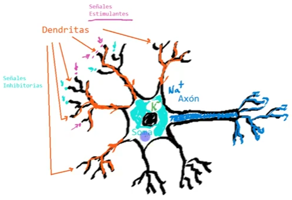
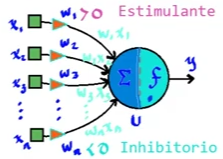

## La neurona biológica

Se compone de las siguientes partes:
* **Cuerpo (soma)**: Contiene el núcleo de la neurona.
* **Dendritas**: Ramificaciones donde se reciben las señales de entrada, de otras neuronas u órganos.
* **Axón**: Incrementa y propaga el potencial de activación de la neurona, que se termina conectando con otras neuronas.

Las neuronas del cerebro humano, están conectadas con miles de neuronas a la entrada y a la salida.

Las neuronas pueden recibir señales de tipo *estimulantes* e *inhibitorias*, que al ser evaluadas, se determina si la neurona se activa o no.

El cerebro contiene muchas neuronas conectadas, se estima que al rededor de $10^{15}$. Estas se comunican por el proceso llamado *sinapsis*. Además, dichas conexiones no son fijas, si no que se pueden reconfigurar.

## La neurona artificial

Donde:
$x_i$: Unidades de entrada
$w_i$: Pesos sinápticos
$\Sigma$: Concentración de la información de entrada
$a$: Valor de activación o valor de entrada

$$
a = \Sigma^n_{i=1} w_i x_i\quad:\quad\text{Suma ponderada de las entradas}
$$

$f$: Función de activación o función de transferencia
$y$: Salida de la neurona

$$
y = f(a - \phi)
$$

### Función de activación
La función de activación define el comportamiento de una neurona frente a las entradas, entre las funciones de activación más comúnes están:

##### Escalón unitario

$$
f(a-\phi) = \begin{cases}
    1 & a \geq \phi\\
    0 & a < \phi\\
\end{cases}
$$

##### Signo

$$
f(a - \phi) = \begin{cases}
     1 & a \geq \phi\\
    -1 & a < \phi
\end{cases}
$$

##### Lineal

$$
f(a - \phi) = a -\phi
$$

##### Sigmoide

$$
f(a - \phi) = \frac{1}{1+e^{\phi-a}}
$$

##### Gaussiana

$$
f(a - \phi) = \frac{1}{1+e^{\phi-a}}
$$

### Comportamiento con diferentes pesos sinápticos
El comportamiento de una neurona depende de los pesos sinápticos, por ejemplo considerando una neurona con una función de activación escalón unitario.

$$
f(a-\phi) = \begin{cases}
    1 & a \geq \phi\\
    0 & a < \phi\\
\end{cases}
$$

Los pesos sinápticos se pueden adaptar para que siga el comportamiento de una compuerta lógica `AND` o una compuerta `OR`.

$$
y = AND(x_1,x_2)
$$

| $x_1$ | $x_2$ | $y$ |
| -     | -     | -   |
| $0$   | $0$   | $0$ |
| $0$   | $1$   | $0$ |
| $1$   | $0$   | $0$ |
| $1$   | $1$   | $1$ |

Para simular dicho comportamiento, se necesitan 3 pesos sinápticos, 2 para las entradas y el valor del umbral.

$$
a = \omega_0 + \omega_1 x_1 + \omega_2 x_2
$$

Haciendo $\omega_0 = -1.5$, $\omega_1 = \omega_2 = 1$, se cumple la tabla de verdad para la compuerta `AND`.

$$
a_{AND} = -1.5 + x_1 + x_2
$$

Por otro lado, haciendo $\omega_0 = -0.5$ la neurona seguiría el comportamiento de la compuerta `OR`.

$$
y = OR(x_1,x_2)
$$

$$
a_{OR} = -0.5 + x_1 + x_2
$$

| $x_1$ | $x_2$ | $y$ |
| -     | -     | -   |
| $0$   | $0$   | $0$ |
| $0$   | $1$   | $1$ |
| $1$   | $0$   | $1$ |
| $1$   | $1$   | $1$ |
