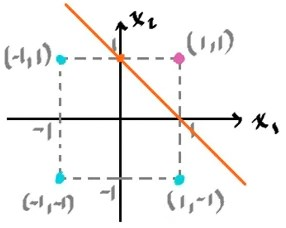

El perceptron es una neurona bipolar, pero que tiene una diferente regla de entrenamiento.

### Regla del perceptron

$$
\omega_i^{new} = \omega_i^{old} + \underbrace{\alpha\overbrace{(d_i- y_i)}^{error}x_i}_{\Delta\omega_i}
$$

Como se puede apreciar, el perceptron tiene en cuenta el error, cosa que no pasaba con la regla de Hebb, sin embargo, por la forma, se dice que el perceptron sigue un entrenamiento de tipo Hebbiano.

La salida deseada $d_i$ cuando se tiene la entrada $x_i$, es la que se utiliza para el entrenamiento del perceptron.

Por ejemplo, si se desea que el perceptron siga el comportamiento de una compuerta `AND bipolar`, considerando $\alpha = 1$ y los pesos sinápticos iniciales $\omega_i = 0$, el proceso sería el siguiente:

`OR bipolar`
| $x_1$ | $x_2$ | $y$  |
| -     | -     | -    |
|       |       |      |
| $-1$  | $-1$  | $-1$ |
| $-1$  | $1$   | $-1$ |
| $1$   | $-1$  | $-1$ |
| $1$   | $1$   | $1$  |

A cada una de las filas se les conoce como **par de entrenamiento**, para cada par de entrenamiento se calculan los pesos sinápticos por la regla del perceptron:

$$
\begin{aligned}
&\underset{Error = -1}{\begin{cases}
    \omega_0^{new} = 0 + (-1-0) (1) = -1\\
    \omega_1^{new} = 0 + (-1-0) (-1) = 1\\
    \omega_2^{new} = 0 + (-1-0) (-1) = 1\\
\end{cases}}\quad\underset{Error = 0}{\begin{cases}
    \omega_0^{new} = -1 + (-1+1) (1) = -1\\
    \omega_1^{new} = 1 + (-1+1) (-1) = 1\\
    \omega_2^{new} = 1 + (-1+1) (1) = 1\\
\end{cases}}\\
\\
&\underset{Error = -1}{\begin{cases}
    \omega_0^{new} = -1 + (-1-0) (1) = -1\\
    \omega_1^{new} = 1 + (-1-0) (1) = 1\\
    \omega_2^{new} = 1 + (-1-0) (-1) = 1\\
\end{cases}}\quad\underset{Error = 0}{\begin{cases}
    \omega_0^{new} = -1 + (-1-0) (1) = -1\\
    \omega_1^{new} = 1 + (-1-0) (1) = 1\\
    \omega_2^{new} = 1 + (-1-0) (1) = 1\\
\end{cases}}\\
\end{aligned}
$$

Como se puede apreciar, los pesos tuvieron un error de cero para los 3 últimos pares de entrenamiento, pero no para el primero y por lo tanto, se requiere repetir el entrenamiento, sin embargo, las condiciones iniciales, serán ahora las obtenidas. A esto se le llama **épocas**. La segunda época del entrenamiento es la siguiente:

$$
\begin{aligned}
&\underset{Error = 0}{\begin{cases}
    \omega_0^{new} = -1 + (-1+1) (1) = -1\\
    \omega_1^{new} = 1 + (-1+1) (-1) = 1\\
    \omega_2^{new} = 1 + (-1+1) (-1) = 1\\
\end{cases}}\quad\underset{Error = 0}{\begin{cases}
    \omega_0^{new} = -1 + (-1+1) (1) = -1\\
    \omega_1^{new} = 1 + (-1+1) (-1) = 1\\
    \omega_2^{new} = 1 + (-1+1) (1) = 1\\
\end{cases}}\\
\\
&\underset{Error = -1}{\begin{cases}
    \omega_0^{new} = -1 + (-1-0) (1) = -1\\
    \omega_1^{new} = 1 + (-1-0) (1) = 1\\
    \omega_2^{new} = 1 + (-1-0) (-1) = 1\\
\end{cases}}\quad\underset{Error = 0}{\begin{cases}
    \omega_0^{new} = -1 + (-1-0) (1) = -1\\
    \omega_1^{new} = 1 + (-1-0) (1) = 1\\
    \omega_2^{new} = 1 + (-1-0) (1) = 1\\
\end{cases}}\\
\end{aligned}
$$

Dado que en esta ocasión el error fue de 0 para todos los pares de entrenamiento, la neurona ya está entrenada.

$$
\begin{aligned}
    x_2 &= -\frac{\omega_1}{\omega_2}x_1 - \frac{\omega_0}{\omega_2}\\
    &= -\frac{1}{1}x_1 - \frac{-1}{1}\\
    &= -x_1 + 1\\
\end{aligned}
$$

