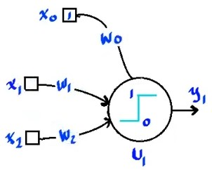
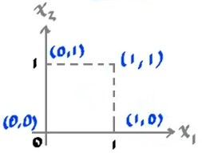
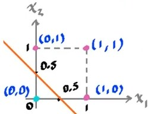
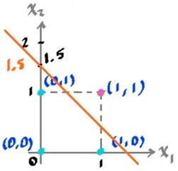

# Neurona de McCulloh - Pitts

Es una neurona cuyas entradas pueden adquirir los valores $\left\{0,1\right\}$, al igual que la salida. Utiliza la función de activación **escalón unitario**.

Esta es una de las primeras **unidades lógicas de umbral**, que demostró que se pueden obtener diferentes respuestas, siguiendo por ejemplo el comportamiento de una compuerta lógica `AND` u `OR`.

El comportamiento de esta neurona se pude visualizar utilizando el **espacio de entradas**:

$$
a = \omega_0 + \omega_1 x_1 + \omega_2 x_2
$$

Nos interesa conocer el comportamiento donde $a$ cambia, en este caso la función escalón unitario cambia en $a = 0$.

$$
0 = \omega_0 + \omega_1 x_1 + \omega_2 x_2
$$

$$
\tag{1}
x_2 = -\frac{\omega_1}{\omega_2}x_1-\frac{\omega_0}{\omega_2}
$$

Como se puede apreciar en $(1)$, la ecuación es una recta dicha recta describe el comportamiento de la neurona, donde todos los valores encima de la recta serán valores de activación y los que esten por debajo serán valores donde la neurona no será activada.

Por ejemplo para una compuerta `OR`, una posible recta sería la siguiente:

$$
x_2 = -x_1 + 0.5
$$

Para una `AND` se puede proponer está otra:

$$
x_2 = -x_1 + 1.5
$$

