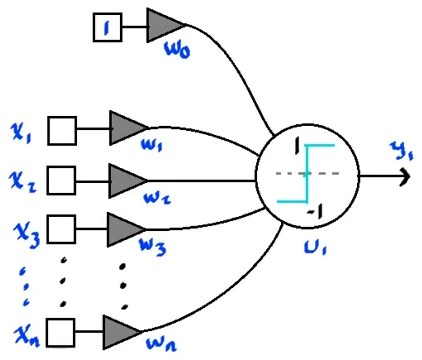
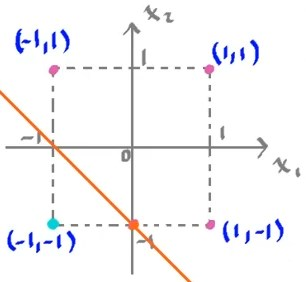

## Postulado de Hebb
"Cuando el axón de una célula A, está suficientemente cerca como para estimular a una célula B y repetida o persistentemente está involucrada en su proceso de disparo, algún tipo de crecimiento o de cambio metabólico toma lugar en una o ambas células de tal forma que, la eficiencia de A, como una de las células responsables de disparar a B, se ve incrementada."

Esto quiere decir que la neurona aprende, con respecto a las entradas que tiene y modifica su comportamiento conforme más repetitivo sean las entradas.

### Regla de Hebb
Esta regla es el modelo matemático del postulado antes presentado:

$$
\boxed{\omega_i^{new} = \omega_i^{old} + \alpha x_i y_i}
$$

$$
\alpha > 0\quad;\quad \forall i = 0,1,\ldots,n
$$

Donde $\alpha$ es la **razón de aprendizaje**. De este valor depende si la neurona converge o diverge al ser entrenada.

Tomando la neurona bipolar como unidad lógica funcional; que utiliza la función signo como función de activación:

$$
f(a) = \begin{cases}
    1 & a>0\\
    0 & a=0\\
    -1 & a<0\\
\end{cases}
$$

Esta neurona sólo acepta los valores $\left\{-1,1\right\}$ como valores para sus entradas.

Si se quisiera entrenar esta neurona para seguir el comportamiento de la función `OR` bipolar, siguiendo la regla de Hebb, se seguirían los siguientes pasos:

`OR bipolar`
| $x_1$ | $x_2$ | $y$  |
| -     | -     | -    |
| $-1$  | $-1$  | $-1$ |
| $-1$  | $1$   | $1$  |
| $1$   | $-1$  | $1$  |
| $1$   | $1$   | $1$  |

Iniciando los valores en de $\omega$ en $0$, con un valore de $\alpha = 1$:

$$
\begin{aligned}
&\begin{cases}
    \omega_0^{new} = 0 + (1) (-1) = -1\\
    \omega_1^{new} = 0 + (-1) (-1) = 1\\
    \omega_2^{new} = 0 + (-1) (-1) = 1\\
\end{cases}\quad\begin{cases}
    \omega_0^{new} = -1 + (1) (1) = 0\\
    \omega_1^{new} = 1 + (-1) (1) = 0\\
    \omega_2^{new} = 1 + (1) (1) = 2\\
\end{cases}\\
\\
&\begin{cases}
    \omega_0^{new} = 0 + (1) (1) = 1\\
    \omega_1^{new} = 0 + (1) (1) = 1\\
    \omega_2^{new} = 2 + (-1) (1) = 1\\
\end{cases}\quad\begin{cases}
    \omega_0^{new} = 1 + (1) (1) = 2\\
    \omega_1^{new} = 1 + (1) (1) = 2\\
    \omega_2^{new} = 1 + (-1) (1) = 2\\
\end{cases}\\
\end{aligned}
$$

Estos valores se pueden comprobar, graficando la frontera de desición en el espacio de entrdas:

$$
\begin{aligned}
    x_2 &= -\frac{\omega_1}{\omega_2}x_1 - \frac{\omega_0}{\omega_2}\\
    &= -\frac{2}{2}x_1 - \frac{2}{2}\\
    &= -x_1 - 1\\
\end{aligned}
$$

