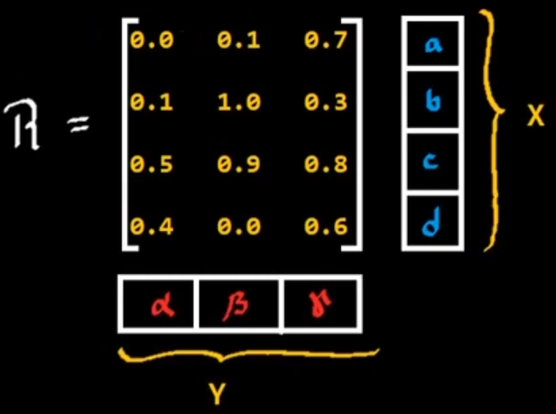
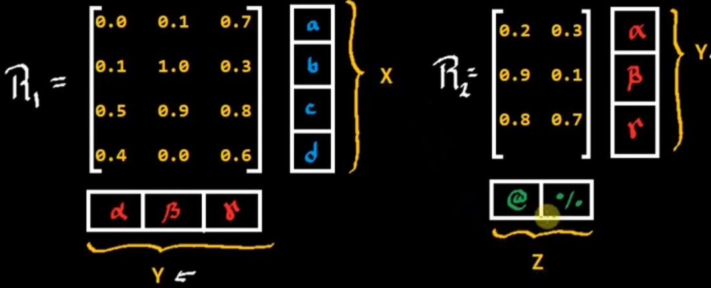
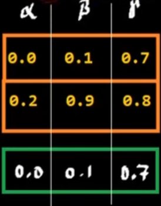
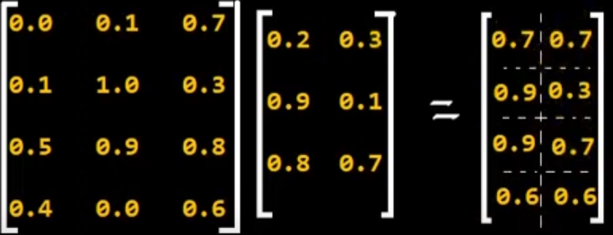

# Relaciones difusas binarias
Es un tipo de conjunto difuso que relaciona dos tipos de espacios de discurso distintos.
#### Ejemplo

$$
X = {a,b,c,d}\\
Y = {\alpha, \beta, \gamma}\\
$$

$$
\begin{aligned}
R &= X\times Y \mapsto [0,1]\\
&= \left\{(x,y,\mu(x,y))|: (x,y)\in X\times Y\right\}
\end{aligned}
$$

#### Ejemplos de relaciones difusas binarias
* $X$ está cerca de $Y$ ($X$ e $Y$ son números).
* $X$ depende de $Y$ ($X$ e $Y$ son eventos).
* $X$ se parece a $Y$ ($X$ e $Y$ son objetos).
* Si $X$ es grande, entonces $Y$ es pequeño ($X$ es una medición e $Y$ es una acción correspondiente).

# Composición difusa
Se puede obtener la relación entre $X$ y $Z$ siguientes:

Esto se realiza mediante la composición difusa:

$$
R_1 o R_2 = \left\{(x,z,f(\mu_{R1},\mu_{R2}))|:x\in X;y\in Y;z \in Z\right\}
$$

## Composición difusa MAX-MIN
Para esta composición:

$$
R_1 o R_2 = \left\{(x,z,\text{MAX}_Y\left[MIN[\mu_{R1}(x,y),\mu_{R2}(y,z)]\right])|:x\in X;y\in Y;z \in Z\right\}
$$

Para el primer término:

Por lo tanto el resultado es 0.7

La matriz calculada es la siguiente:

Por lo tanto:

# Principio de extensión

$$
R = \left\{(x,y,\mu_R(x,y))|: x \in X; y \in Y\right\}
$$
