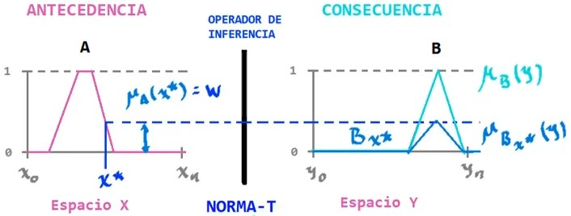
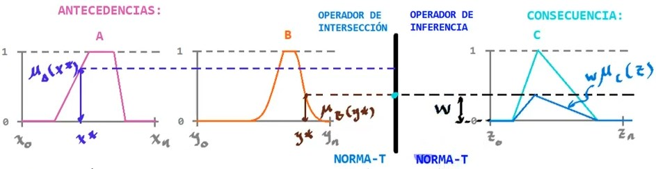

# La regla IF - THEN

En lógica los razonamientos, de inferencia son de este tipo:

Premisa 1 (Hecho): $x$ **es** $A$
Premisa 2 (Regla): **si** $x$ es $A$, **entonces** $y$ es $B$
$\overline{\hphantom{Premisa 1 (Regla): si x es A, entonces y es B}}$
Conclusión (Consecuencia): $y$ **es** $B$

Pero esto aplica para conjuntos certeros, en caso de conjuntos difusos se utiliza el denominado **razonamiento aproximado**.

## Razonamiento aproximado

En este caso, se tienen conjuntos difusos, por lo tanto, el razonamiento aproximado utiliza conjuntos difusos.

Premisa 1 (Hecho): $x$ **es** $A'$
Premisa 2 (Regla): **si** $x$ es $A$, **entonces** $y$ es $B$
$\overline{\hphantom{Premisa 1 (Regla): si x es A, entonces y es B}}$
Conclusión (Consecuencia): $y$ **es** $B'$

### Inferencia tipo Mamdani

Ebrahim Mamdani, propuso este modelo de inferencia para razonamiento aproximado, donde podemos ver que primero se obtiene $w$ a partir de la **antecedencia**, que es la **intensidad de disparo de la regla**, luego por medio de un operador de inferencia; una **Norma-T**, se obtiene el conjunto correspondiente de **consecuencia**.

$$
B_x* = T(w,\mu_B(y))
$$

Al ser el operador de inferencia una **Norma-T**, se puede utilizar el mínimo (**MIN**) o el producto (**PROD**) por ejemplo.

#### Multiples antecedencias
Para el caso de razonamientos con interseccion:

Premisa 1 (Hecho): $x$ **es** $A'$
Premisa 2 (Hecho): $y$ **es** $B'$
Premisa 3 (Regla): **si** $x$ es $A$ **y** $y$ es $B$, **entonces** $z$ es $C$
$\overline{\hphantom{Premisa 1 (Regla): si x es A, entonces y es natonces}}$
Conclusión (Consecuencia): $z$ **es** $C'$

En este caso, se utiliza un operador de intersección antes, que también es una **Norma-T** y es independiente de la utilizada en el operador de inferencia.

$$
w = \text{NORMA-T}_{inter}(\underbrace{\mu_A(x*)}_{A'},\underbrace{\mu_B(y*)}_{B'})
$$

$$
w = \text{NORMA-T}_{infer}(w,\mu_C(z))
$$

#### Multiples reglas
Para el caso de cuando existe más de una regla, por ejemplo

$R_1$: **si** $x$ **es** $A_1$ **y** $y$ es $B_1$, **entonces** $z$ es $C_1$
$R_2$: **si** $x$ **es** $A_2$ **y** $y$ es $B_2$, **entonces** $z$ es $C_2$

Dependiendo del razonamiento, se puede utilizar la agregación o sustracción de las reglas, es decir, utilizando la **Norma-S** o **Norma-T** respectivamente:

$$
\begin{aligned}
R_1 \text{or} R_2 &= \text{NORMA-S}(C_1',C_2')\\
\\
R_1 \text{and} R_2 &= \text{NORMA-T}(C_1',C_2')\\
\end{aligned}
$$
