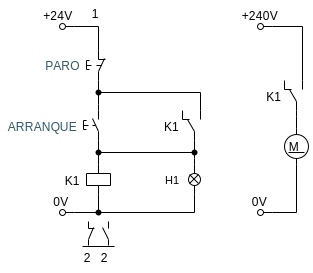
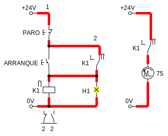
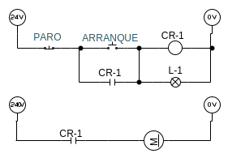
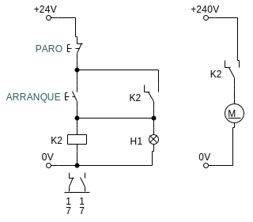

La cuarta función de un relevador es la del enclavamiento. Es decir, que al presionar un interruptor, el circuito se mantenga encendido a pesar de usar de liberar el interruptor.

A continuación se exponen algunos circuitos que utilizan el principio de enclavamiento.

## Circuito Arranque-Paro con prioridad al paro

Este circuito funciona como una flip flop, pues mantiene el estado al presionar el botón de arranque o de paro. Al presionar el botón de `ARRANQUE` se alimenta la bobina del relevador y hace que se activen los switches `K1`, esto a su vez hace que se cierre una nueva ruta para la energía hacia la bobina `K1`, por lo tanto se queda encendido y la forma de cerrarlo, es presionando el botón de `PARO`, quitando la energía.

El circuito se llama "con prioridad al paro" porque al presionar los dos botones al mismo tiempo, la máquina seguiría el estado de paro.

El circuito en norma **ANSI** es el siguiente:

## Circuito Arranque-Paro con prioridad al arranque

El circuito actúa muy similar al anterior, pero si se presionaran los dos, la bobina se seguiría alimentando, por lo tanto estaría encendido.

## Ejercicio: Circuito de selector doble

A continuación se muestra un circuito que tiene dos interruptores, cada uno controlando una carga, al presionar algún interruptor se debe activar su respectiva carga, pero el otro circuito debe de pararse. También existe un paro general que para ambos procesos.

