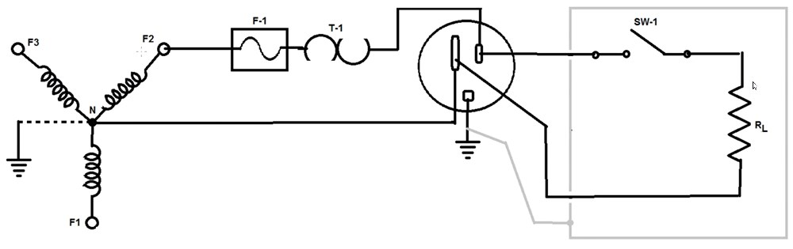
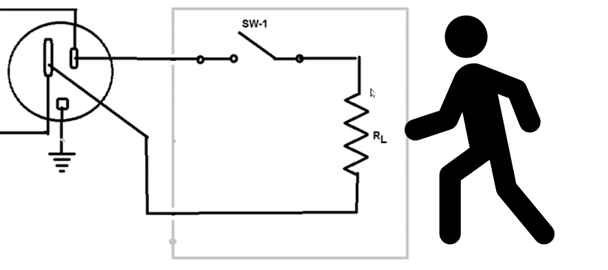
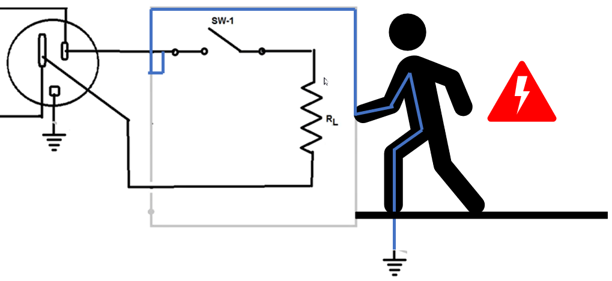
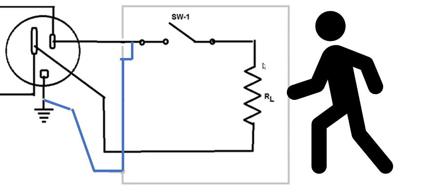

La fase, neutro y tierra son parte del cableado de una conexión eléctrica. Y sus funciones son las siguientes:

* **Fase**: Es el cableado donde se tiene la tensión con la que se trabaja.
* **Neutro**: Es la referencia a partir de la cual se toma la diferencia de tensión con la fase, por lo tanto de potencial 0. Sin embargo, esto no quiere decir que no tenga corriente, en una conexión monofásica, el neutro es el retorno de la corriente, tiene potencial 0 pero la diferencia de tensión hace que fluya la corriente de fase a neutro.
* **Tierra**: Es la conexión de protección al **usuario** que está conectada directamente al suelo, siendo este también conectado con el neutro en un punto de la conexión eléctrica.

Consideremos la siguiente conexión eléctrica:

El enchufe, donde está conectado el aparato eléctrico, tiene sus conexiones correspondientes a **fase**, **neutro** y **tierra**.

Suponiendo que el aparato no se conecta a tierra como es debido, y una persona toca el dispositivo por fuera, en realidad no pasa si el dispositivo funciona correctamente.

Pero si por ejemplo el cable donde entra la fase en el dispositivo eléctrico, con el paso del tiempo se pela y tiene contacto con el chasis del aparato, el usuario sufriría una descarga eléctrica, pues se cierra el circuito entre la fase y la tierra a través del usuario.

Es así que la conexión a tierra física representa un protección para el usuario, porque al estar conectado mediante un conductor directamente a tierra, la corriente pasara principalmente por el conductor y no por el usuario, debido a la resistividad mucho más alta del usuario.

