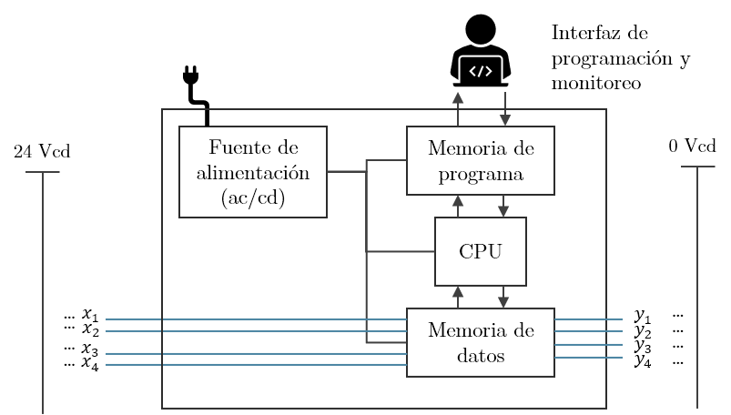

Los **controladores lógicos programables** o PLCs (por sus siglas en inglés) son controladores que reciben ciertas entradas y entregan una salida en respuesta, dependiendo del programa cargado. Están basados principalmente en microcontroladores y tienen características que los hacen aptos para ambientes industriales.

Su estructura básica es la siguiente:



Estos controladores son aptos y utilizados en la industria para controlar máquinas eléctricas.

# Principio de programación

Existen varios lenguajes con los que se puede programar un PLC y uno de los más comunes es el lenguaje de [diagrama de escalera](Simbología Eléctrica.html). Sólo que en este contexto un programa se vería de la siguiente forma:

```ladder
|    x1     x2     x3     y1    |
|---|  |---|  |---|  |---(  )---|
|                               |
|    x1            x3     y2    |
|---|  |----------|  |---(  )---|
|          |                    |
|    x2    |                    |
|---|  |----                    |
|                               |
```

Así, se tiene:

$$
\begin{aligned}
    y_1 &= x_1 x_2 x_3\\
    y_2 &= (x_1 + x_2) x_3\\
\end{aligned}
$$

Hoy en día existen diferentes software para realizar estos diagramas, que facilitan la tarea, sin embargo, este tipo de lenguaje se vuelve difícil de mantener para múltiples entradas y salidas, para lo cual un lenguaje de programación secuencial es mejor.

# Clasificación
La clasificación más común de PLCs es la que clasifica por su número de entradas y salidas principalmente:

* PLC Nano (entradas $< 100$)
* PLC Compacto ($100 <$ entradas $< 500$)
* PLC Compacto (entradas $> 500$)
