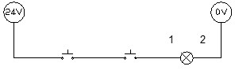
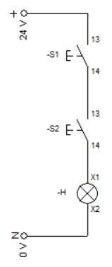
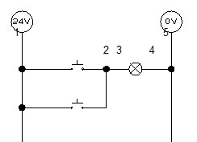
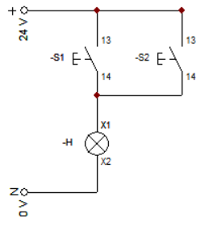
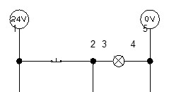
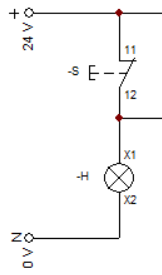
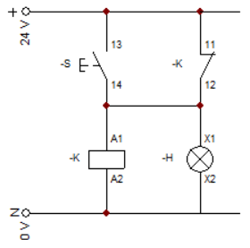
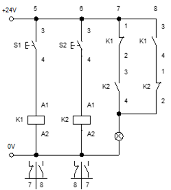

Usando las normas ANSI y DIN, se expresan circuitos lógicos.

#### AND

| PB-1 | PB-2 | AND |
| :-:  | :-:  | :-: |
| $0$  | $0$  | $0$ |
| $0$  | $1$  | $0$ |
| $1$  | $0$  | $0$ |
| $1$  | $1$  | $1$ |

| Norma Americana (ANSI)                             | Norma Europea (DIN)                              |
| :-:                                                | :-:                                              |
| {:max-width="300px"} | {:max-height="300px"} |

------------------------------------------------

#### OR

| PB-1 | PB-2 | OR  |
| :-:  | :-:  | :-: |
| $0$  | $0$  | $0$ |
| $0$  | $1$  | $1$ |
| $1$  | $0$  | $1$ |
| $1$  | $1$  | $1$ |

| Norma Americana (ANSI)                             | Norma Europea (DIN)                              |
| :-:                                                | :-:                                              |
| {:max-width="200px"}   | {:max-height="270px"}   |

-----------------------------------------------

#### NOT

| PB-1 | NOT |
| :-:  | :-: |
| $0$  | $1$ |
| $1$  | $0$ |

| Norma Americana (ANSI)                                            | Norma Europea (DIN)                                                      |
| :-:                                                               | :-:                                                                      |
| {:max-width="200px"}                | {:max-height="270px"}                        |
| {:max-width="350px"}    | {:max-height="270px"} |

Como se puede observar, se utilizó un relevador para resolver el problema de otra forma. A continuación se listan las 4 funciones típicas de un relevador.

1. Acoplamiento a diferentes niveles de tensión eléctrica.
2. Realizar operaciones matemáticas (booleanas o de lógica cableada).
3. Multiplicar salidas.
4. Enclavamiento.

---------------------------------------

#### XOR

| PB-1 | PB-2 | XOR |
| :-:  | :-:  | :-: |
| $0$  | $0$  | $0$ |
| $0$  | $1$  | $1$ |
| $1$  | $0$  | $1$ |
| $1$  | $1$  | $0$ |

Su ecuación lógica es la siguiente:

$$
H_1 = (\overline{S_1}\cdot S_2) + (S_1 \cdot \overline{S_2})
$$

| Norma Americana (ANSI)                             | Norma Europea (DIN)                              |
| :-:                                                | :-:                                              |
|                  |                   |
