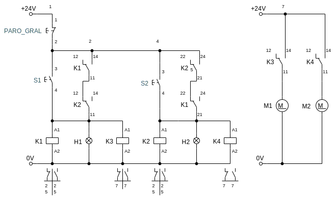

Como ya se vió en lógica cableada, se pueden realizar circuitos lógicos que permitan controlar los dispositivos deseados. Sin embargo, para circuitos mucho más complejos, repicarlo puramente con dispositivos como botónes, switches, relés y demás, se volvería mucho más difícil y costoso.

Por ejemplo considerando el siguiente circuito:

Realmente **no es muy complejo** y podría ser viable utilizar **lógica cableada** para abordar el problema. Sin embargo, esto sólo sería viable si el circuito no fuera a cambiar nunca. Al necesitar un comportamiento diferente, habría que diseñar e implementar el circuito de nuevo.

Pero si quisiéramos poder fácilmente **adaptar el comportamiento** del sistema, o si el circuito se volviera **más complejo**, lo más conveniente sería implementar un **MCU** o un **PLC**.

Podríamos pensar que es más barato implementar un MCU, pues son más baratos, existen muchas opciones para programarlo de forma sencilla. Sin embargo, se requiere **diseñar un circuito** embebido para el microcontrolador y **adaptación de las señales** de entrada y salida, también la **impresión de la placa** y la **mano de obra** asociada. Aún así implementarlo de esta manera podría ser viable si **no se busca robustez** en el sistema.

Cuando se tienen que **cumplir** con ciertas **normas**, los **costos** y **tiempos** se **elevan** muchísimo, puesto que se requiere **más tiempo** para diseñar y **certificación** de las cumplimiento de las normas por el dispositivo. Además de la realización de **pruebas** que garanticen la **durabilidad** y **correcto funcionamiento** del sistema. Esto es normalmente requerido en **entornos industriales** y es por eso que muchas veces, por estas razones en más **barato** y **rápido** utilizar **PLC**.

| Característica               | Lógica Cableada | MCU   | PLC  |
| -                            | :-:             | :-:   | :-:  |
| Adaptabilidad                | ❌              | ✔     | ✔    |
| Estandarizado                | ❌              | ❌    | ✔    |
| Costo de circuitos complejos | Alto            | Medio | Bajo |
| Costo de circuitos básicos   | Bajo            | Medio | Alto |
