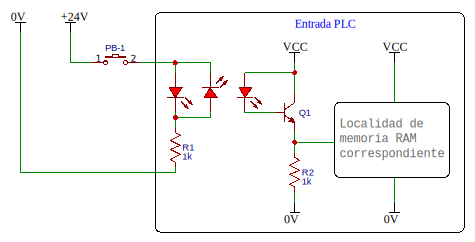
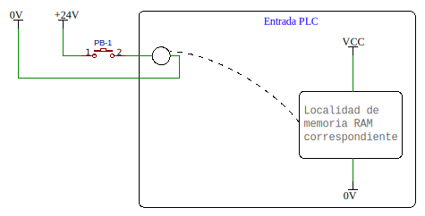
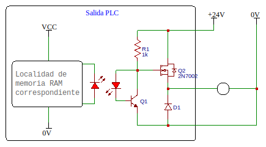
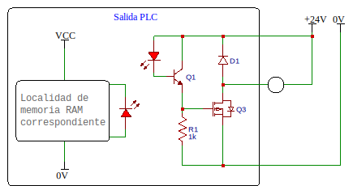
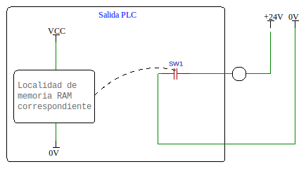

Los circuitos de entrada y salida que implementan los PLC son por lo general construidos hoy en día por transistores o relés y optoacopladores.

# Entradas
## Entradas Digitales de Corriente Directa

El modelo general del circuito de una entrada en el PLC, es con optoacopladores que activan un transistor, luego este se conecta directamente con la memoria asignada.

En este caso cuando el switch está del lado de positivo de la fuente, se le llama en **conexión PNP**, **conexión que cierra por positivo** o **conexión tipo fuente**.

Cuando se da el caso opuesto, entonces la corriente fluye en sentido contrario pero sigue activando el optoacoplador, puesto que cuenta con ambos diodos. En ese caso se llama **conexión que cierra por negativo**, **conexión NPN** o **conexión de tipo sumidero**.

## Entradas Digitales de Corriente Alterna

En este caso, se utilizan por lo general relevadores pequeños en las entradas del PLC.

# Salidas
## Salidas Digitales de Corriente Directa

La **conexión que cierra por positivo**, **conexión PNP** o **conexión tipo fuente**, se implementa con optoacopladores pero que son activados desde la localidad de memoria RAM, que luego activan el circuito que cuenta con un transistor NPN y otro mosfet PNP.

La otra configuración sería la **conexión que cierra por negativo**, **conexión NPN** o **conexión tipo sumidero**:

## Salidas Digitales de Corriente Alterna
Las salidas para corriente alterna se hacen por medio de switches que son modificados por la memoria.

