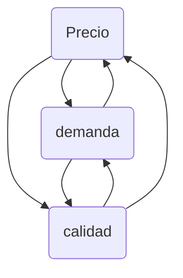

La *industria* es una actividad económica sistemática, que puede ser dedicada a la manufactura, los servicios o al comercio. El área de interés principal para la automatización es la manufactura.

Automatización tiene sus raíces etimológicas del griego *αυτο* (auto) y *ματος* (matos), que significan *por sí mismo* y *moviéndose* respectivamente. Por lo que se refiere a un dispositivo o un objeto que se mueve o actúa por si mismo.

> **Definición**: La automatización industrial es un conjunto de tecnologías que resulta en la operación the máquinas industriales y sistemas sin que necesiten intervención humana y con un rendimiento superior.

# Automatización en sistemas de producción
Un proceso industrial tiene las siguientes características:

```meramaid
graph TD
    A[Material] -->|Energía, mano de obra, infraestructura, manufactura| B(Producto final)
```

# Razones para automatizar
En una industria, las ganancias se pueden calcular de forma general de la siguiente forma:

$$
\boxed{\text{Ganancia} = (\text{Precio unitario} - \text{Costo unitario})\ \text{Volúmen de producción}}
$$

> Esto asumiendo que la venta no es un problema, es decir, que se vende todo lo que se produce.

De aquí se puede apreciar que las formas de aumentar las ganancias son las siguientes:

* Aumentar el precio unitario $\uparrow$
* Disminuir el costo unitario $\downarrow$
* Aumentar el vólumen de producción $\uparrow$

## Disminución del costo unitario
Existen principalmente estos 4 factores que afectan al costo de producción:

* Material
* Energía
* Mano de obra
* Infraestructura (tierra, equipamiento, maquinaria, etc)

El **material** es un *costo variable* puesto que para producir más se necesita proporcionalmente más material. Sin embargo, la automatización baja los costos en material, porque **disminuye los errores en los productos finales**, es decir, habrán menos productos que no pasen los estándares de calidad y deban ser desechados.

En **energía** los costos son asociados al precio de su producción y su constante incremento debido a políticas implementadas con el tiempo como la producción de energías más limpias. Es un *costo variable* también, sin embargo la automatización también ayuda a bajar estos costos porque la maquinaria y sistemas utilizados en automatización, buscan la **optimización de la energía** y por lo tanto utilizan la menor cantidad de energía posible.

La **mano de obra** como la energía son un *costo variable* y en este rubro se ve más explicito el impacto de la automatización, puesto que la automatización busca sustituir este trabajo humano, sin embargo se incrementa el costo en infraestructura.

Entonces la **infraestructura** tiene de hecho un *aumento en el costo inicial* cuando se va a automatizar por el costo de la maquinaria especializada. Sin embargo, aún así puede lograr la automatización bajar los costos unitarios de producción porque **el costo de infraestructura es un costo fijo**. El costo unitario se calcula de la siguiente forma:

$$
\text{Costo unitario}_\text{infraestructura} = \frac{\text{Costo de infraestructura}}{\text{No. de unidades producidas}}
$$

Así que el **costo unitario por infraestructura** también se ve disminuido porque el **número de unidades producidas incrementa enormemente**.

## Aumento de volúmen de producción
Asumiendo que tenemos suficiente mano de obra, material y demanda, los factores que afectan al volúmen son:

* Tiempo de producción
* Tiempo de manejo de materiales
* Tiempo de espera
* Tiempo de aseguramiento de calidad

El **tiempo de producción** se ve mejorado con la automatización puesto que las maquinarias son capaces de **manejar mayor cantidad de materiales** y realizar procesos a **velocidades mayores** que las del ser humano al usar las herramientas.

También son diseñados los sistemas para hacer más eficientes los tiempos de traslado entre una operación o proceso a otro en una máquina y por lo tanto, el **tiempo de manejo de materiales disminuye**.

El **tiempo de espera** es algo que ocurre poco en procesos automatizados porque tienen **alta coordinación** y por lo tanto esos tiempos son reducidos al máximo.

Finalmente, el **tiempo de aseguramiento de calidad** es disminuido por la automatización de forma muy grande porque puede manejar **sistemas de medición precisos** a **velocidades de la misma cadena de producción**, incluso hace que se deje el sistema de prueba de calidad por lotes y se puedan implementar pruebas de calidad por unidad.

## Aumento de precio unitario
El precio está ligado a la **demanda** y la **calidad**.



La automatización **aumenta la calidad** puesto que utiliza sistemas mucho más precisos y constantes. Eso puede hacer que aumente el precio.

Sin embargo de hecho la automatización **disminuye el precio** puesto que aumenta la oferta comparada con la demanda. Sin embargo esto no es malo puesto que al disminuir los precios también aumenta la demanda y se vende más, lo que hace que al final existan más ganancias.

# Razones para NO automatizar
Al leer el temario de mi curso de automatización industrial me di cuenta de la ausencia de algo. Este es el temario de la primera sección de la primera unidad del curso:

1. Fundamentos de automatización
    1. Automatización en sistemas de producción
    2. Razones para automatizar

Eso es todo. Lo que me llamó la atención es que vemos *razones para automatizar*, pero no vemos *razones para NO automatizar*.

Pareciera que en los cursos de ingeniería sólo se ve la automatización desde el punto de vista utilitario, contemplando ganancias y eficiencia. Lo que me hace pensar que la ingeniería se enseña para servir puramente al capital hoy en día. No se analiza dentro del marco de una industria, el factor trabajo en el humano. La toma de decisiones se basa puramente en parámetros económicos.

En cambio existen problemas además de los técnicos y económicos, que como ingenieros creo que deberían por lo menos, ser considerados, como la alienación en el trabajo y la consecuente pandemia de afecciones psicológicas, incluso de forma económica la desigualdad es casi increíble de aceptar o entender.

Es sólo una reflexión que quiero dejar porque considero que es importante y a veces ni siquiera se piensa.

# Automatización sin control electrónico
# Automatización con control electrónico
# Funciones avanzadas de automatización
# Niveles de automatización
# Sistemas de control industrial
# Tipos de controladores industriales
