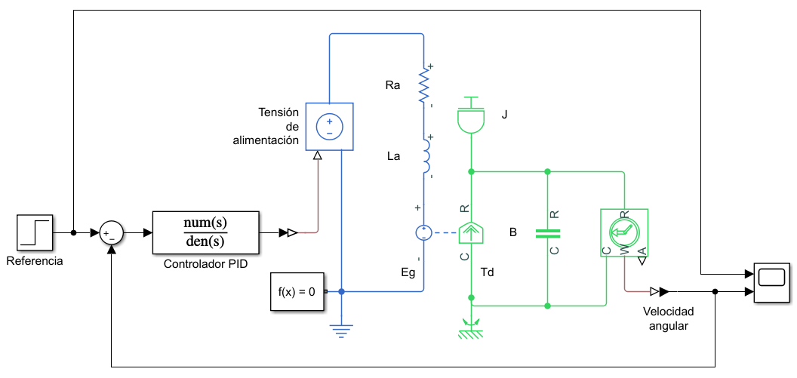
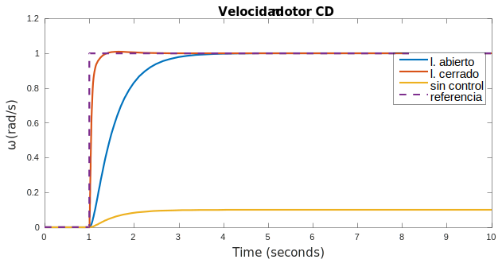

Como se vio en el curso de control, el [controlador pid](../../6to Semestre/Control/Control PID.html#proporcional-integral-derivativo-pid) tiene la siguiente forma:

$$
\tag{1}
C(s) = K_p + \frac{K_i}{s} + K_d s
$$

Sin embargo, esta función de transferencia **no es propia** y su implementación en físico se **complica**, además el término **derivador amplifica** altas frecuencias, pues es un filtro pasa altas con polo en el infinito. Por ende esto puede **incrementar el ruido**, para ello se [implementa con un filtro pasa-bajas](../../6to Semestre/Control/Control PID.html#implementación). Quedando la función de transferencia de la siguiente forma:

$$
\tag{2}
C(s) = K_p + \frac{K_i}{s} + K_d \frac{Ns}{s + N}
$$

Donde $N$ es la frecuencia de corte del filtro pasa-bajas.

A $(2)$ se le conoce como **controlador PID de banda limitada**. Simplificando la expresión:

$$
\tag{3}
C(s) = \frac{(K_p + K_d N)s^2 + (K_i + K_p N)s + K_iN}{s^2 + Ns}
$$

Así, se reduce el ruido y la función de transferencia ya es propia, haciendo más fácil su implementación.

# Implementación en Simulink

Como parámetros se utilizaron los mismos que en el control de velocidad en lazo abierto:

$$
\begin{aligned}
    J &= 0.01\text{ kg.m}^2\\
    B &= 0.1\text{ N.m}\\
    K_v &= 0.01 \frac{\text{V}}{\frac{\text{rad}}{\text{s}}}\\
    K_t &= 0.01 \frac{\text{N.m}}{\text{A}}\\
    R_a &= 1 \Omega\\
    L_a &= 0.5 \text{ H}\\
\end{aligned}
$$

En el controlador, se utilizaron los siguientes coeficientes:

$$
\begin{aligned}
K_p &= 100\\
K_i &= 200\\
K_d &= 10\\
N &= 100\\
\end{aligned}
$$

Quedando la función de transferencia como:

$$
C(s) = \frac{1100s^2 + 10200s + 20000}{s^2+100s}
$$

## Resultado
Se recabaron los datos de control de lazo abierto, cerrado y sin control para realizar la siguiente comparativa:

Se puede observar, que el control en lazo cerrado es más rápido que el de lazo abierto y ambos llegan a la referencia en el estado estacionario.

Por lo que los controladores en **lazo cerrado** permiten alcanzar un **mejor desempeño**, sin embargo acarrean consigo un **costo mayor** de implementación.
