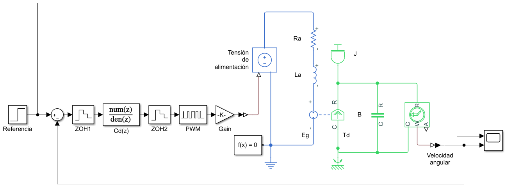
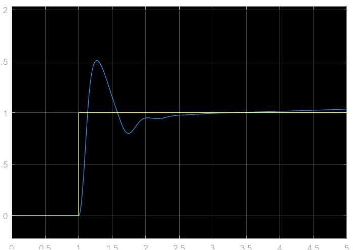

# Modelo en Simulink
La diferencia de este modelo y el utilizado para [tiempo continuo](./Control de velocidad en lazo cerrado para un motor de CD.html#implementación-en-simulink), es que el controlador se implementa dentro de dos [retenedores de orden cero](https://en.wikipedia.org/wiki/Zero-order_hold) que simulan el paso entre continuo y discreto como lo sería en la práctica por medio de convertidores analógicos digitales o viceversa.



Como se puede observar, la ganancia se aplicó después del controlador puesto que se busca reducir la probabilidad de [desbordamiento aritmético](https://es.wikipedia.org/wiki/Desbordamiento_aritm%C3%A9tico), que puede ocurrir al tener número muy grandes o muy pequeños. Así, se busca que la ganancia del controlador sea de aproximadamente 1 y la ganancia se aplica después. Para esto es necesario dividir sobre la ganancia en la [ecuación del controlador PID](../../6to Semestre/Control/Control PID.html#proporcional-integral-derivativo-pid):

$$
u(t)=e(t)+\frac{K_i}{K_p}\int e(t)dt + \frac{K_d}{K_p}\dfrac{de(t)}{dt}
$$

Además, se utilizó un PWM a la salida puesto que normalmente se regula así la tensión en aplicaciones reales.

# Implementación de sistema de control
El motor tiene los siguientes parámetros:

$$
\begin{aligned}
    J &= 0.01\text{ kg.m}^2\\
    B &= 0.1\text{ N.m}\\
    K_v &= 0.01 \frac{\text{V}}{\frac{\text{rad}}{\text{s}}}\\
    K_t &= 0.01 \frac{\text{N.m}}{\text{A}}\\
    R_a &= 1 \Omega\\
    L_a &= 0.5 \text{ H}\\
\end{aligned}
$$

Para [discretizar el sistema de control](./Discretización de sistemas discretos.html), se comenzará por obtener el controlador en tiempo continuo:

```
s = tf('s')
M = K / ((J*s+b)*(L*s+R)+K^2);
M = minreal(M)
```

$$
\tag{1}
M = \frac{2}{s^2 + 12s + 20.02}
$$

Utilizando el [controlador PID de banda limitada](https://ghsalazar.github.io/cem-matlab/docs/control-velocidad-lazo-cerrado-motor-cd.html#controlador-pid-de-banda-limitada), pero con ganancia unitaria:

$$
\tag{2}
C(s) = 1 + \frac{K_i}{K_p}\frac{1}{s} + \frac{K_d}{K_p}\frac{Ns}{s+N}
$$

Se utilizaran los siguientes valores de coeficientes:

$$
\begin{aligned}
K_p &= 100\\
K_i &= 200\\
K_d &= 10\\
N &= 100\\
\end{aligned}
$$

```
C = tf(pid(1,Ki/Kp,Kd/Kp,N))
C = minreal(C)
```

$$
\tag{3}
C(s) = \frac{1.01s^2 + 2.01s + 0.02}{s^2 + 0.01s}
$$

## Discretización
Primero se busca conocer la frecuencia de muestreo del sistema del sistema:

```
% Función de transferencia en lazo cerrado
G = minreal(feedback(C*Kp*M,1));
% Ancho de banda
Bw = bandwidth(G)/(2*pi);
% frecuencia de muestreo
fs = 10*Bw
```

> La frecuencia de muestreo, según el [teorema de muestreo de Nyquist-Shanon](https://es.wikipedia.org/wiki/Teorema_de_muestreo_de_Nyquist-Shannon) debe ser mayor que el doble del ancho de banda del sistema.

Ahora se obtiene la aproximación del sistema continuo a digital:

```
h = 1/fs;
Cd = c2d(C,h,'Tustin')
```

$$
\tag{4}
C_d(s) = \frac{1.041z^2 - 2.02z + 0.9784}{z^2 - 2z + 0.9997}
$$

> $h$ es el valor que se debe utilizar como tiempo de muestreo en los bloques PWM y el primer retenedor de orden 0, en realidad el segundo retenedor no es necesario pero está como representación de un convertidor DAC.

# Resultado

