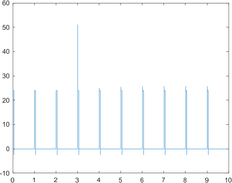

Un **driver** es un circuito que se utiliza para **alimentar** un motor. El **brake** se utiliza para **frenar** el motor.

# Driver
El circuito base es el siguiente:

Sin al ver la señal de salida en tensión, se tiene lo siguiente:

Esto pasa porque el inductor del motor, al abrir y cerrar el switch cambia de $24 V$ a $0 V$ en un periodo de tiempo muy corto y por lo tanto el cambio en la corriente tiende a menos infinito.

Para solucionar esto, se implementa un diodo de protección en paralelo con el motor:

Así, la señal de salida en tensión es la siguiente:

# Brake
## Frenado regenerativo
El freno del motor se implementa por medio del siguiente circuito:

Los cambios en este circuito son:
* El diodo está ahora en serie con el motor
* El switch está en paralelo con el motor

Lo que hace este circuito en realidad es actuar como un **generador**, el motor genera energía eléctrica que después es **consumida** por la fuente de tensión. Por eso, dicha fuente requiere tener la capacidad de absorber la energía.

El **diodo** en este caso funciona para evitar que la corriente entre en **sentido contrario** a la fuente de alimentación.

## Frenado disipativo

Aquí el diodo no está puesto que la resistencia simplemente disipa la energía del motor.
