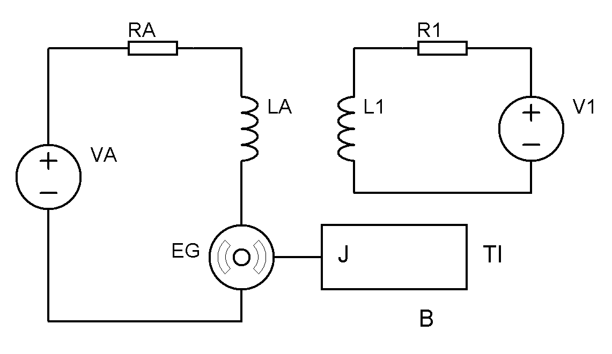

Para entender el comportamiento de un motor de existen diferentes formas, que atienden a diferentes intereses, en concreto se estudiaran estas 3:

* **Ecuaciones diferenciales**: Sirven para entender el comportamiento de un motor en el estado transitorio.
* **Función de transferencia**: Nos ayudan a entender el comportamiento en frecuencia y diseñar controladores.
* **Módelo de régimen permanente**: Se aplica para el análisis de un motor a velocidad constante y nos ayuda seleccionar el motor.

## Modelo matemático
Tomando en cuenta el siguiente esquemático:

{:width="400px"}

Utilizando leyes de Kirchhoff se obtienen las ecuaciones para el circuito de armadura y de campo.

$$
\tag{1}
v_a = R_a i_a - L_a\frac{d i_a}{dt} - e_g = 0
$$

$$
\tag{2}
v_f - R_f i_f - L_f\frac{d i_f}{dt} = 0
$$

Luego por medio de la segunda [ley de Euler de movimiento](https://en.wikipedia.org/wiki/Euler%27s_laws_of_motion#Euler's_second_law), se analiza el subsistema mecánico.

$$
\tag{3}
J\frac{d\omega}{dt} = {\Large\tau}_D - {\Large\tau}_L - B\omega
$$

Donde:
${\Large\tau}_D$ es el par desarrollado que se aplica al rotor.
${\Large\tau}_L$ es el par de la carga.
$B$ es la fricción viscosa.
$\omega$ es la velocidad angular del rotor.
$J$ es el momento de inercia del rotor.

### Interacciones

A continuación se describen las interacciones eléctrico mecánicas.

$$
\tag{4}
{\Large\tau}_D = K_{\normalsize\tau} i_f i_a
$$

$$
\tag{5}
e_g = K_v i_f \omega
$$

Donde:
$K_T$ es la constante del motor o constante de par.
$K_v$ es la constante de tensión.

> Las constantes $K_T$ y $K_v$ tienen el mismo valor pero sus unidades son distintas.

> Todo esto fue visto más a fondo en el curso de [máquinas eléctricas](../../6to Semestre/Maquinas Eléctricas/index.html).

Sustituyendo $(5)$ en $(1)$, $(4)$ en $(3)$ y reordenando $(2)$, se obtiene el sistema de ecuaciones diferenciales algebraicas no homogéneas del modelo del motor de CD.

$$
\begin{cases}
    L_a\frac{di_a}{dt} + R_ai_a = v_a - K_v i_f \omega\\
    L_f\frac{di_f}{dt} + R_fi_f = v_f\\
    J\frac{d\omega}{dt} + B\omega = K_{\normalsize\tau} i_f i_a - {\Large\tau}_L
\end{cases}
$$

Como se puede apreciar el modelo es de 3er orden.

## Linealización
Como se vio en el curso de control, para controlar sistemas es necesario y [linealizarlos](../../6to Semestre/Control/Modelado de sistemas.html) antes. Para este caso, se toman las siguientes suposiciones:

* La **tensión de campo** $v_f$ es **constante**: Para esto se debe usar una fuente de tensión constante.
* El **par de la carga** $T_L$ es **despreciable**: Esto se puede lograr utilizando una transmisión reductora en la salida del motor.

Así, el sistema se ve reducido a un sistema de dos ecuaciones diferenciales lineales.

$$
\begin{cases}
    L_a\frac{di_a}{dt} + R_ai_a = v_a - K_v^* \omega\\
    J\frac{d\omega}{dt} + B\omega = K^*_{\normalsize\tau} i_a
\end{cases}
$$

Donde:
$K^\star_{\normalsize\tau} = K_{\normalsize\tau} I_f$
$K^\star_v = K_v I_f$

Así, será posible diseñar controladores para este modelo.

Aplicando la transformada de Laplace.

$$
\begin{aligned}
    sL_aI_a + R_aI_a &= V_a - K_v^* \Omega\\
    sJ\Omega + B\Omega &= K^*_{\normalsize\tau} I_a
\end{aligned}
$$

Sustituyendo $I_a$ y desarrollando:

$$
\begin{aligned}
    sJ\Omega + B\Omega &= K^*_{\normalsize\tau} \frac{V_a-K^*_v\Omega}{R_a + sL_a}\\
    \Omega(sJ + B) (R_a + sL_a) &= V_a K^*_{\normalsize\tau} -K^*_{\normalsize\tau} K^*_v\Omega\\
    \Omega\left[(sJ + B) (R_a + sL_a) + K^*_{\normalsize\tau} K^*_v\right] &= V_a K^*_{\normalsize\tau}\\
\end{aligned}
$$

Por lo tanto la función de transferencia de un motor de CD, con entrada de tensión y salida en velocidad angular, sería la siguiente:

$$
\boxed{\frac{\Omega}{V_a} = \frac{K^*_{\normalsize\tau}}{(sJ + B) (R_a + sL_a) + K^*_{\normalsize\tau} K^*_v}}
$$

Para obtener la constante del motor $K_{cd}$, se con la velocidad angular en estado estacionario y la tensión de la armadura aplicada: 

$$
K_{cd} = \frac{\omega_n}{V_a}
$$

$\omega_n$ es la velocidad angular medida, al aplicar una tensión de armadura constante $V_a$.

## Modelo en régimen permanente
En este modelo se asumen que no hay más cambios en la corriente de armadura ni en la velocidad angular del rotor. Entonces las variables en las ecuaciones diferenciales se vuelven constantes.

$$
V_a - E_g = R_a I_a
$$

$$
V_f = R_f I_f
$$

$$
T_D = T_L + B\Omega
$$

Las ecuaciones de las interacciones se vuelven lo siguiente.

$$
T_D = K_{\normalsize\tau} I_f I_a
$$

$$
E_g = K_v I_f \Omega
$$

