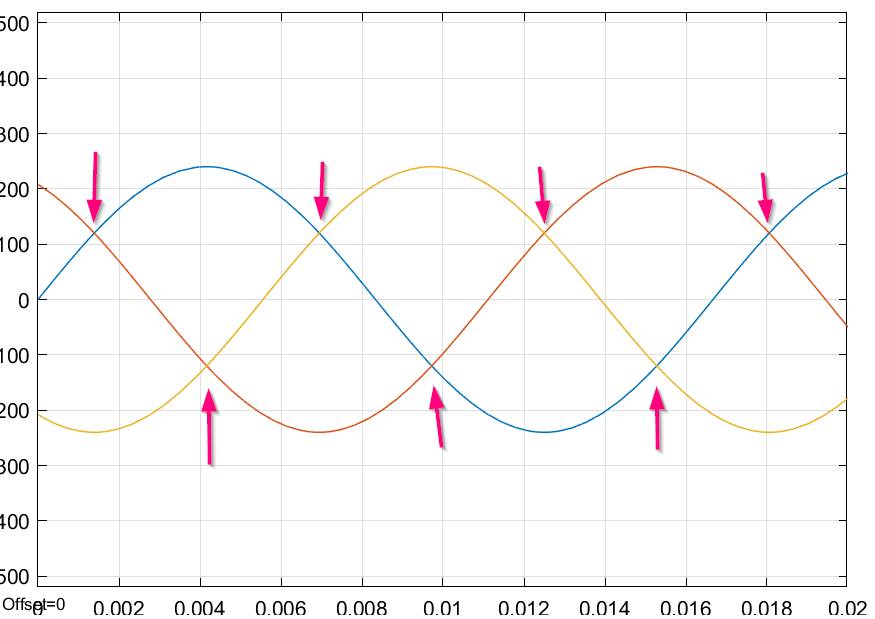
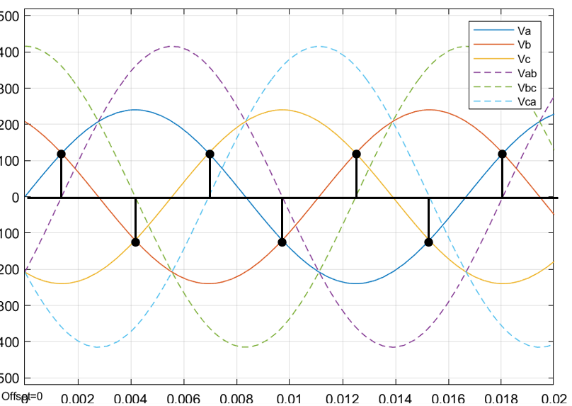
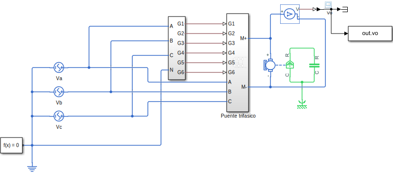
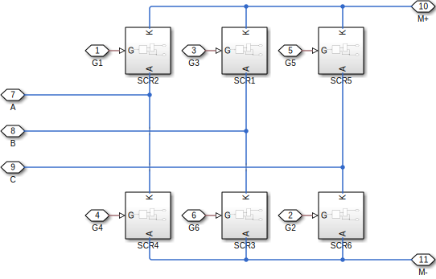
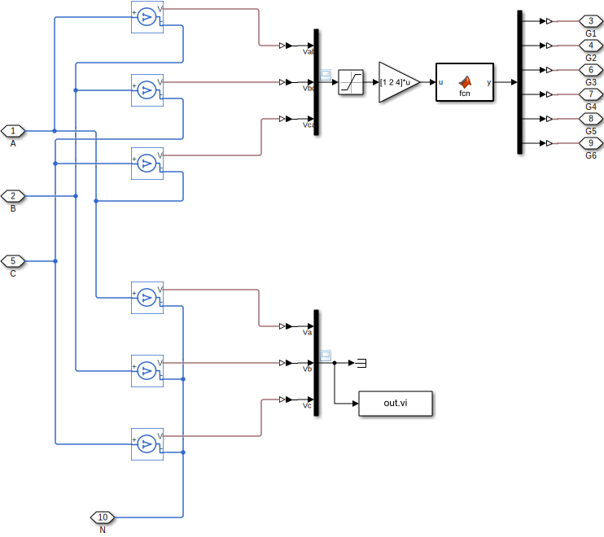
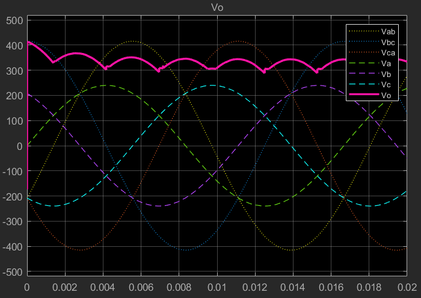

El puente trifásico se utiliza mucho en la industria principalmente en inversores para motores trifásicos.

El circuito y secuencia de activado se puede ver [aquí](https://riverraid17.files.wordpress.com/2010/03/electronica-de-potencia-rashid-espanol.pdf#page=178). Básicamente se deben activar 2 tiristores en cada cruce de fases, es decir en los siguientes puntos:



Para detectar estos puntos con mayor facilidad, se realiza la medición de las tensiones de línea y en cada cruce de fases, su tensión de línea correspondiente tiene un cruce por 0:


Esto se logra por medio del siguiente circuito:

|  |
| :-:                                                                          |
| Modelo de rectificador trifásico                                             |

|  |
| :-:                                                                        |
| Subsistema de arreglo de SCR                                               |

|  |
| :-:                                                 |
| Subsistema SCR                                      |

|  |
| :-:                                                                            |
| Subsistema de disparo                                                          |

El disparador entonces convierte la lectura de tensión en 0s y 1s, luego se multiplican por una matriz para tener la siguiente expresión:

$$
\begin{bmatrix}
    1 & 2 & 4
\end{bmatrix}\begin{bmatrix}
    V_{ab}\\
    V_{bc}\\
    V_{ca}
\end{bmatrix} = V_{ab} + 2 V_{bc} + 4 V_{ca}
$$

Así, cuando hay un cruce por 0 de cualquiera de las tensiones de línea, el número resultante es diferente del 1 al 6. Entonces para cada número se relacionan un conjunto de SCR por medio de una tabla.

El código del Matlab function es el siguiente:

```matlab
function y = fcn(u)
T = [0 0 0 0 0 0
     1 0 0 0 0 1
     0 1 1 0 0 0
     1 1 0 0 0 0
     0 0 0 1 1 0
     0 0 0 0 1 1
     0 0 1 1 0 0];
y = T(uint32(u+1),:);
```

Se obtienen la siguiente salida:


