Los **tiristores** a diferencia de los *transistores*, cumplen con las siguientes características:

1. Opera con una polarización directa
2. Se activa por compuerta o por exceso de polarización
3. Deja de operar cuando la corriente disminuye

Se utilizan por lo tanto para realizar circuitos que utilizan corriente alterna por lo general.

# Motor de AC monofásico
En el circuito para controlar un motor de AC monofásico, se utiliza un tiristor junto con un driver de compuerta y un circuito de disparo.

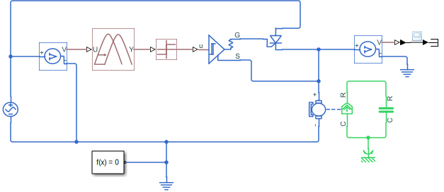

En este caso el disparo es controlado por una función *sign*, por lo que cuando el ciclo es positivo, se activa el disparo, obteniendo la siguiente señal:

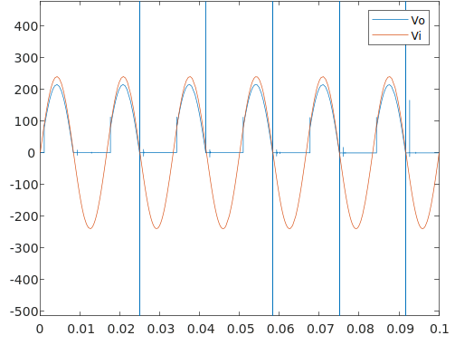

# Puente Rectificador
## Puente Rectificador con 4 tiristores
Con los tiristores se puede también rectificar una señal de corriente alterna. Para eso se puede implementar el circuito con SCRs de la siguiente forma:

| 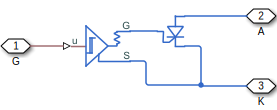 |
| :-:                                                                             |
| SCR con driver de compuerta y tiristor                                          |

| 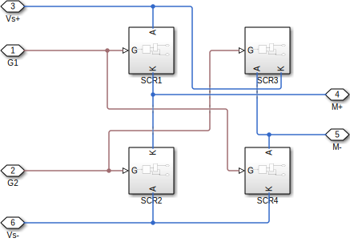 |
| :-:                                                                                                      |
| Puente rectificador con SCR                                                                              |

| 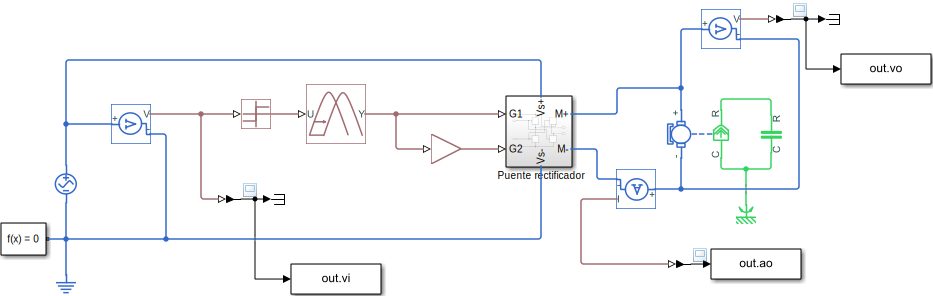 |
| :-:                                                                                                |
| Motor y puente rectificador                                                                        |

Si con el puente rectificador no se dispara el semiciclo negativo, es decir, se pone la ganancia de 0, se obtienen picos de tensión a causa de que el inductor no se está descargando:

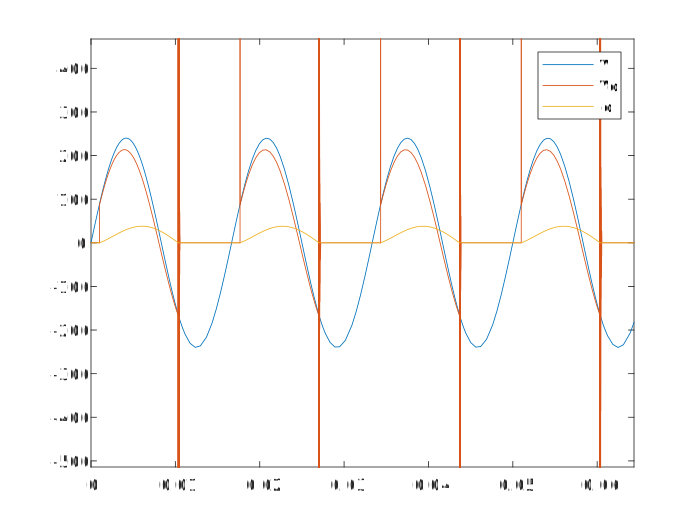

Para corregir eso se utiliza un diodo:

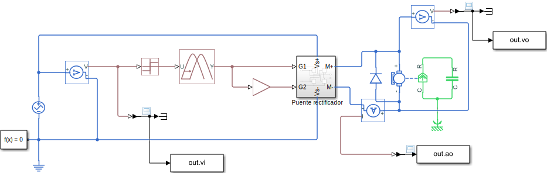

Y se obtiene la siguiente salida:

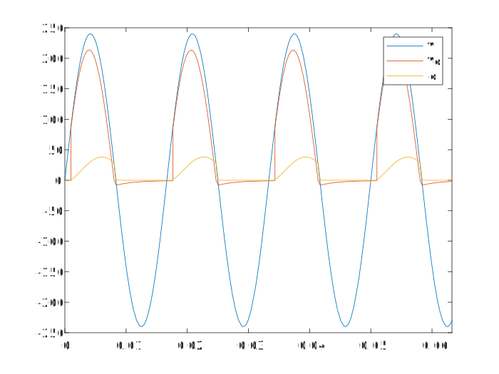

Ahora bien, si a la ganancia del semiciclo negativo, se le pone de -1 y se quita el diodo, se obtiene la siguiente salida:

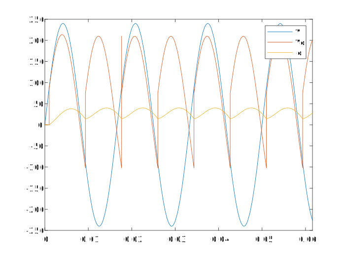

Como podemos darnos cuenta, ya no se tiene el pico de tensión debido a que ahora la corriente retorna por los otros scr. La corriente sigue siendo positiva.

Ahora bien, como se puede observar la corriente está desfasada de la tensión y por lo tanto la inductancia es grande, eso ocasiona los pequeños picos de tensión. Así que la inductancia es muy importante y hay que considerarla. Para motores pequeños por lo general no afecta mucho, pero en grandes sí tiene un efecto considerable.

## Puente Rectificador con 2 tiristores
Se puede hacer un puente rectificador más sencillo con sólo 2 tiristores y dos diodos.

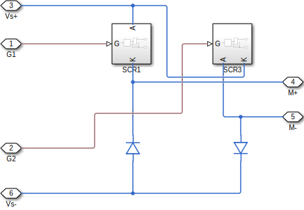

Y la salida es la siguiente:

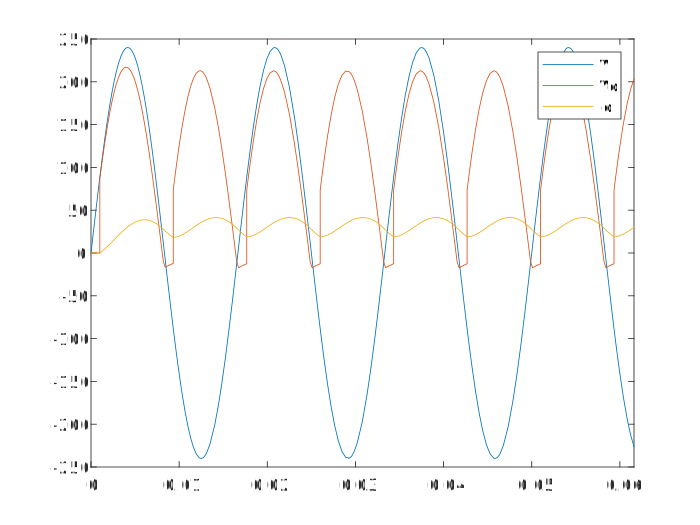

Como se puede observar, los diodos cortan la tensión en negativo y por lo tanto al tener cargas inductivas grandes, se puede utilizar este circuito para eliminar las tensiones negativas.
