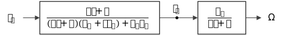

Para controlar el **par** de un motor de CD es necesario controlar la **corriente de armadura**

$$
\tag{1}
T_D = K_v I_a
$$

Del modelo [linealizado](./Modelos de motor de CD para control de velocidad.html#linealización) también sabemos:

$$
\tag{2}
\Omega(sJ + B) = K_{\normalsize\tau} I_a\quad\Rightarrow\quad I_a = \frac{\Omega(sJ + B)}{K_{\normalsize\tau}}
$$

Sabemos que la función de transferencia de velocidad de un motor de CD es la siguiente:

$$
\tag{3}
M = \frac{\Omega}{V_a} = \frac{K_{\normalsize\tau}}{(sJ + B) (R_a + sL_a) + K_{\normalsize\tau} K_v}
$$

Por lo tanto, dividiendo $(2)$ entre $V_a$:

$$
\tag{4}
\begin{aligned}
\frac{I_a}{V_a} &= \frac{\Omega}{V_a}\frac{(sJ + B)}{K_{\normalsize\tau}} = \frac{K_{\normalsize\tau}}{(sJ + B) (R_a + sL_a) + K_{\normalsize\tau} K_v}\frac{(sJ + B)}{K_{\normalsize\tau}}\\
&= \frac{(sJ + B)}{(sJ + B) (R_a + sL_a) + K_{\normalsize\tau} K_v}\\
\end{aligned}
$$

Podemos controlar el par por medio de $(4)$ y la velocidad con $(3)$, así que se define:

$$
\boxed{M = M_1 M_2}
$$

Donde:

$$
\boxed{
\begin{aligned}
    M_1 &= \frac{(sJ + B)}{(sJ + B) (R_a + sL_a) + K_{\normalsize\tau} K_v}\\
    M_2 &= \frac{K_{\normalsize\tau}}{(sJ + B)}\\
\end{aligned}
}
$$

El diagrama de bloques equivalente es el siguiente:

El control entonces consiste en regular la corriente de armadura para indirectamente regular el par. Un controlador [**PI**](../../6to Semestre/Control/Control PID.html#proporcional-integral-pi) es bueno para este propósito y el diagrama de bloques sería el siguiente:

